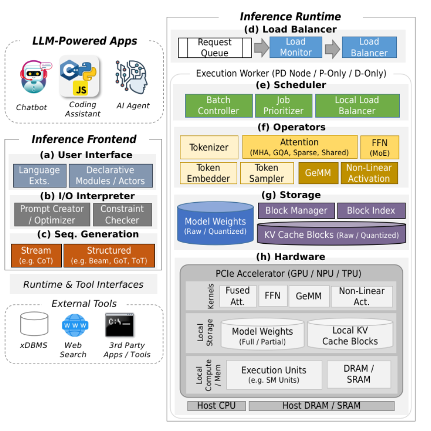

# Introduction

The shift from recurrent neural networks to transformer architectures enabled large language models (LLMs) to reach a level of quality that supports a wide range of applications, including question answering, document summarization, classification, language translation, code generation, data wrangling, and unstructured data analysis. This breakthrough has driven widespread adoption of LLMs across industries and by everyday consumers through services like ChatGPT, Gemini, Claude, Grok, Kimi, and DeepSeek.

This surge in usage has created pressure to design systems capable of high-performance model serving. In response, specialized LLM inference systems have been developed to manage both the core LLM inference workflow and system-level tasks such as load balancing, job batching, job scheduling, and memory management. Unlike traditional high-volume data processing systems, which typically process input requests in a single pass, LLMs must repeatedly process sequences in proportion to the length of the generated output.

Because all requests take the form of text and the output length depends unpredictably on the content of the input, there is no fixed or typical output size. As a result, the cost of processing requests—particularly memory cost—varies widely, even for inputs that may appear similar. This inherent unpredictability and autoregressive generation pattern drive the need for new inference system techniques that can handle variable workloads efficiently.

---

The non-deterministic nature of LLM outputs introduces three major challenges for inference systems:

1. **Output Quality**

   * Since outputs are generated through probabilistic sampling rather than deterministic construction, the quality of responses cannot be fully guaranteed.

2. **Memory Allocation**

   * The number of execution rounds required for generation is unpredictable, making it difficult to estimate memory usage, especially when serving multiple concurrent requests.

3. **Processing Time**

   * The variable duration of requests complicates batching and scheduling, increasing the risk of inefficiencies such as stragglers and head-of-line blocking.

To address these challenges, LLM inference systems integrate a variety of techniques across both the user-facing frontend and the execution runtime:

* **Improving Output Quality**:

  * Advanced sequence generation methods (e.g., beam search, tree-of-thoughts, graph-of-thoughts, self-consistency).
  * Prompting strategies that enhance task satisfaction.

* **User-Facing Frontend Enhancements**:

  * Features such as automatic prompt optimization and constrained output generation reduce user effort and simplify interactions.

* **Memory Management**:

  * Page-based memory allocation, cache persistence, and quantization techniques adapt to dynamic and unpredictable memory demands while reducing overall usage.

* **Request Scheduling and Execution**:

  * Dynamic job scheduling, adaptive batching, and flexible load balancing driven by load prediction.
  * Specialized operators and optimized kernel implementations lower inference cost and improve efficiency.

---

This survey organizes the discussion of LLM inference techniques within the framework of a complete inference system. It begins by examining operators and sequence generation algorithms that enable high-quality inference. Next, it explores batching and scheduling methods alongside kernel design strategies that optimize operator execution on specialized hardware.

The survey then addresses memory management, covering approaches such as page-based memory allocation, eviction and offloading methods for handling preemptions and long contexts, quantization, and cache persistence mechanisms, including cache reconstruction.

Finally, it brings these elements together to describe the broader landscape of inference systems. This includes single-replica systems, which run one instance of the model, and multi-replica systems, which distribute requests across multiple instances. Multi-replica systems, in particular, enable **disaggregated architectures** that provide finer control over hardware resource allocation.

---

Previous surveys have discussed many of the techniques used in LLM inference, but often in isolation rather than as part of a unified system framework. Some focus on specific areas such as sparse attention, mixture-of-experts, decoding strategies, KV cache management, and quantization. Others examine KV cache management more deeply, while additional surveys emphasize model architecture improvements, including pruning, knowledge distillation, and quantization.

In contrast, this survey positions these techniques within a **comprehensive inference system framework** and highlights how they can be integrated to form **dedicated LLM inference systems**.

---

