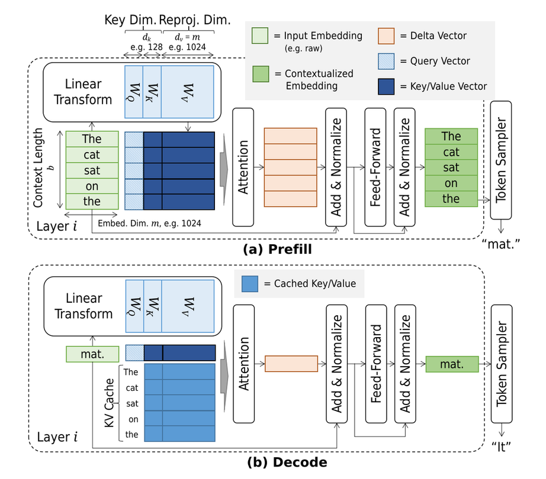

# **2.1 Inference Workflow**

### **1. Sequence Generation Setup**

* Prompt / prefix tokens:

$$
x_{1}, x_{2}, \dots, x_{p}
$$

* Output sequence:

$$
x_{1}, \dots, x_{p}, \dots, x_{n}
$$

* Each new token $x_{i+1}$ requires:

$$
x_{i+1} = \mathrm{LLM}(x_1, \dots, x_i)
$$

→ This defines **autoregressive generation**, where outputs are computed one token at a time by conditioning on all previous tokens.

### **2. Embedding and Contextualization**

1. **Embedding layer:**
   Each token $x_i$ is mapped to a high-dimensional vector:

$$
h_i^{(0)} = \mathrm{Embed}(x_i) \in \mathbb{R}^d
$$

2. **Transformer stack (for $L$ layers):**
   For layer $\ell$:

$$
h_i^{(\ell)} = \mathrm{TransformerLayer}^{(\ell)}(h_i^{(\ell-1)})
$$

   producing contextualized embeddings.

3. **Token sampler (logits → distribution):**
   Only the contextualized embedding of the **last token** $h_i^{(L)}$ is used to produce the probability distribution for $x_{i+1}$.

### **3. Attention Operator**

Inside each transformer layer:

* Linear projections:

$$
q_i = h_i W_Q, \quad k_i = h_i W_K, \quad v_i = h_i W_V
$$

* Attention update:

$$
\mathrm{Attn}(h_i) = \sum_{j=1}^{i} \alpha_{ij} v_j, \quad
\alpha_{ij} = \frac{\exp \left( \frac{q_i \cdot k_j}{\sqrt{d_k}} \right)}{\sum_{j'=1}^{i} \exp \left( \frac{q_i \cdot k_{j'}}{\sqrt{d_k}} \right)}
$$

* **Key observation**: computing attention at step $i$ requires access to *all past keys and values*, i.e., ${k_j, v_j}_{j < i}$.

### **4. KV Cache Growth**

* The **KV cache** stores all previous $k_j, v_j$ pairs.
* For sequence length $t$, hidden dimension $d$, head size $d_k$, and $L$ layers:

$$
\mathrm{KV\ Cache\ Memory} = \mathcal{O}(L \cdot t \cdot d_k)
$$

* This cache grows **linearly** with sequence length during generation.

### **5. Compute & Memory Costs**

#### **Prefill Phase (processing prompt $x_1 \dots x_p$):**

* Cost dominated by full attention:

$$
\mathcal{O}(p^2 d)
$$

* Cache allocated for $p$ tokens.

#### **Decode Phase (incremental token generation):**

* At step $i$:

  * Compute new $q_i, k_i, v_i$
  * Attention involves $i-1$ cached keys/values
* Cost per step:

$$
\mathcal{O}(i d)
$$

* Total decode cost for $n-p$ output tokens:

$$
\mathcal{O}((n-p) \cdot n d)
$$

* Memory footprint grows as:

$$
\mathcal{O}(L \cdot n \cdot d_k)
$$

### **6. System-Level Interpretation**

* **Autoregressive bottleneck:** Cannot compute tokens in parallel beyond the prefix → inference is **sequential and latency-bound**.
* **KV cache tradeoff:** Reduces recomputation but introduces **growing memory pressure**.
* **Scaling implications:**

  * Longer generations → quadratic prefill + linear decode costs.
  * Large $d, L$ → huge KV cache memory usage (often tens of GBs).
* **Optimizations:**

  * **Delta vectors** (as in the earlier figure): represent only incremental updates.
  * **KV compression / eviction:** reduce memory cost.
  * **Speculative decoding:** parallelize multiple future tokens, then verify.
  * **Quantization of KV cache:** store $k,v$ at reduced precision.

* Prefill is **quadratic** in prompt length ($p^2$), but parallelizable.
* Decode is **linear per token** ($\mathcal{O}(td)$), but inherently sequential.
* The **KV cache** is the main system bottleneck, scaling linearly with sequence length, and motivating many inference-time optimizations.

---

## **Performance and Accuracy in LLM Inference**

### **1. Latency in Autoregressive Generation**

Given a request consisting of prompt $x_{1:p}$ and generated tokens $x_{p+1:n}$, the **end-to-end latency** is:

$$
T_{\mathrm{E2E}} = T_{\mathrm{prefill}} + T_{\mathrm{decode}}
$$

* **Prefill latency ($T_{\mathrm{prefill}}$):**

  * Full-sequence computation for $p$ tokens.
  * Quadratic cost in $p$ due to attention:

$$
T_{\mathrm{prefill}} \sim \mathcal{O}(p^2 d)
$$

* **Decode latency ($T_{\mathrm{decode}}$):**

  * Sequential generation of $n-p$ tokens.
  * Each step requires attention over all past tokens:

$$
T_{\mathrm{decode}} \sim \mathcal{O}((n-p) \cdot n d)
$$

### **2. Streamed Outputs**

Unlike batch inference, autoregressive models allow **token streaming**:

* **Time to First Token (TTFT):**

$$
T_{\mathrm{TTFT}} \approx T_{\mathrm{prefill}}
$$

  Time from request submission until the first token is produced.

* **Time Between Tokens (TBT):**

$$
T_{\mathrm{TBT}} \approx \frac{T_{\mathrm{decode}}}{n-p}
$$

  Average time to generate each new token.

* **Impact on applications:**

  * **Interactive Q\&A:** TBT and TTFT dominate user experience.
  * **Summarization / batch tasks:** end-to-end latency and throughput matter more.

### **3. Throughput vs. Goodput**

* **Throughput (raw):**

$$
\mathrm{Throughput} = \frac{\# \text{tokens or requests processed}}{\text{second}}
$$

* **Goodput (quality-aware):**

$$
\mathrm{Goodput} = \frac{\# \text{requests completed within SLO}}{\text{second}}
$$

→ *Goodput is the more realistic metric for multi-user LLM systems under latency targets.*

### **4. Accuracy & Quality Metrics**

Since tasks vary widely, there is no single universal quality metric:

* **Perplexity (general fluency):**

$$
\mathrm{PPL}(x_{1:n}) = \exp\left( - \frac{1}{n} \sum_{i=1}^{n} \log P(x_i \mid x_{1:i-1}) \right)
$$

* **Task-specific metrics:**

  * **BLEU** (translation quality) → n-gram precision with brevity penalty.
  * **ROUGE** (summarization quality) → recall-based n-gram overlap.
  * **Others:** accuracy (QA), F1 (information extraction), etc.

### **5. System–Quality Tradeoff**

* **Latency / throughput optimizations** (e.g., caching, batching, speculative decoding) can reduce TBT/TTFT but may:

  * Affect perplexity (if approximations are introduced).
  * Impact downstream quality if pruning/quantization is aggressive.

* **Design balance:**
  Systems must target **goodput under SLOs** *and* maintain acceptable **quality metrics** for the intended task.

Performance in LLM systems is not just raw latency or throughput — it is about **TTFT, TBT, and goodput**. Accuracy is not one-size-fits-all but depends on **perplexity for general language modeling** and **task-specific metrics (BLEU, ROUGE, F1)**.

---

