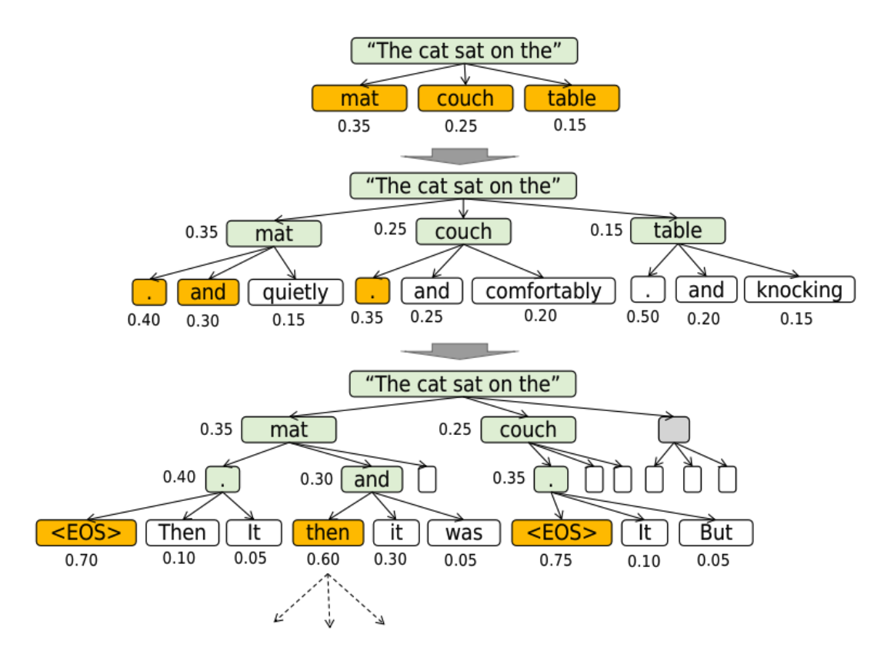

# **2.3 Sequence Generation in LLMs**

Sequence generation is the process by which a language model produces a full output (sentence, paragraph, or multi-turn conversation) one token at a time. The process is autoregressive: the model generates a token, appends it to the prompt, and then reuses the updated sequence to predict the next token. This continues until a termination condition (e.g., an *end-of-sequence token*) is met.

## **1. Streaming (Prompt-Based Techniques)**

These techniques directly influence how tokens are generated in a sequential/streaming manner:

1. **Chain-of-Thought (CoT) Prompting**

   * Involves inserting key phrases like *“let’s think step by step”* or *“show your work”*.
   * Encourages the model to output intermediate reasoning steps.
   * Improves reasoning-heavy tasks (math, logic, coding), but increases sequence length and compute cost.

2. **Few-Shot Prompting**

   * Appends a handful of solved examples (inputs and outputs) to the prompt.
   * Helps the model generalize better by mimicking patterns from demonstrations.
   * Commonly used in tasks like translation, summarization, or QA.

3. **Internalized CoT**

   * Instead of explicit prompting, the model is fine-tuned (often via reinforcement learning) to *naturally* generate reasoning-style outputs.
   * Reduces the need for verbose prompts while retaining reasoning ability.
   * Example: RLHF models that implicitly show structured reasoning in answers.

**Trade-off:**

* Prompting methods are lightweight (no retraining), but sensitive to phrasing.
* Internalized CoT requires training effort but yields more consistent outputs.

## **2. Structured Generation (Search-Based Techniques)**

Instead of producing one candidate sequence, structured methods generate and maintain multiple candidates, selecting the best among them.

1. **Beam Search**

   * Keeps track of the top *k* candidate sequences.
   * At each step, expands candidates by sampling new tokens, then prunes to retain only the top *k*.
   * Final output = sequence with highest cumulative probability.
   * Balances between greedy decoding (fast but rigid) and probabilistic sampling (diverse but unstable).

2. **Tree-of-Thoughts (ToT)**

   * Extends beam search into a **search tree**.
   * Each node = a possible partial sequence.
   * Uses reasoning prompts at nodes to expand multiple future possibilities.
   * Enables more deliberate exploration of reasoning paths.

3. **Graph-of-Thoughts (GoT)**

   * Generalizes ToT by structuring candidates as a **graph** (not just a tree).
   * Allows **aggregation of information** from multiple parents (e.g., merging reasoning branches).
   * Better suited for tasks requiring multi-path reasoning or consensus building.

4. **Self-Consistency**

   * Runs multiple generations independently.
   * Discards outlier candidates, keeping those that converge toward a consistent answer.
   * Improves reliability in reasoning tasks but increases cost due to multiple runs.

**Trade-off:**

* Structured methods improve **quality, reasoning depth, and reliability**, but at higher computational cost.
* Beam search is relatively efficient, while ToT/GoT and self-consistency can be expensive but yield richer outputs.

## **Summary Table**

| Method                 | Category   | Key Idea                         | Pros                               | Cons                          |
| ---------------------- | ---------- | -------------------------------- | ---------------------------------- | ----------------------------- |
| **Greedy Decoding**    | Streaming  | Pick max logit each step         | Fast, deterministic                | Repetitive, unnatural outputs |
| **CoT Prompting**      | Streaming  | Add “think step by step”         | Better reasoning                   | Longer outputs, higher cost   |
| **Few-Shot Prompting** | Streaming  | Provide examples in prompt       | Better task adherence              | Prompt length can explode     |
| **Internalized CoT**   | Streaming  | Train model to reason implicitly | Natural reasoning, no extra tokens | Needs training/fine-tuning    |
| **Beam Search**        | Structured | Maintain top-k sequences         | More fluent, avoids greedy traps   | More compute cost             |
| **Tree-of-Thoughts**   | Structured | Search tree over sequences       | Deliberate reasoning exploration   | Expensive                     |
| **Graph-of-Thoughts**  | Structured | Logical graph of candidates      | Aggregated reasoning paths         | Even more compute-heavy       |
| **Self-Consistency**   | Structured | Prune outliers among candidates  | Reliable, stable outputs           | Requires multiple model runs  |

---

