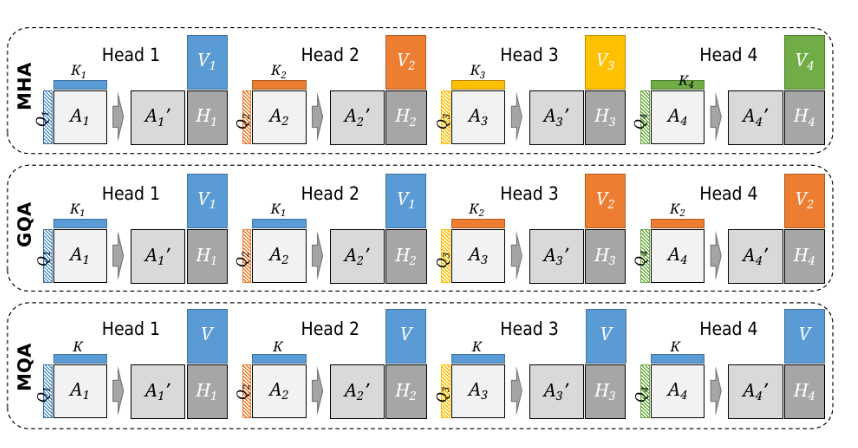

### **1. Multi-Head Attention (MHA)**

* **How it works:**

  * Each head has its **own** projections for $Q, K, V$.
  * Example: Head 1 uses $(W_q^{(1)}, W_k^{(1)}, W_v^{(1)})$, Head 2 uses its own set, etc.
  
* **Pros:**

  * Maximum flexibility → each head can learn different relationships.
  * Often yields **higher accuracy** and richer representations.
  
* **Cons:**

  * Expensive: every head requires its **own KV cache** → memory and compute scale linearly with number of heads.

### **2. Grouped Query Attention (GQA)**

* **How it works:**

  * Still multiple heads, but **queries are split per head**, while **keys and values are shared across a group of heads**.
  * In the figure, Heads 1 & 2 share $K_1, V_1$; Heads 3 & 4 share $K_2, V_2$.

* **Pros:**

  * Reduces memory & compute cost compared to MHA.
  * Each group still has some specialization, so performance is usually close to MHA.

* **Cons:**

  * Less expressive than full MHA, but usually a good tradeoff.

### **3. Multi-Query Attention (MQA)**

* **How it works:**

  * All heads have **independent queries**, but they **share the same single K and V projections**.
  * So across all heads:

$$
Q^{(h)} = X W_q^{(h)}, \quad K = X W_k, \quad V = X W_v
$$

* **Pros:**

  * Huge memory savings: only **one KV cache** instead of per head.
  * Greatly speeds up inference since KV lookups dominate in decoding.

* **Cons:**

  * Some loss of accuracy compared to MHA and GQA (since all heads look at the same keys/values).
  * Works best when inference efficiency is prioritized (common in large LLM deployments).

### **Key Trade-offs (from Table 1 in your text)**

| Variant | Latency      | Memory      | Accuracy           |
| ------- | ------------ | ----------- | ------------------ |
| **MHA** | ↑ (slowest)  | ↑           | Best               |
| **GQA** | ↓            | ↓           | Near MHA           |
| **MQA** | ↓↓ (fastest) | ↓↓ (lowest) | Lower than GQA/MHA |

So, visually:

* **MHA:** independent everything → high cost, high quality.
* **GQA:** shared K/V per group → compromise.
* **MQA:** one shared K/V → efficient, but weaker expressivity.

---

