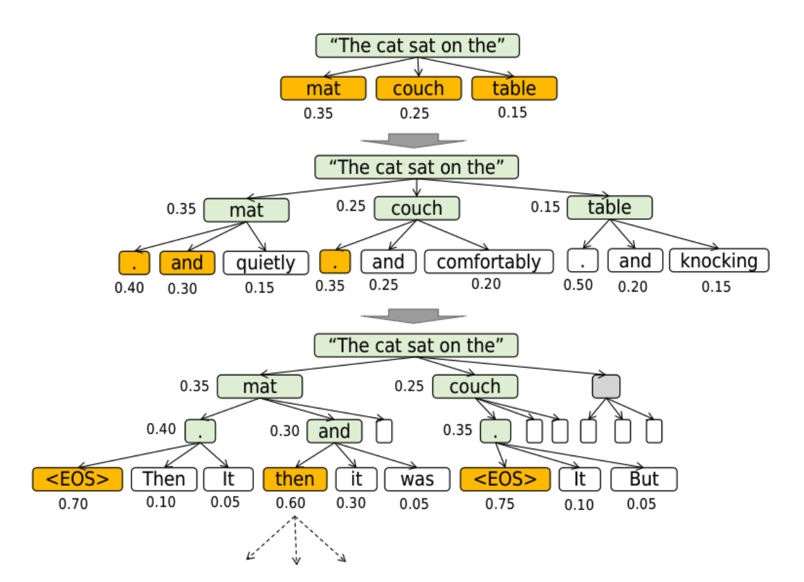

## **High-Level Concept**

Beam Search is a compromise between two extremes:
*   **Greedy Decoding:** Always pick the single most probable next token. It's fast but can miss better overall sequences that start with a slightly less likely token.
  
*   **Exhaustive Search:** Consider every possible sequence. This finds the optimal result but is computationally impossible for long sequences.

Beam Search maintains a small number (`k`) of the most promising partial sequences at each step. This number `k` is called the **beam width**. The image illustrates a beam search with a **beam width of 3**.

### **Step-by-Step Explanation of the Image (k=3)**

#### **Step 1: Starting Point**

We begin with the context: **"The cat sat on the"**. The model calculates the probabilities for the next token. The top candidates are:

*   `mat` (Probability: 0.35)
*   `couch` (Probability: 0.25)
*   `table` (Probability: 0.15)

If we were doing Greedy Search, we would simply pick `mat` and continue. With a beam width of **k=3**, we keep all three of these top candidates.

#### **Step 2: First Expansion (Beam Width = 3)**

Instead of picking just one or two, Beam Search keeps the top `k` candidates. Here, `k=3`. So, we keep the three most likely sequences:

1.  **"The cat sat on the mat"** (Score: 0.35)
2.  **"The cat sat on the couch"** (Score: 0.25)
3.  **"The cat sat on the table"** (Score: 0.15)

#### **Step 3: Second Expansion**

Now, we expand **each** of the three kept sequences independently. For every sequence, the model predicts the probabilities of the *next* token.

*   **For Sequence 1 ("...mat"):** The likely next tokens might be `and` (0.40), `quietly` (0.30), etc. The score for the new sequence is the product of the previous scores. For example:
    *   "...mat and" score = 0.35 * 0.40 = 0.14
    *   "...mat quietly" score = 0.35 * 0.30 = 0.105

*   **For Sequence 2 ("...couch"):** The likely next tokens might be `and` (0.15), `comfortably` (0.35), etc. Their scores are:
    *   "...couch and" score = 0.25 * 0.15 = 0.0375
    *   "...couch comfortably" score = 0.25 * 0.35 = 0.0875

*   **For Sequence 3 ("...table"):** The likely next tokens might be `and` (0.25), `knocking` (0.20), etc. Their scores are:
    *   "...table and" score = 0.15 * 0.25 = 0.0375
    *   "...table knocking" score = 0.15 * 0.20 = 0.03

After this expansion, we have a pool of six candidate sequences.

#### **Step 4: Pruning with k=3 (The Key Step)**

We now select the **top `k` (3) sequences from the entire new pool of six**, regardless of which "parent" sequence they came from.

Ranking all the new sequences by their scores, the top 3 are:
1.  `"...mat and"` (score 0.14)
2.  `"...mat quietly"` (score 0.105)
3.  `"...couch comfortably"` (score 0.0875)

The sequences from the `"...table"` branch and the lower-scoring `"...couch and"` are pruned (discarded). This is the "search" part of beam search.

#### **Step 5: Final Step (Reaching an End Point)**

The process repeats with the three surviving sequences. The image shows the next step where the sequences can now end with an `<EOS>` (End-Of-Sequence) token.

*   The sequence **"The cat sat on the mat and"** has a high probability of ending (`<EOS>` with score 0.70).
  
*   The sequence **"The cat sat on the couch comfortably"** also has a high probability of ending (`<EOS>` with score 0.75).

When sequences end, they are set aside as finished hypotheses. The search continues with the remaining incomplete sequences until they all finish or a maximum length is reached. Finally, the finished sequence with the highest overall score is chosen as the final output.

### **Summary of Beam Search with k=3**

*   **Goal:** Find a high-quality, coherent sequence that has a high overall probability, not just high probability at each step.

*   **Method:** At each step, it keeps the `k` best partial sequences (beams). With **k=3**, the search is broader than with k=2.

*   **Advantage over Greedy (and k=2):** It explores more options, making it even less likely to get stuck in a poor sequence early on. For example, by keeping three candidates, it can explore multiple promising branches from the same parent (like two different continuations after "mat").

*   **Disadvantage:** It is more computationally expensive than greedy search or beam search with a smaller k. The search space, while broader than with k=2, is still limited by the beam width `k`.