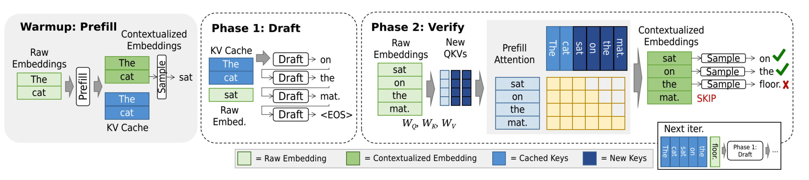

# **2.2 Operators**

## **Inference Operator Design: Performance vs. Accuracy**

Large Language Model (LLM) inference is dominated by three key operators: **Attention**, **Feed-Forward Networks (FFN)**, and **Token Sampling**. Improving performance while preserving accuracy motivates specialized variants of these operators.

### **1. Attention Operators**

#### Standard Multi-Head Attention (MHA)

Given input $X \in \mathbb{R}^{n \times d}$ with sequence length $n$ and hidden dimension $d$, each head applies:

$Q = XW_Q, \quad K = XW_K, \quad V = XW_V$

Attention weights per head:

$A = \mathrm{softmax}\left(\frac{QK^\top}{\sqrt{d\_k}}\right)V$

where $d_k = d / h$, $h$ is the number of heads.

**Cost**:

* Memory: $O(n^2)$ for storing $QK^\top$
* Compute: $O(h \cdot n^2 \cdot d_k) = O(n^2 d)$

This quadratic cost dominates long-sequence inference.

#### Multi-Query Attention (MQA) / Grouped-Query Attention (GQA)

MQA: all heads **share $K, V$**.

GQA: groups of heads share $K, V$.

* Compute: still $O(n^2 d)$
* Memory: reduced from $O(hn^2)$ to $O(g n^2)$, where $g \ll h$.

This reduces **KV cache size** in autoregressive decoding:

* MHA KV cache: $O(h \cdot n \cdot d_k)$

* MQA KV cache: $O(n \cdot d_k)$

#### Sparse Attention

Restrict each token to attend to $O(\log n)$ or $O(\sqrt{n})$ neighbors instead of $O(n)$.

* Compute: $O(n \cdot k \cdot d)$ where $k \ll n$.
* Improves latency but risks lower accuracy if the sparsity pattern misses dependencies.

#### Shared Attention

Reuses cached attention outputs across multiple requests (batching for similarity).

* Effective for **retrieval-augmented generation** and multi-user systems.
* Lowers memory pressure by amortizing KV storage.

### **2. Feed-Forward Networks (FFN)**

Standard FFN in Transformers:

$\mathrm{FFN}(x) = \sigma(x W_1 + b_1)W_2 + b_2$

* Compute per token: $O(d^2)$
* Memory: $O(d^2)$ for weights

#### Mixture-of-Experts (MoE)

Split FFN into $E$ experts, each smaller. A router selects $k \ll E$ experts per token.

$\mathrm{MoE}(x) = \sum_{i \in \mathcal{S}(x)} g_i(x) f_i(x)$

where $\mathcal{S}(x)$ is the selected set of experts, $g_i(x)$ is gating weight.

* Compute per token: $O(k d^2)$
* Model capacity grows $\sim E d^2$, but per-token compute remains bounded.

**Trade-off**:

* Higher accuracy due to larger model capacity.
* Latency reduced since only a fraction of experts are active.

### **3. Token Sampling Operators**

At inference, logits $z_t$ yield probability distribution:

$p(y_t \mid y_{<t}) = \mathrm{softmax}(z_t)$

#### Stochastic Sampling

* **Top-k**: sample from $k$ most probable tokens.
* **Nucleus (top-p)**: sample from smallest set $\mathcal{V}*p$ such that $\sum*{i \in \mathcal{V}_p} p_i \geq p$.

Improves diversity → higher subjective accuracy for creative tasks.

#### Speculative Decoding

Use a small **draft model** $M_d$ to propose $m$ tokens $\hat{y}_{t+1\:t+m}$, then validate in parallel with large model $M$.

If accepted, throughput improves by factor $\approx m$.

### **System Design Implications**

* **Latency**:

  * Attention dominates *time-to-first-token (TTFT)*.
  * KV cache size affects *time-between-tokens (TBT)*.
  * MoE reduces per-token FFN cost.
  * Speculative decoding reduces end-to-end request latency.

* **Accuracy**:

  * MHA > MQA/GQA > sparse/shared (accuracy trade-off).
  * MoE improves accuracy (capacity scaling).
  * Sampling methods (nucleus, top-k) improve human-perceived output quality.

### **Complexity & Memory Summary**

| Operator             | Compute Complexity | Memory                                    | Accuracy Trade-off              |
| -------------------- | ------------------ | ----------------------------------------- | ------------------------------- |
| MHA                  | $O(n^2 d)$         | $O(h \cdot n \cdot d_k)$                              | High accuracy                   |
| MQA/GQA              | $O(n^2 d)$         | $O(g \cdot n \cdot d_k)$                              | Slightly lower accuracy         |
| Sparse Attn          | $O(n k d)$         | $O(n \cdot k)$                                  | Risk of missing dependencies    |
| MoE-FFN              | $O(k d^2)$         | $O(E d^2)$ weights, $O(k d^2)$ active     | Higher accuracy                 |
| Speculative Decoding | $\sim O(n d)$      | Dual models                               | Accuracy depends on draft model |

Operator innovations directly target bottlenecks (attention = quadratic scaling, FFN = compute-heavy, sampling = sequential bottleneck). System design balances **latency, throughput, and quality** via these specialized techniques.

---

## **2.2.1 Attention Operator and Delta Vector**

The **attention operator** computes a *delta vector* $u_i$ for each token $x_i$, updating its embedding so that it is contextualized by prior tokens:

$$
x_i \;\;\leftarrow\;\; x_i + u_i
$$

where $u_i$ captures contextual semantics from the sequence history.

### **Delta Vector Definition**

For token embedding $x_i \in \mathbb{R}^d$, the query is:

$$
q_i^\top = x_i^\top W_q, \quad W_q \in \mathbb{R}^{d \times d_k}
$$

The **delta vector** is:

$$
u_i = \mathrm{softmax}\!\left(\frac{q_i^\top K^\top}{\sqrt{d_k}}\right)V
$$

where:

* $K = [k_1; \dots; k_{i-1}]$, $k_j^\top = x_j^\top W_k$ (keys)
* $V = [v_1; \dots; v_{i-1}]$, $v_j^\top = x_j^\top W_v$ (values)

Thus, $u_i$ is a weighted combination of past value vectors, with weights determined by **attention scores** $q_i^\top k_j$.

### **KV Cache Dynamics**

During autoregressive decoding:

* At each new token $x_i$, its projections $(k_i, v_i)$ are appended:

$$
K \leftarrow [K; k_i], \quad V \leftarrow [V; v_i]
$$

* These grow **linearly with sequence length $n$**.

* **Memory cost**: $O(n d_k)$ for keys + $O(n d_v)$ for values, per layer.

* Over $L$ layers: $O(L \cdot n \cdot d)$.

This is the **KV cache**, persisting across the request. It enables reuse of past context but introduces rising memory + compute cost.

### **Prefill vs. Decode Phases**

* **Prefill phase (prompt processing):**
  Entire prompt embeddings $[x_1, \dots, x_m]$ are processed at once.

  * Matrix form:

$$
U = \mathrm{softmax}\!\left(\frac{QK^\top}{\sqrt{d_k}}\right)V
$$

where 
* $Q = X W_q$, 
* $K = X W_k$, 
* $V = X W_v$, with $X \in \mathbb{R}^{m \times d}$.

  * Cost: $O(m^2 d)$ compute, $O(m d)$ memory.

* **Decode phase (generation):**
  Each new token $x_i$ uses existing $K, V$ to compute its $u_i$.

  * Per-token cost: $O(n d)$.
  * Over sequence length $n$: $O(n^2 d)$ compute.

### **System-Level Implications**

* **Time-to-First-Token (TTFT):** dominated by **prefill cost** ($O(m^2 d)$).
* **Time-Between-Tokens (TBT):** dominated by **decode per-token attention** ($O(n d)$, but accumulates as $n$ grows).
* **KV Cache Growth:** memory cost grows linearly with sequence length; batching across requests multiplies this.
* **Scalability Pressure:** motivates optimizations like Multi-Query Attention (MQA), Grouped-Query Attention (GQA), and Sparse Attention.

### **Summary of Costs**

| Phase    | Compute Cost                            | Memory Cost          | Bottleneck       |
| -------- | --------------------------------------- | -------------------- | ---------------- |
| Prefill  | $O(m^2 d)$                              | $O(m d)$             | Latency (TTFT)   |
| Decode   | $O(n d)$ per step, $O(n^2 d)$ total     | $O(n d)$ per layer   | Throughput (TBT) |
| KV Cache | —                                       | $O(L n d)$           | Memory scaling   |

The **delta vector $u_i$ is the fundamental unit of contextualization** in attention. Its recursive accumulation across tokens is what gives LLMs sequence memory, but also drives quadratic compute and linear memory scaling—core system bottlenecks.

---

### **Prefill and Batching in Transformer Inference**

#### **1. Prefill Phase**

For a prompt of $m$ tokens, embeddings are stacked into:

$$
X \in \mathbb{R}^{m \times d}
$$

Each projection is computed in matrix form:

$$
Q = X W_q, \quad K = X W_k, \quad V = X W_v
$$

where $W_q, W_k, W_v \in \mathbb{R}^{d \times d_k}$ (or $d \times d_v$ for $V$).

The update vectors are then:

$$
U = \mathrm{softmax}\!\left(\frac{Q K^\top}{\sqrt{d_k}}\right) V \tag{2}
$$

with **row-wise softmax** ensuring each token attends to all others in the prompt.

The contextualized embeddings are:

$$
X \;\leftarrow\; X + U
$$

#### **Complexity**

* **Compute cost:** $O(m^2 d)$ due to $QK^\top$.
* **Memory cost:** $O(m d)$ for activations + $O(m^2)$ for the attention matrix.
* **Parallelism:** Equation (2) processes *all tokens simultaneously*, mapping well to GPU batch-matrix-multiplication kernels.

#### **2. Comparison to Per-Token Attention**

* **Naïve approach:** process each token $x_i$ individually, $O(m^2 d)$ total but with *serial execution*.
* **Matrix form (Eq. 2):** same asymptotic cost, but executed as *one batched operation*.
* **Result:** drastically better GPU utilization, lowering *time-to-first-token (TTFT)*.

#### **3. Request Batching**

The same matrix trick generalizes across *multiple requests*.
Suppose we have $B$ independent requests, each with prompt length $m_b$. Concatenate all embeddings into:

$$
X = \begin{bmatrix} X^{(1)} \\ X^{(2)} \\ \dots \\ X^{(B)} \end{bmatrix}
$$

Then apply:

$$
Q = X W_q, \quad K = X W_k, \quad V = X W_v
$$

and compute updates blockwise:

$$
U = \mathrm{softmax}\!\left(\frac{Q K^\top}{\sqrt{d_k}} \right)V
$$

with masking to ensure each request attends *only within itself*.

This **batched prefill**:

* amortizes GPU kernel launches,
* increases throughput (requests/sec),
* reduces per-request latency,
* forms the basis of systems like **vLLM** and **speculative decoding**.

#### **4. System-Level Implications**

| Mechanism           | Benefit                                            | Cost/Constraint                 |
| ------------------- | -------------------------------------------------- | ------------------------------- |
| **Prefill (Eq. 2)** | Parallel contextualization of prompt, reduces TTFT | Quadratic in $m$              |
| **Decode**  | Per-token incremental update, enables streaming    | Linear in $n$ (per step)      |
| **Batching**        | Increases throughput, enables speculative decoding | Memory growth (larger KV cache) |

**Insight:** Prefill + batching **trade memory for speed**. Prefill accelerates contextualization of prompts (lower TTFT), while batching extends the same efficiency across requests (higher goodput). Both are fundamental to system design, since GPU/TPU efficiency hinges more on **parallelism** than raw FLOP count.

---

### **Attention Variants**

Long prompts ($m \gg 10^3$) or long-running requests (large $n$ decode rounds) cause the **KV cache** to grow significantly:

* **Memory cost:**
$\mathrm{Mem}_{KV} = O(m d_k + m d_v)$

* **Compute cost per token:**
$\mathrm{Cost}_{\mathrm{attn}} = O(m d_k)$

Thus, for $m$ in the tens or hundreds of thousands, both latency and GPU memory pressure become dominant. Various **attention variants** are designed to mitigate this.

#### **1. Multi-Head Attention (MHA)**

* **Definition:** Split projection matrices $W_q, W_k, W_v$ into $h$ smaller matrices (heads).
* **Per-head update:**

$$
U^{(h)} = \mathrm{softmax}\!\left(\frac{Q^{(h)} {K^{(h)}}^\top}{\sqrt{d_k/h}}\right)V^{(h)}
$$

* **Final aggregation:**
$U = \mathrm{Concat}(U^{(1)}, \dots, U^{(h)})W_o$

**Trade-offs:**

* Improves **representation quality** (different heads capture different relations).
* Increases **latency** and memory footprint (more projections).

#### **2. Grouped Query Attention (GQA)**

* **Key idea:** Queries remain separate, but multiple heads share the same $K, V$.
* **Memory savings:**
  $\mathrm{Mem}_{KV}^{\mathrm{GQA}} \approx \frac{1}{g}\mathrm{Mem}_{KV}^{\mathrm{MHA}}$
  where $g$ is the grouping factor.

**System effect:** Reduces both **memory** and **bandwidth costs**, while maintaining some diversity across queries.

#### **3. Multi-Query Attention (MQA)**

* **Extreme case of GQA:** All heads share a **single** $K, V$.
* **Memory savings:**
  $\mathrm{Mem}_{KV}^{\mathrm{MQA}} \approx \frac{1}{h}\mathrm{Mem}_{KV}^{\mathrm{MHA}}$

**Trade-offs:**

* Lowest memory usage.
* Slight drop in accuracy compared to MHA.
* Favored in large-scale serving (used in PaLM, LLaMA 2).

#### **4. Sparse Attention**

* Instead of attending to all past tokens, restrict attention to a subset $\mathcal{S}(i) \subseteq {1,\dots,i-1}$.
* **Cost reduction:**
  $\mathrm{Cost}_{\mathrm{sparse}} = O(|\mathcal{S}(i)| d_k) \ll O(i d_k)$

**Masking strategies:**

* Static (e.g., local windows, strided).
* Dynamic (e.g., top-$k$ similarity, k-NN search).

**System benefit:** Scales to **very long contexts** without quadratic blow-up.

#### **5. Shared Attention**

* Compute attention pattern for some shared tokens once (e.g., system prompt, beam search).
* Reuse across multiple requests.

**System savings:**

* Compute reduced by factor of number of shared consumers.
* Memory reduced since shared KV cache is stored once.

#### **Comparison of Variants**

| Variant    | Latency | Memory | Accuracy | Use Case                           |
| ---------- | ------- | ------ | -------- | ---------------------------------- |
| **MHA**    | ↑       | ↑      | ↑↑       | General-purpose, high accuracy     |
| **GQA**    | ↓       | ↓      | \~       | Balanced serving, moderate scale   |
| **MQA**    | ↓↓      | ↓↓     | ↓        | Large-scale serving, long contexts |
| **Sparse** | ↓       | ↓      | ↓        | Very long sequences                |
| **Shared** | ↓       | ↓      | \~       | Multi-request reuse                |

---

### **2.2.2 Feed-Forward Network (FFN) in Transformers**

1. **Input:**

   * You start with a token embedding $x_i \in \mathbb{R}^d$, which is the hidden state for the $i$-th token.

2. **First Linear Transformation:**

$$
f_1(x_i) = x_i^\top W_1 + b_1
$$

* Here, $W_1 \in \mathbb{R}^{d \times d_{ff}}$ and $b_1 \in \mathbb{R}^{d_{ff}}$.
* This expands the embedding into a higher-dimensional "feed-forward" space (usually $d_{ff} \gg d$).

1. **Non-linear Activation:**

$$
g(h) = \max(0, h)
$$

* This is the **ReLU** function applied elementwise.
* It introduces non-linearity so the FFN can learn more expressive mappings.

1. **Second Linear Transformation:**

$$
f_2(h) = h^\top W_2 + b_2
$$

* Here, $W_2 \in \mathbb{R}^{d_{ff} \times d}$ and $b_2 \in \mathbb{R}^d$.
* This projects the representation back to the original model dimension $d$.

1. **Final FFN Equation:**
   Substituting everything in:

$$
\mathrm{FFN}(x_i) = \max(0, x_i^\top W_1 + b_1)^\top W_2 + b_2
$$

#### **Costs**

* **Compute & Memory:**

  * Determined by the size of parameters: $W_1, b_1, W_2, b_2$.
  * Independent of sequence length (unlike attention, where cost grows with the KV cache size).

#### **Summary of FFN**

* The FFN is basically a **two-layer MLP with ReLU** inside each Transformer block.
* Its role: transform each token embedding **independently** (no cross-token interaction like attention).
* Complexity:

  * Parameters = $d \times d_{ff} + d_{ff} \times d$.
  * Costs scale with $d_{ff}$, but remain constant across input length.

---

### **Mixture-of-Experts (MoE)**

#### **1. Standard FFN Recap**

From earlier, a standard feed-forward block is:

$$
\mathrm{FFN}(x_i) = \max(0, x_i^\top W_1 + b_1) W_2 + b_2
$$

* Every token goes through the **same dense FFN**.
* Cost: proportional to hidden dimension size, independent of sequence length.

#### **2. MoE Formulation**

In MoE, instead of a single FFN, we define **$E$ experts**:

$$
\mathcal{E} = \{ \mathrm{FFN}_1, \mathrm{FFN}_2, \dots, \mathrm{FFN}_E \}
$$

Each expert is smaller than the original FFN, i.e.:

$$
\mathrm{FFN}_j(x) = g(x^\top W_{1,j} + b_{1,j}) W_{2,j} + b_{2,j}
$$

#### **3. Gating Mechanism**

A **gate function** $G(x)$ selects which experts to activate for input $x$.

* **Soft gating (mixture):**

$$
y = \sum_{j=1}^{E} p_j(x)\, \mathrm{FFN}_j(x), 
\quad p_j(x) = \frac{\exp(x^\top W_{g,j})}{\sum_{k=1}^{E} \exp(x^\top W_{g,k})}
$$

* **Top-$k$ gating (practical):**

Only the top $k \ll E$ experts (highest scores) are activated per token, giving:

$$
y = \sum_{j \in \mathrm{TopK}(x)} p_j(x)\, \mathrm{FFN}_j(x)
$$

with sparse dispatch.

#### **4. Compute & Memory Trade-offs**

* **Dense FFN cost:**
  $O(d_\text{model} \cdot d_\text{ff})$

* **MoE (Top-$k$) cost:**
  $O(k \cdot d_\text{model} \cdot d_\text{ff}/E)$
  → much lower, since only $k$ experts are active.

* **Memory:** Must hold parameters for **all experts**.

* **Compute:** Only a few are actually used per token → efficiency gain.

#### **5. System Design Considerations**

* **Expert placement (distributed):** Experts may be sharded across GPUs/nodes. Efficient routing is required.
* **Load balancing:** Without balancing, some experts may be overloaded while others are idle.

  * Auxiliary loss terms (e.g., load-balancing loss) are added to encourage uniform expert usage.
* **Hardware efficiency:** Requires **fast dynamic routing** of tokens → e.g., using custom kernels (DeepSpeed, GShard, Switch Transformers).

#### **6. Summary Trade-offs**

| Property          | Dense FFN                           | MoE (Top-$k$)                                        |
| ----------------- | ----------------------------------- | ------------------------------------------------------ |
| Parameters        | $O(d_\text{model} d_\text{ff})$   | $O(E d_\text{model} d_\text{ff}/E)$ (larger total)   |
| Compute per token | Full FFN                            | Only $k$ experts (cheaper)                             |
| Memory            | Moderate                            | High (all experts stored)                              |
| Flexibility       | Low                                 | High (specialized experts)                             |
| Engineering cost  | Low                                 | High (routing, balance, placement)                     |

So, MoE replaces **one giant universal FFN** with a **bank of specialized small FFNs** + a **gating function**.

* **Training:** encourages specialization.
* **Inference:** activates only a few experts → **substantial compute reduction**.
* **Challenge:** routing & balancing in distributed systems.

---

### **2.2.3 Token Sampling**

#### **1. Probability Distribution over Tokens**

Given contextualized embedding $x_i \in \mathbb{R}^d$, the **token sampler** projects it into the vocabulary space using:

$$
z = x_i^\top W_b + b_b
$$

where $W_b \in \mathbb{R}^{d \times |\mathcal{V}|}$, $b_b \in \mathbb{R}^{|\mathcal{V}|}$.

The probability distribution over tokens is:

$$
p = \mathrm{softmax}(z), \quad 
p_j = \frac{\exp(z_j)}{\sum_{k=1}^{|\mathcal{V}|} \exp(z_k)}
$$

* $|\mathcal{V}|$: vocabulary size (e.g., 30k–200k).
* $p \in \mathbb{R}^{|\mathcal{V}|}$: categorical distribution used to pick the next token.

#### **2. Sampling Strategies**

1. **Greedy sampling**
$\hat{t}_i = \arg\max_j p_j$

   * Lowest latency.
   * Produces deterministic but repetitive text.

2. **Probabilistic sampling**
$\hat{t}_i \sim \mathrm{Categorical}(p)$

   * Increases diversity.
   * Risk: low-quality or incoherent tokens.

3. **Top-$k$ sampling**
   Restrict to $k$ largest probabilities:

$$
\hat{t}_i \sim \mathrm{Categorical}(p_{[k]})
$$

   * Excludes improbable tokens.
   * Balances diversity and coherence.

4. **Nucleus (top-$p$) sampling**
   Restrict to smallest set $S$ such that:

$$
\sum_{j \in S} p_j \geq p_{\text{threshold}}
$$

   * Dynamic, adapts to distribution shape.
   * More natural outputs vs fixed \$k\$.

#### **3. Computational Complexity**

* **Projection (logits):**
$O(d \cdot |\mathcal{V}|)$ — dominates cost when vocabulary is very large.

* **Softmax:**
$O(|\mathcal{V}|)$ — requires reduction across entire vocab.

* **Memory:** logits $z$ and distribution $p$ are both $O(|\mathcal{V}|)$.

Unlike **attention** (whose cost grows with context length), **sampling cost is fixed per token**, but grows linearly with vocabulary size.

#### **4. Speculative Decoding**

To improve **token throughput**, speculative decoding amortizes cost by using a **draft model**:

1. **Drafting:**
   Generate $b$ candidate tokens $\hat{x}*{i+1}, \dots, \hat{x}*{i+b}$ with a small LM.

2. **Verification:**
   Run main model in parallel $b+1$ times:

$$
x_{i+j} = \mathrm{LLM}(x_1, \dots, x_i, \hat{x}_{i+1}, \dots, \hat{x}_{i+j-1}), \quad 0 \leq j \leq b
$$

3. **Acceptance:**
   If $\hat{x}*{i+j} = x*{i+j}$ for all $j < J$, accept tokens up to $x_{i+J}$; otherwise, revert at mismatch.

4. **Optimization:**
   Step 2 can be collapsed into a **single prefill call**, computing all contextualized embeddings in parallel.

* **Expected speedup:** $\sim b \times$ tokens per step.
* **Overhead:** extra verification cost if draft predictions diverge.

#### **5. System-Level Trade-offs**

| Technique            | Latency | Diversity | Throughput | Notes                            |
| -------------------- | ------- | --------- | ---------- | -------------------------------- |
| Greedy               | ↓       | Very low  | High       | Fast but bland outputs           |
| Probabilistic        | ↑       | Medium    | Medium     | Simple, sometimes incoherent     |
| Top-$k$            | ↑       | Medium    | Medium     | Fixed control over randomness    |
| Nucleus (top-$p$)  | ↑       | High      | Medium     | Adaptive, best balance           |
| Speculative Decoding | ↓↓↓     | N/A       | High       | Draft + verify, parallel speedup |

Now, attention ($O(m^2 d)$), FFN ($O(d \cdot d_{ff})$), and token sampling ($O(d \cdot |\mathcal{V}|)$) all have clear **formula-driven complexity characterizations**.

---

