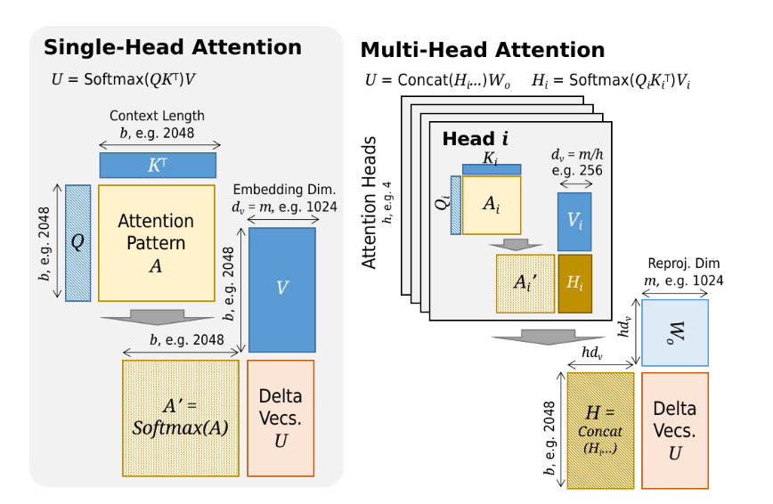

# **Single-Head vs. Multi-Head Attention in LLM Inference**

## **1. Single-Head Attention**

### Workflow

1. **Query, Key, Value projections:**

   * Input embeddings $X \in \mathbb{R}^{b \times m}$
   * Projected into:

$$
Q = XW_Q, \quad K = XW_K, \quad V = XW_V
$$

   * Dimensions:
     $Q, K, V \in \mathbb{R}^{b \times d_k}$ (with $d_k \approx m$)

2. **Attention pattern:**

$$
A = QK^\top \in \mathbb{R}^{b \times b}
$$

3. **Softmax + weighting:**

$$
A' = \mathrm{Softmax}(A), \quad U = A'V
$$

   * $U$ = **Delta vectors** (context-updated representations).

### Complexity

* **Compute:**

  * Attention matrix: $\mathcal{O}(b^2 d_k)$
  * Weighted sum: $\mathcal{O}(b^2 d_v)$
  * Total: $\mathcal{O}(b^2 m)$

* **Memory:**

  * Attention matrix: $\mathcal{O}(b^2)$
  * KV storage: $\mathcal{O}(bd_k + bd_v)$

## **2. Multi-Head Attention**

### Workflow

1. Split embedding dimension $m$ into $h$ heads:

$$
d_k = d_v = m / h
$$

2. For each head $i$:

$$
Q_i = XW_{Q_i}, \quad K_i = XW_{K_i}, \quad V_i = XW_{V_i}
$$

   Attention within head:

$$
H_i = \mathrm{Softmax}(Q_i K_i^\top) V_i
$$

3. Concatenate results:

$$
U = \mathrm{Concat}(H_1, \ldots, H_h) W_o
$$

   * $W_o \in \mathbb{R}^{m \times m}$ reprojects concatenated vectors.

### Complexity

* **Per head:** $\mathcal{O}(b^2 \cdot m/h)$
* **All heads:** $\mathcal{O}(h \cdot b^2 \cdot m/h) = \mathcal{O}(b^2 m)$

→ Same asymptotic cost as single-head, but distributed across multiple subspaces.

* **Memory:**

  * $h$ attention patterns: $\mathcal{O}(h \cdot b^2)$
  * Still dominated by quadratic scaling.

## **3. System Design Implications**

* **Single-head attention:**

  * Cheaper memory footprint, but limited expressivity.
  * Each query only attends in one projection subspace.

* **Multi-head attention:**

  * Improves model quality by enabling **multi-subspace attention patterns**.
  * System-level tradeoff: more memory for parallel heads, but same compute scaling.
  * Larger KV cache size: $\mathcal{O}(h \cdot b \cdot d_k)$.

## **4. Summary Table**

| Feature         | Single-Head Attention              | Multi-Head Attention               |
| --------------- | ---------------------------------- | ---------------------------------- |
| Attention space | Single subspace ($d_k \sim m$)     | $h$ subspaces ($d_k = m/h$)   |
| Output          | $U = \mathrm{Softmax}(QK^\top)V$   | $U = \mathrm{Concat}(H_i) W_o$ |
| Complexity      | $mathcal{O}(b^2 m)$                | $mathcal{O}(b^2 m)$             |
| Memory cost     | $mathcal{O}(b^2)$ + KV storage     | $mathcal{O}(h b^2)$ + larger KV |
| Expressivity    | Limited                            | Higher (diverse attention views)   |
| System impact   | More efficient, lower quality      | Better quality, higher memory      |

**both have quadratic complexity**, but multi-head attention improves **representation power** at the cost of **increased memory pressure**, which has direct implications for KV cache scaling and inference system design.

---

