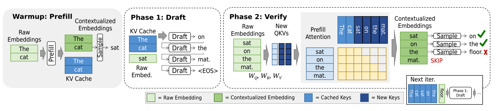

## **High-Level Concept**

Speculative Decoding is an advanced technique to accelerate the text generation of large language models (LLMs). The core idea is to use a small, fast "draft model" to guess a short sequence of future tokens. Then, a large, powerful "target model" verifies all these guesses in a single, parallel step. If the guesses are correct, you get multiple tokens for the cost of slightly more than one generation step. This significantly reduces latency.

The image illustrates one full iteration of this process. Let's break it down phase by phase.

### **Phase 1: Prefill (The Warmup)**

This is the starting point, common to all autoregressive models.

1.  **Input:** We begin with a prompt or context, which is "The cat".

2.  **Contextualized Embeddings:** The model processes this input, converting each token into a high-dimensional representation that contains contextual information (i.e., the embedding for "cat" is influenced by the presence of "The").

3.  **KV Cache (Key-Value Cache):** To generate tokens efficiently, Transformer models cache the "Key" and "Value" vectors for all previous tokens. This avoids recomputing them for every new generation step. At the start of this cycle, the KV Cache contains the keys and values for the tokens "The" and "cat".

**State at end of Prefill:** The model is ready to generate the next token, with a full understanding of the context "The cat".

### **Phase 2: Draft Generation (The Fast Guess)**

This phase uses a small, less accurate, but much faster model.

1.  **Draft Model Input:** The draft model uses the existing **KV Cache** (from "The cat") to generate tokens autoregressively, but very quickly.

2.  **Autoregressive Drafting:** The draft model generates a short sequence of tokens one after the other:
    *   It takes "The cat" and predicts "sat".
    *   It then takes "The cat sat" and predicts "on".
    *   It continues this process, generating the draft sequence: **"sat on the mat."**

3.  **Output:** The draft sequence is **"sat on the mat."** This is a speculative guess for the next few tokens. It's fast but may be incorrect.

### **Phase 3: Verification (The Quality Check)**

This is the most critical phase, performed by the large, target model.

1.  **Raw Embeddings:** The target model takes the entire sequence to be verified—the original context plus the draft tokens: **"The cat sat on the mat."**

2.  **Parallel Forward Pass (Prefill Attention):** Instead of generating tokens one-by-one, the model processes this entire sequence in a **single, parallel forward pass**. This is the same efficient computation used in the initial "prefill" phase.

3.  **Generate New OKVs:** During this pass, the model computes new Key and Value vectors (**New OKVs**) for the draft tokens. More importantly, it calculates the probability distributions for each token *given the correct previous context*.

4.  **Verification Logic:** The model compares its own predictions against the draft tokens:
    *   For the first position, it checks: "Given 'The cat', what is the most likely next token?" If its own prediction matches "sat", the draft token is **accepted**.
    *   It moves to the next position: "Given 'The cat sat', what is the next token?" If it matches "on", accept.
    *   This continues sequentially.

5.  **The Result (The "Skip"):**
    *   The image shows that the tokens **"sat on the"** are accepted because they match the target model's predictions.
    *   However, at the position after "The cat sat on the", the target model's most likely token is **"floor"**, not the draft model's guess of **"mat"**.
    *   The verification process **halts** at the first mismatch. The correct tokens ("sat on the") are appended to the output, and the incorrect token ("mat") is discarded.

### **What Happens Next ("Next Iter")**

The process immediately repeats from the point where it left off.

1.  **New Context:** The accepted sequence is now "The cat sat on the".

2.  **Updated Cache:** The **KV Cache** is updated with the correct, verified tokens ("sat on the"). There is no need to recompute them.

3.  **New Starting Point:** The model now needs to generate the token that comes after "the". The Raw Embedding and Contextualized Embedding for this new starting point are the same.

4.  **Repeat:** The draft model now takes over from this new point ("...the") and generates a new short speculative sequence (e.g., it might guess "floor and"), which will then be verified by the target model in parallel.

### **Summary of Benefits**

*   **Speed:** The target model generates 3 tokens ("sat on the") in roughly the same time it would normally take to generate 1 token. The "cost" is one fast draft step and one parallel verification step.

*   **Identical Output:** The final output is **provably identical** to what the large target model would have generated on its own. The draft model only speeds up the process; it does not alter the quality of the final result.