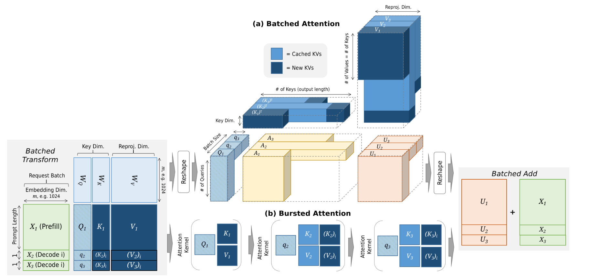
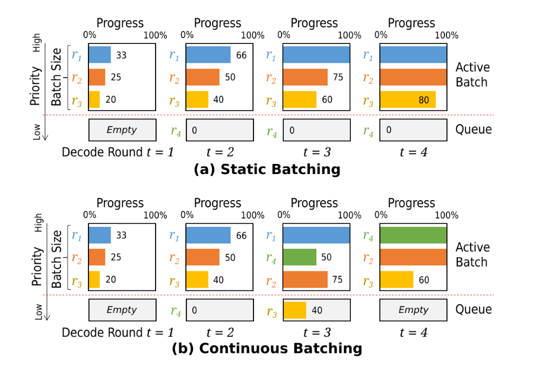

# **3.2 Batching**

### **Why Batching Matters**

* GPUs excel at large, parallel workloads.

* Serving requests one-by-one leads to **poor utilization**, especially when requests have varying sequence lengths.

* Batching groups requests together so that operations (matrix multiplications, attention, etc.) can be executed more efficiently.

### **Batching Challenges**

1. **Ragged inputs**:

   * Requests have different prompt lengths or KV cache sizes.
   * Leads to **sparse matrices** → underutilized GPU cores.
   * Two approaches:

     * **Keep batching**: wastes compute on padded tokens.
     * **Burst batching**: run separate kernels for each request (less efficient, more kernel launches).

2. **Stragglers**:

   * In static batching, one slow/long request holds up the entire batch.

3. **Memory oversubscription**:

   * KV cache grows with every decoding step.
   * If batch size is too large, GPU memory can be exceeded mid-inference.

### **Batching Strategies**

1. **Static Batching**

   * All requests in a batch are executed until completion.
   * Simple, but suffers from stragglers and memory growth issues.

2. **Dynamic Batching**

   * Batch is **reformed after every decoding step**.
   * Benefits:

     * Finished requests immediately release KV cache memory.
     * New requests can join the next batch.
     * Reduces straggler effect.

   **Variants:**

   * **Continuous batching**: reshuffle after each decoding round.
   * **Chunked prefill**: break long prompts into smaller chunks, process them in stages (avoids giant prefill bottlenecks).

### **Batch Size Control**

* **Static batching**: batch size is bounded by maximum memory across all decoding steps.

* **Dynamic batching**: larger batches possible since memory is reclaimed at every round.

* Trade-off:

  * **Large batch** = high throughput, risk of eviction/preemption.
  * **Small batch** = low GPU utilization.

* Systems often pick batch sizes via **offline profiling** or **token budget caps**.

In practice, modern LLM serving systems almost always use **dynamic batching + chunked prefills**, since they provide:

* High GPU utilization,
* Fairness across requests,
* Better memory safety.

---

