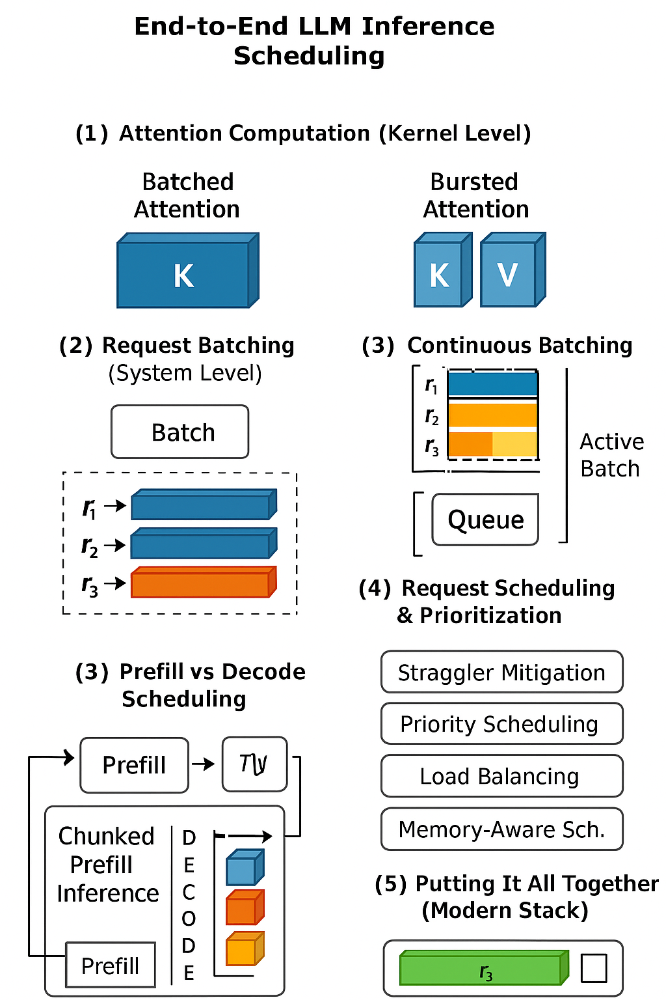

# **End-to-End LLM Inference Scheduling**

## **1. Attention Computation (Kernel Level)**

At the lowest level, LLMs rely on **attention kernels** to process tokens. There are two main ways to structure these kernels:

* **Batched Attention**

  * A single large kernel processes multiple requests together.
  * Efficient when sequence lengths are uniform.
  * Problems: real-world requests have variable lengths → padding waste, ragged batch inefficiency.

* **Bursted Attention (Paged/Blockwise)**

  * Attention is computed in smaller **chunks (pages/blocks)**.
  * Allows mixing requests with different sequence lengths without wasting compute.
  * Enables dynamic scheduling (different requests can join/leave efficiently).
  * Key innovation: **Paged Attention** in systems like vLLM, reducing fragmentation and memory overhead.

## **2. Request Batching (System Level)**

Once kernels are efficient, the next challenge is **how to feed multiple requests to the GPU**:

* **Static Batching**

  * A batch of requests is fixed at the start.
  * Entire batch runs until all finish.
  * Inefficient due to **stragglers** and **latency bottlenecks**.

* **Continuous Batching**

  * After every decode round, the batch is **reformed dynamically**.
  * Finished requests are evicted, queued requests can join immediately.
  * Combined with bursted attention → avoids padding waste and enables higher GPU utilization.
  * Today’s standard in production LLM serving.

## **3. Prefill vs Decode Scheduling**

LLM inference has two phases per request:

1. **Prefill (prompt ingestion):** large, parallel compute-heavy stage.

2. **Decode (token-by-token generation):** iterative, smaller compute per step.

Challenges:

* Long prefill requests can **block decoding** for short, interactive requests.
* Memory cost grows with prefill length (KV cache explosion).

Solutions:

* **Chunked Prefill** → break long prompts into smaller pieces that can be interleaved with decoding.
* **Two-Queue Scheduling** → separate prefill queue and decode queue, ensuring interactive latency isn’t starved.
* Works best with continuous batching and bursted attention.

## **4. Request Scheduling & Prioritization**

Beyond batching, systems need **fair and efficient scheduling**:

* **Straggler mitigation** → drop or defer long requests if they block others.
* **Priority scheduling** → prioritize short interactive queries over long background ones.
* **Load balancing** → distribute requests across multiple GPUs/nodes.
* **Memory-aware scheduling** → predict KV cache cost; evict or spill if oversubscribed.

## **5. Putting It All Together (Modern Stack)**

A modern LLM inference engine (e.g., **vLLM, DeepSpeed-Inference, TensorRT-LLM**) integrates all the above:

1. **Bursted/Paged Attention** → efficient kernel execution with variable-length sequences.
2. **Continuous Batching** → dynamic batch formation across decode rounds.
3. **Chunked Prefill** → overlap long prompts with decoding traffic.
4. **Priority Scheduling** → prevent latency spikes for interactive requests.
5. **Speculative Decoding / CUDA Graphs** → additional throughput and launch efficiency.

**Big Picture:**

* **Kernel Level (Batched vs Bursted)** = how to run attention efficiently.
* **Batching Level (Static vs Continuous)** = how to group requests.
* **Scheduling Level (Prefill/Decode + Priorities)** = how to order and balance requests.
* Together, these advances make large-scale LLM serving feasible with low latency and high throughput.

---

