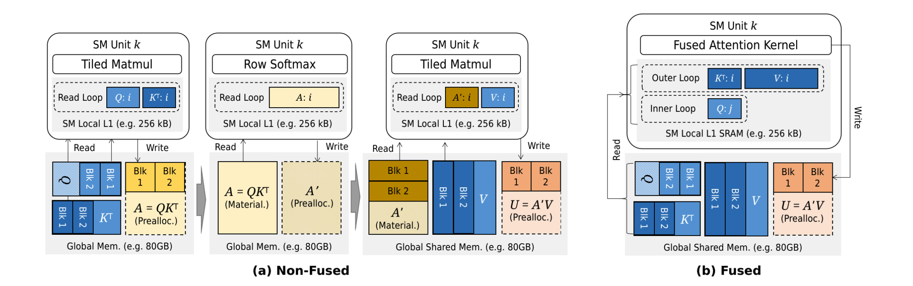
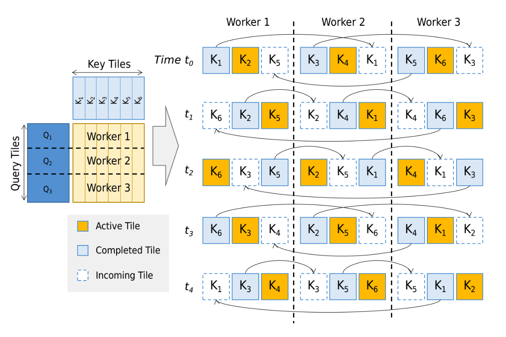

# **3.1 Kernels**

The efficiency of LLM inference is heavily shaped by **kernel design**, since most of the runtime cost comes not just from the mathematical complexity of operators but also from **system-level overheads** such as memory access and GPU kernel invocations.

### **1. Physical Operator Costs**

* **I/O costs**:

  * Arise from reading/writing intermediate tensors during execution.
  * Especially heavy in **attention** and **feed-forward networks (FFN)** where activation matrices are large.
* **Invocation costs**:

  * Each GPU kernel launch incurs overhead.
  * If an operator requires multiple sequential kernels (e.g., separate matmul, softmax, scaling), these add up.

### **2. Kernel Fusion**

* **Idea**: Combine multiple sequential GPU operations into a **single fused kernel**.
* **Benefits**:

  * Avoids writing intermediate results to memory (reduces I/O).
  * Reduces kernel launch overhead (fewer invocations).
* Example: Fuse **linear projection → scaling → softmax → matmul** in attention into one pass.

### **3. Specialized Optimizations**

* **Tiled Matrix Multiplication**:

  * Breaks large matrix multiplies into **tiles** that fit into on-chip GPU memory (shared memory, registers).
  * Minimizes global memory bandwidth usage.

* **Online Softmax**:

  * Computes $\mathrm{softmax}$ in a streaming fashion without materializing the full intermediate $QK^\top$.
  * Reduces memory footprint from $O(m^2)$ to $O(m)$ in attention.

### **4. Blockwise and Distributed Kernels**

* **Blockwise Attention Kernels**:

  * Partition the attention computation into **blocks**.
  * Each block fits in fast memory → improves GPU utilization.
  * Example: **FlashAttention** achieves near-optimal memory usage.

* **Distributed Attention Kernels**:

  * Partition attention across **multiple GPUs**.
  * Useful when a single GPU’s memory cannot hold the KV cache for very long sequences.

### **5. Beyond Attention**

* Techniques originally developed for attention are being applied to other parts of the model:

  * **FFN kernels**: Optimized for large dense matmuls in MLP layers.
  * **Non-matrix operators**: LayerNorm, activation functions (ReLU, GELU) also benefit from fusion and tiling.

### **Computational Complexity & Cost**

For attention:

$$
U = \mathrm{softmax}\!\left(\frac{Q K^\top}{\sqrt{d_k}}\right)V
$$

* **Naïve implementation cost**:

  * Compute: $O(m^2 d)$ (quadratic in sequence length $m$).
  * Memory: $O(m^2)$ for storing $QK^\top$.

* **Optimized kernels (e.g., FlashAttention)**:

  * Compute: still $O(m^2 d)$ in FLOPs.
  * Memory: reduced to $O(m d)$ by recomputing partial results instead of materializing $QK^\top$.

This shift—**reducing memory traffic rather than FLOPs**—is the main advantage of kernel-level optimizations.

**Takeaway:**
Kernel design in LLM inference is about **closing the gap between theoretical compute cost and practical runtime** by:

1. Reducing **I/O and invocation overheads** (fusion).
2. Exploiting **GPU memory hierarchy** (tiling, online softmax).
3. Scaling across **multiple GPUs** (distributed kernels).

---

## **3.1.1 Attention Kernels**

The **attention operator**:

$$
U = \mathrm{softmax}\!\left(\frac{QK^\top}{\sqrt{d_k}}\right) V
$$

is the most computationally and memory-intensive part of LLM inference. Optimizing it requires reducing **idle GPU cores**, **I/O overhead**, and **scaling beyond a single GPU**.

### **1. Challenges in Naïve Attention**

* **Low core utilization**: If scalar multiplications are unevenly assigned to GPU Streaming Multiprocessors (SMs), stragglers cause idle units.

* **High I/O cost**: Computing $QK^\top$ produces a large $m \times m$ intermediate matrix ($m =$ sequence length), which must be stored before applying $\mathrm{softmax}$.

* For long sequences, $O(m^2)$ memory usage is unsustainable.

### **2. Blockwise Attention Kernels**

Designed to improve GPU utilization and reduce memory overhead.

#### **a. Tiled Matrix Multiplication (Stream-K)**

* **Idea**: Break large matrix products into **cache-local tiles**.
* Each tile is streamed through GPU cores sequentially → prevents idle workers.
* Eliminates stragglers compared to:

  * **Round-robin assignment** (naive cycling across SMs).
  * **Fixed-split assignment** (assigning fixed blocks to cores).

But: still materializes full $QK^\top$ before softmax.

#### **b. Online Softmax**

* Computes $\mathrm{softmax}$ **incrementally** during streaming.
* Collects normalization terms on-the-fly.
* Removes the need to store full $QK^\top$.
* Memory reduced from $O(m^2)$ → $O(m d)$.

#### **c. Fused Attention Variants**

* **FlashAttention**: Combines tiled matmul + online softmax (round-robin scheduling).
* **FlashDecoding**: Uses fixed-split scheduling.
* **Lean Attention**, **FlashInfer**: Use **streaming assignment** (eliminates idle workers more effectively).

These fuse *matmul + scaling + softmax + weighted sum with V* into a single kernel.

#### **d. Extensions to Variants**

* **FlashMask**: Extends fused kernels to **masked attention**.
* **FlexAttention**: Compiles **custom fused kernels** for arbitrary attention masks automatically.
* Both achieve near-handcrafted performance while generalizing to diverse masking strategies.

### **3. Distributed Attention Kernels**

When context length (KV cache size) exceeds single GPU memory, attention must be **distributed across multiple GPUs**.

#### **a. Ring Attention**

* **Row-wise tiling of Q**: Each device processes a subset of queries.
* **Column-wise tiling of K**: Keys are partitioned and passed between devices.
* **Mechanism**:

  * Each device must process **all K tiles** to compute its query rows.
  * Devices exchange K tiles in a **ring topology** (decentralized, deterministic).
  * Overlaps **communication** with **tile processing** → minimizes latency.

This balances GPU workloads while handling very long sequences (tens/hundreds of thousands of tokens).

### **4. Complexity Trade-offs**

| Approach                        | Compute FLOPs | Memory                 | GPU Utilization         | Scaling    |
| ------------------------------- | ------------- | ---------------------- | ----------------------- | ---------- |
| Naïve Attention                 | $O(m^2 d)$    | $O(m^2)$               | Poor (stragglers)       | Single GPU |
| Tiled Matmul                    | $O(m^2 d)$    | $O(m^2)$               | Better (balanced cores) | Single GPU |
| Online Softmax + FlashAttention | $O(m^2 d)$    | $O(m d)$               | High                    | Single GPU |
| Ring Attention                  | $O(m^2 d)$    | $O(m d / p)$ per GPU   | High                    | Multi-GPU  |

($m$ = sequence length, $d$ = hidden dimension, $p$ = number of GPUs).

**Key Takeaway:**

* **Blockwise kernels (FlashAttention, etc.)** are the current standard for **single-GPU efficiency**, dramatically reducing memory usage.
* **Distributed kernels (Ring Attention)** enable scaling to ultra-long contexts by balancing KV cache across GPUs with overlapping compute + communication.

---

## **3.1.2 Other Kernels**

This section discusses optimization of **kernels** (low-level GPU compute units) used in Transformer models, focusing on **reducing kernel invocation overhead** and **avoiding materialization of intermediates**.

### Key Points:

1. **FFN Fusion**

   * In Transformer **Feed-Forward Networks (FFN)**, the functions $f_1$, $f_2$, and $g$ (typically linear transformations + activation) are **element-wise**.
   * Because they’re element-wise, they can be **pipelined into a single fused kernel**, avoiding separate memory loads/writes.
   * This fusion can even be extended to include **blockwise attention kernels**, giving **latency reductions**.

2. **LightSeq Optimizations**

   * LightSeq fuses multiple **non-GeMM (non-matrix multiplication) operations** into **single handcrafted kernels**.
   * Examples:

     * **Layer normalization**
     * **Tensor reshaping**
     * **Softmax**
     * **ReLU activation**
   * Result: **4× fewer kernel invocations per Transformer block** compared to standard vendor-provided kernels (e.g., cuBLAS, cuDNN).

3. **DeepSpeed-Inference with CUDA Graphs**

   * Instead of launching each kernel individually, **CUDA Graphs** allow launching **multiple kernels with a single invocation**.
   * This reduces **kernel launch overhead** and improves **latency/throughput**.

**Summary:**
The main strategy is **kernel fusion** — combining multiple sequential small ops into larger single kernels to reduce memory **I/O** and kernel launch costs. LightSeq takes a **handcrafted fusion** approach for non-matrix ops, while DeepSpeed-Inference uses **CUDA Graphs** to reduce launch overhead. Together, these methods significantly speed up inference by reducing per-block kernel calls.

---

