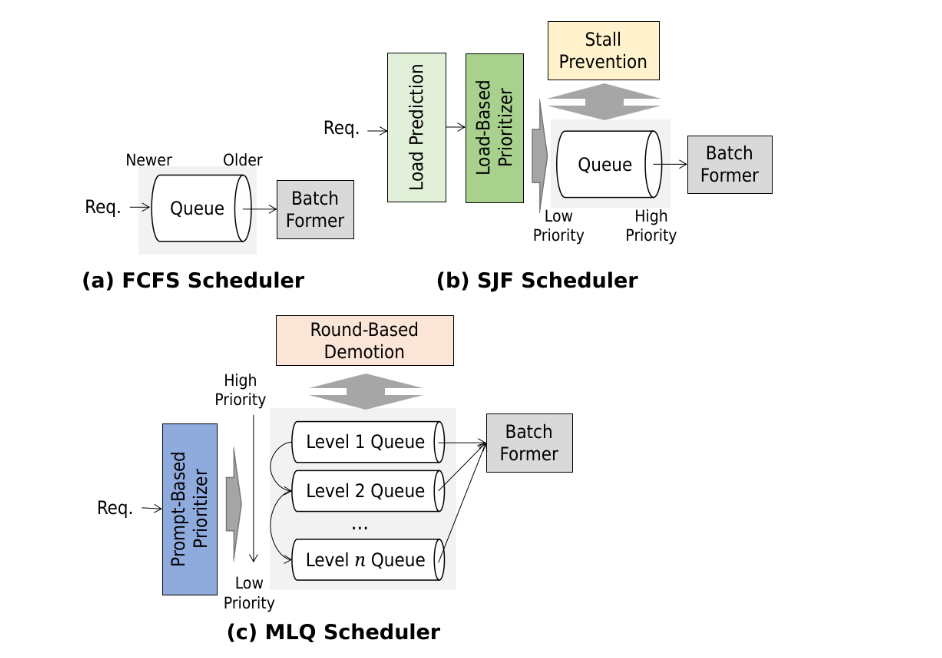

# **3.3 Scheduling**

### **1. Classical Scheduling Approaches**

* **First-Come First-Serve (FCFS):** Simple, fair, but sensitive to stragglers. Long requests can delay short ones.
* **Shortest-Job First (SJF):** Prioritizes short sequences, improving average latency but may starve long requests.
* **Multi-Level Queuing (MLQ):** Segregates jobs by priority or size buckets (e.g., short vs. long prompts).

These can be directly adapted for inference workloads but require adjustments due to memory dynamics.

### **2. Challenges in LLM Scheduling**

* **KV Cache Growth:** Each decoding step expands the cache size linearly with sequence length:

  * Memory cost per request after $t$ decoding steps:
    $M(t) \approx O(B \cdot H \cdot d_{head} \cdot t)$

    where 

    * $B$ = batch size, 
    * $H$ = number of heads, 
    * $d_{head}$ = head dimension.
* **Preemption Risk:** Interrupting a request risks losing its KV cache:

  * Recovery requires either recomputing the **prefill phase** (compute-heavy) or reloading KV from storage (I/O-heavy).
* **Latency Variability:** Unequal prompt lengths and unpredictable termination make naive scheduling inefficient.

### **3. Dynamic Scheduling Mechanisms**

* **Dynamic Promotion:** Elevates long-running or memory-hungry jobs to higher priority before they risk eviction.
* **Request Resumption Handling:** Systems implement recovery either through:

  * **Checkpointed KV Caches** (periodic saves).
  * **Externalized KV Storage** (swapping KV to CPU or remote memory).

### **4. Multi-Replica Load Balancing**

For systems running multiple inference replicas:

* **Greedy Least-Load Assignment:** Assigns new requests to the least-loaded replica.
* **Dynamic Rebalancing:** Migrates active requests if replicas become imbalanced.
* **Cache-Aware Balancing:** If replicas can share KV caches, scheduling prioritizes assignment where cache reuse is maximized.

### **5. Modern LLM Practices**

Current serving frameworks (vLLM, TensorRT-LLM, Orca, DeepSpeed-Inference):

* Use **continuous batching + dynamic scheduling** to minimize stragglers.
* Employ **cache-aware schedulers** to reduce recomputation overhead.
* Apply **priority queues** for latency-sensitive requests (e.g., chatbots vs. background jobs).
* Leverage **hybrid scheduling** (SJF + dynamic promotion) to balance throughput and fairness.

**System Design Takeaway:**
The choice of scheduling policy in LLM inference must account for **compute efficiency (avoiding idle cores)**, **memory growth (KV cache expansion)**, and **latency fairness (stragglers and priorities)**. Modern LLM systems increasingly adopt **dynamic, cache-aware, and load-balanced schedulers** instead of static classical ones.

---

## **Job Prioritization in LLM Inference**

Job prioritization determines **which requests run first** and directly impacts **latency, fairness, and memory pressure**. Since preemption (removing a request and evicting its KV cache) is often used to free memory, priority policies also influence which request gets preempted and how costly recovery will be.

### **1. Classical Prioritization Policies**

* **First-Come First-Serve (FCFS):**

  * Higher priority to requests that waited longer.
  * ✅ Fair, simple.
  * ❌ Head-of-line blocking: one long request can delay many short ones.

* **Shortest-Job First (SJF):**

  * Prioritizes requests predicted to finish faster (fewer decode rounds).
  * ✅ Minimizes *average* latency.
  * ❌ Risks **starvation** of long requests.
  * Mitigation:

    * Limit how many times a request can be demoted.
    * Promote jobs with long wait time or high resumption cost.

* **Multi-Level Queuing (MLQ):**

  * Simulates SJF by **gradually demoting** requests instead of a fixed priority.
  * Example: classify by **prompt length**, then lower priority as more tokens are produced.
  * ✅ Balances throughput and fairness.

### **2. Cache-Aware Prioritization**

Unique to LLMs: KV cache is **expensive to compute** and **large in memory**.

* **Cache-based policies** prioritize requests with overlapping cache entries → maximize reuse, reduce recomputation.
* Prevents **cache thrashing** (frequent eviction + recomputation).
* Can complement SJF or MLQ.

### **3. Preemption and Resumption**

* **When memory pressure rises**, lowest-priority requests get preempted.
* Recovery requires either:

  1. **Recomputation:** rerun prefill (compute-heavy).
  2. **Retrieval:** load cache from CPU/disk/remote storage (I/O-heavy).
* Priority policies often weigh **resumption cost** when deciding who to preempt.

### **4. Modern LLM Practices**

Frameworks like **vLLM, Orca, DeepSpeed-Inference** use **hybrid strategies**:

* Base scheduling on **SJF/MLQ** (short requests first, long ones demoted gradually).
* Add **dynamic promotion** for long-waiting or high-cost requests.
* Use **cache-aware prioritization** to maximize KV reuse.
* Combine with **continuous batching** (to minimize stragglers).

**Key takeaway:**
In LLM inference, prioritization isn’t just about fairness and latency like in classical systems — it must also account for **KV cache cost**, **memory growth**, and **resumption overhead**, making **hybrid, cache-aware scheduling policies** the modern standard.

---

## **Load Balancing in Multi-Replica LLM Inference**

Load balancing determines how requests are distributed across multiple workers (e.g., GPUs or inference servers). The goal is to **minimize makespan** (the maximum load on any worker), while also accounting for memory constraints and cache reuse.

### **1. Optimal vs. Greedy Load Balancing**

* **Optimal load balancing** minimizes the maximum load, but solving it exactly is **NP-hard**.
* **Greedy assignment**:

  * Assign each incoming request to the worker with the current lowest load.
  * Guarantees a makespan at most **2× the optimal** in the worst case.
  * Simple, efficient, widely used in real-world systems.

### **2. Challenges in LLM Inference**

Load is not static because:

* **KV cache grows** as decoding progresses → memory load increases over time.
* **Preemptions & resumptions** → unpredictable memory usage.
* **Natural terminations** free memory at irregular intervals.

Thus, **accurate load prediction** is essential, not only for balancing but also for scheduling.

### **3. Cache-Aware Load Balancing**

Beyond makespan, assignments can be optimized for:

* **Cache hits:** Assign requests to workers where cache reuse is highest → reduces recomputation, saves memory bandwidth.

### **4. Rebalancing Techniques**

Because predictions can be wrong, **periodic rebalancing** is used:

* **Cache-size–based rebalancing:**

  * Workers are given **cache size limits**.

    * High-limit workers → few long-running requests (to avoid memory preemptions).
    * Low-limit workers → many short requests (safe from preemption).
  * Initial assignment based on **prefix length**.
  * As caches grow, requests crossing size thresholds are migrated to better-suited workers.

* **Load-pair balancing:**

  * Periodically form **pairs of workers**: one high-load, one low-load.
  * Migrate requests from high-load → low-load until their loads are balanced.

### **5. Practical Strategy in LLM Serving Systems**

Modern frameworks (e.g., **Ray Serve, vLLM, AlpaServe**) often combine:

1. **Greedy assignment** for simplicity.
2. **Cache-aware heuristics** to minimize recomputation.
3. **Periodic rebalancing** to adapt to KV growth and mispredictions.
4. **Hybrid worker specialization:**

   * Some tuned for **long-running sessions**.
   * Others for **burst traffic of short prompts**.

**Key takeaway:**
In LLM inference, load balancing isn’t just about distributing compute — it must also account for **dynamic KV cache growth** and **memory-induced preemptions**, making **cache-aware, rebalancing-based approaches** essential for stable performance.

---
