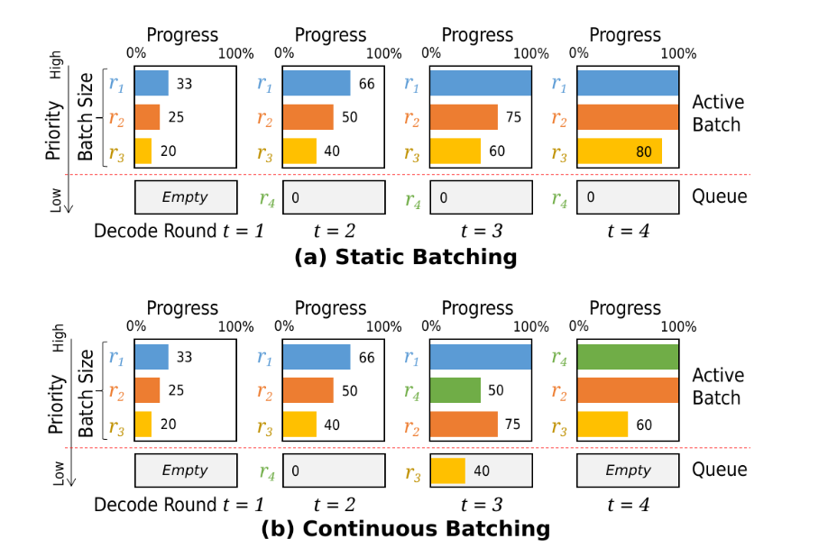

## **1. Static Batching (Figure a)**

* **Mechanism:**

  * A batch of requests ($r_1, r_2, r_3$) is formed once at the beginning.
  * That batch runs **until all requests finish**, even if some finish early.
  * New incoming requests ($r_4$) **must wait** until the batch completes.

* **Problem:**

  * **Stragglers**: slower/longer requests delay the entire batch.
  * **Wasted memory**: completed requests keep occupying cache until batch finishes.
  * **Latency**: new requests wait in queue unnecessarily.

## **2. Continuous Batching (Figure b)**

* **Mechanism:**

  * After every **decode round**, the batch is **reformed dynamically**.
  * If a request finishes, it is evicted (KV cache cleared).
  * A queued request ($r_4$) can immediately join the next round.

* **Advantages:**

  * **No stragglers**: each request runs at its natural pace.
  * **Better memory efficiency**: KV caches are reclaimed immediately.
  * **Lower latency**: new requests don’t wait for the entire batch to finish.
  * Works well with **chunked prefills**, where long prompts are broken into smaller pieces that can be interleaved with decoding.

## **3. What Modern LLM Systems Use**

Modern serving frameworks (vLLM, Orca, Sarathi, DeepSpeed-Inference, TensorRT-LLM):

✅ **Continuous Batching** is the standard today.

✅ Typically combined with:

* **Dynamic Prefill + Decode** → mixing prompt ingestion with ongoing decoding.
* **Paged Attention** → avoids ragged batch inefficiency.
* **Priority scheduling** → allows high-priority/interactive requests to preempt long ones.
* **Speculative Decoding** (optional) → for throughput boosts.

**Summary:**

* **Static Batching** = simpler, but suffers from stragglers and high latency.
* **Continuous Batching** = modern approach → higher GPU utilization, better latency, and efficient memory use.
* This is one of the **core breakthroughs** that makes serving systems like **ChatGPT, Gemini, Claude, and others scalable** in production.

---
