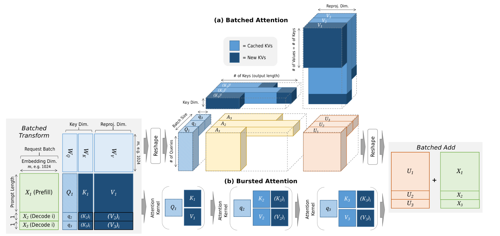

## **1. Batched Attention (Figure a)**

* **How it works:**

  * All requests in a batch share one **large attention kernel**.
  * Queries $Q$, Keys $K$, and Values $V$ from multiple requests are **concatenated** into 3D tensors.
  * Cached KV pairs (light blue) and new KV pairs (dark blue) are combined, so attention operates on both past and new context.
  * The entire batch runs as one GPU kernel call, maximizing utilization.

* **Pros:**

  * Very efficient for GPUs (large dense matrix ops).
  * Fewer kernel launches → lower overhead.

* **Cons:**

  * If requests have very different sequence lengths, this creates **ragged batches** → padding overhead and wasted compute.

## **2. Bursted Attention (Figure b)**

* **How it works:**

  * Instead of one large batch, each request runs its **own attention kernel** sequentially.
  * For example, query $q_1$ runs with $K_1, V_1$, then $q_2$ with $K_2, V_2$, and so on.

* **Pros:**

  * No padding or ragged batch inefficiency. Each request runs exactly as needed.

* **Cons:**

  * Many small kernel launches → **high overhead**.
  * Wastes GPU parallelism (underutilization).

## **3. Modern LLM Approach**

Modern inference systems (like vLLM, TensorRT-LLM, Orca, Sarathi, DeepSpeed-Inference):

✅ Use **Batched Attention** as the **default strategy** (to maximize GPU throughput).

✅ Combine it with **Dynamic Batching** (reforming batches every decoding round).

✅ Use **Chunked Prefill** to break long prompts into smaller chunks that can be interleaved with decoding.

✅ Employ **Paged Attention** (vLLM) to handle ragged inputs more efficiently by virtually paging KV cache, reducing wasted memory and compute.

**In summary:**

* **Batched Attention** is the standard.

* **Bursted Attention** is rarely used in production because of GPU inefficiency.

* Modern systems improve on batched attention with **dynamic batching + paged attention** to handle ragged prompts and variable sequence lengths efficiently.

---

