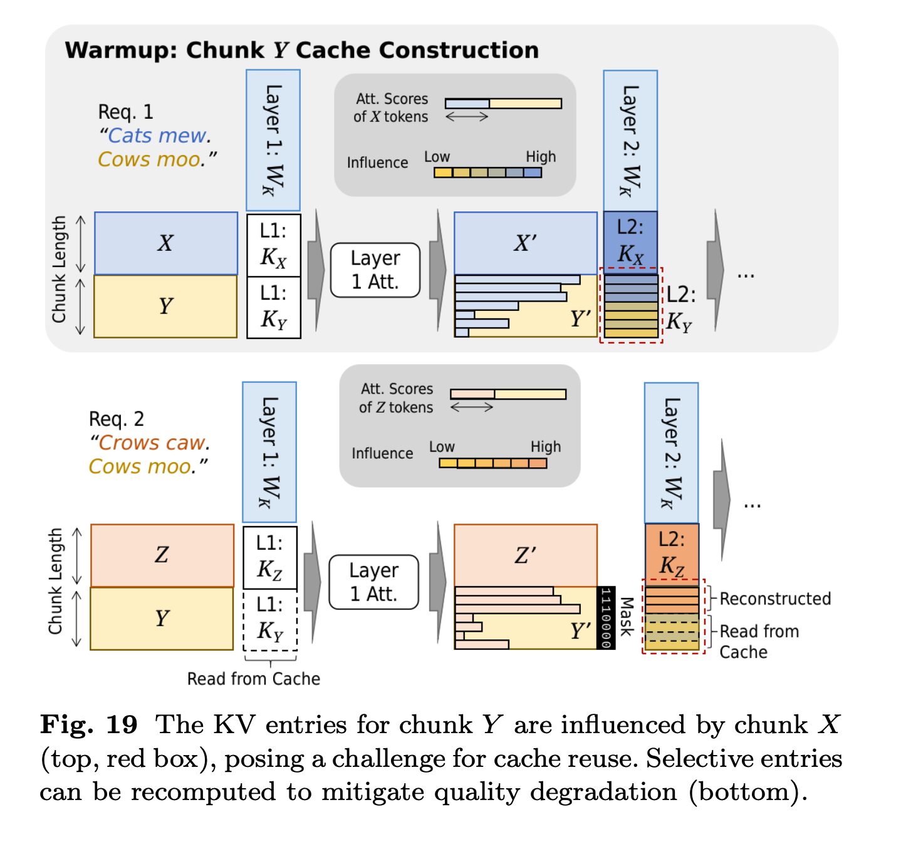

# **4.4 Cache Persistence**

The goal: **reuse KV cache entries across different requests** to reduce redundant computation and latency.
Challenge: KV vectors depend on token positions, so reuse is only possible where requests overlap.

### **Key Techniques**

#### **1. Prefix Sharing (Exact-Match Sharing)**

* **Idea**: Reuse KV cache entries if two sequences share the same prefix.
* **Process**:

  * Scan the incoming request prefix token by token.
  * At each step, check if a cache entry already exists.
  * If yes → reuse it instead of recomputing.
* **Optimization**:

  * If the number of persisted cache blocks is large, use an **index structure** (e.g., radix tree) to speed up lookups.
* **Use Case**:

  * Common when multiple users/documents share the same starting prompt (e.g., system message in chat).

#### **2. Selective Reconstruction (Partial-Match Sharing)**

* **Idea**: Allow cache reuse even when prefixes don’t exactly align.
* **Challenge**: Misaligned KV entries can degrade quality.
* **Solution**:

  * Recompute KV entries **only for the most impactful tokens** while reusing the rest.
  * Impactful tokens are identified via:

    * **Attention score deviations** in the first transformer layer (measure which tokens matter most).
    * **Token position heuristic** (e.g., tokens closer to the current position are more important).
* **Benefit**: Balances efficiency (reuse) with model quality.

### **Example in RAG**

* Even if two prompts differ, they may pull **the same document chunks**.
* Prefix sharing and selective reconstruction allow cache reuse across such overlapping retrievals.

**Summary**:

* **Prefix sharing** = reuse cache for exact-matching token sequences.
* **Selective reconstruction** = reuse partially, recomputing only critical tokens to maintain quality.
* Together, these reduce computation while preserving model accuracy.

---

