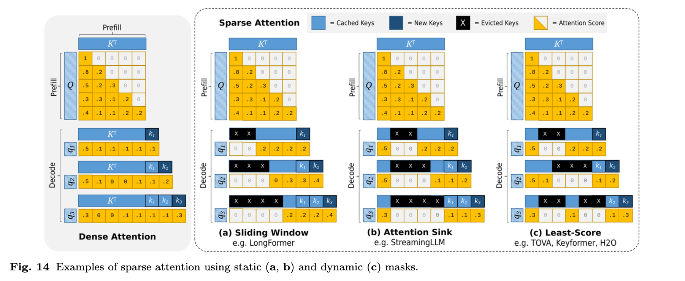
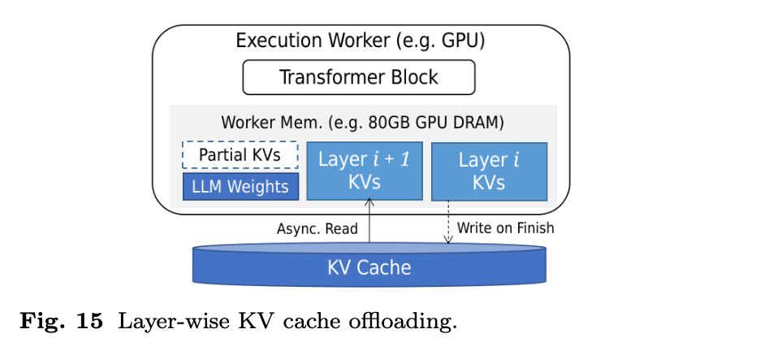

# **4.2 Eviction and Offloading**

This section is about how **KV caches** (key-value caches used in transformers for decoding) are managed when GPU memory is limited, or when requests must be interrupted (preempted). The two main strategies are **eviction** and **offloading**.

### 1. **Why Eviction and Offloading Are Needed**

* **Preemption**:
  When a high-priority request arrives, lower-priority requests may be interrupted. Their KV caches need to be removed from GPU memory to make room.

  * **Eviction**: Throw away the cache (must recompute later).
  * **Offloading**: Move the cache to slower storage (e.g., CPU or disk) to reload later.
    The choice depends on **recovery cost** (how expensive it is to restore).

* **Long Contexts**:
  When sequences exceed available memory, some cache entries must be dropped.

  * Can evict **less important tokens** (using sparse attention).
  * Can offload to a slower tier of memory (tiered storage).

### 2. **Eviction**

* **When used**: Drop unimportant cache entries that don’t contribute much to the final output.
* **Decision factors**:

  * **Token position**: Earlier tokens may have less influence.
  * **Attention scores**: Tokens with low contribution can be removed.
* **Cache control policies**: Standard ones like **LRU (Least Recently Used)** can be applied.
* **Recovery**: Requires recomputing the K/V vectors from the model’s outputs.

  * For short prompts with few decoding steps → recomputation may be faster than reloading.

### 3. **Offloading**

* **When used**: Move cache entries out of GPU memory into cheaper/larger storage (CPU memory, SSD, etc.).
* **Recovery**: Reload offloaded entries back into GPU memory when needed.
* **Optimizations**:

  * **Asynchronous prefetching**: Move data back ahead of time, overlapping transfers with model execution → hides transfer latency.
  * **Streaming recovery**: In distributed runtimes, prefill workers can stream cache entries directly to decode workers.

### 4. **Tradeoff Between Eviction and Offloading**

* **Eviction** = discard & recompute later → cheaper if recomputation is fast (e.g., short prompts).
* **Offloading** = store & reload later → better if recomputation is expensive (e.g., long prompts, many decoding steps).
* Goal: balance **memory usage vs recovery cost**.

**In summary**:

* **Eviction** = saves memory by deleting entries, but requires recomputation.
* **Offloading** = saves memory by moving entries elsewhere, but requires transfer back.
* Both are necessary for **preemption** and **long contexts**, with policies depending on cost tradeoffs and attention importance.

---

## **Long Context Eviction — Breakdown**

This section explains **how to selectively evict KV cache entries** when handling **long sequences** that would otherwise exceed GPU memory, while trying to **minimize quality loss**. Two main policy types are highlighted: **position-based** and **attention-based**.

### 1. **Motivation**

* Long sequences produce very large KV caches.
* Not all tokens are equally important → some can be evicted with little effect on output.
* Goal: free up memory while **preserving model accuracy**.

### 2. **Policy Types**

#### (1) **Position-Based Eviction**

* Idea: Importance correlates with **token position**.
* Finding:

  * Tokens near the **beginning** or **end** of the sequence usually get **higher attention weights**.
  * Middle tokens may contribute less.
* Strategy:

  * Evict **low-importance middle tokens**.
  * Keep beginning & trailing tokens by using **handcrafted attention masks**.

#### (2) **Attention-Based Eviction**

* Idea: Rank tokens directly by their **attention values**.
* Higher attention score → more important → keep.
* Lower attention score → less important → candidate for eviction.
* Enhancements:

  * **Asymmetric noise injection** → reduces bias in eviction decisions.
  * **Averaging across decoding rounds** → more stable importance estimates.
  * **Accumulative scores** → track importance across steps rather than per-step.

### 3. **Tradeoff**

* **Position-based**: Simpler, uses heuristics about positions.
* **Attention-based**: More adaptive, but requires monitoring attention values continuously.
* Both aim to ensure **critical tokens remain**, while memory is reclaimed from less impactful ones.

**In summary**:

* **Position-based policies** → evict middle tokens, keep edges.
* **Attention-based policies** → evict low-score tokens based on attention weight dynamics.
* Enhancements (noise, averaging, accumulation) improve accuracy and stability.

---

## **Long Context Offloading — Breakdown**

This section focuses on **how to handle very large KV caches without evicting entries**, by **moving parts of the cache to secondary (tiered) storage** while keeping the cache intact. Unlike eviction, which discards entries, **offloading preserves data but incurs transfer costs**.

### 1. **Motivation**

* Long contexts → very large KV caches → GPU memory exhaustion.
* Eviction risks losing information.
* Offloading: keep cache intact, but move parts of it to **cheaper/slower storage** (CPU RAM, NVMe, disaggregated memory).

### 2. **Techniques**

#### (1) **Layer-Wise Offloading**

* Offload entire cache blocks from **specific transformer layers**.
* Works because inference proceeds **layer by layer**.
* Example:

  * While computing **layer i**, the system can **asynchronously transfer layer i+1 cache** to/from secondary storage.
  * This overlaps compute with transfer → hides part of the latency.
* Challenge: still expensive for **very large caches**, since whole-layer transfers are heavy.

#### (2) **Model-Wise Offloading**

* Instead of full layers, offload **fractions of the cache across all layers**.
* Benefit:

  * Transfer costs become **tunable** → system can choose the percentage of cache to offload (e.g., 20%, 50%).
  * More granular control compared to layer-wise.
* Tradeoff:

  * More frequent but smaller transfers.
  * Balances memory savings with manageable bandwidth overhead.

### 3. **Tradeoff**

* **Eviction** (previous section): Frees memory by discarding entries → risk of quality loss.
* **Offloading**: Keeps full cache but incurs **transfer overhead** → risk of latency.
* Both are complementary — eviction focuses on **dropping low-value entries**, offloading focuses on **storage hierarchy management**.

**In summary**:

* **Layer-wise offloading**: Move cache of selected transformer layers to secondary storage; can hide latency by overlapping with computation.
* **Model-wise offloading**: Offload only a fraction from all layers; tunable cost but more frequent transfers.

---
