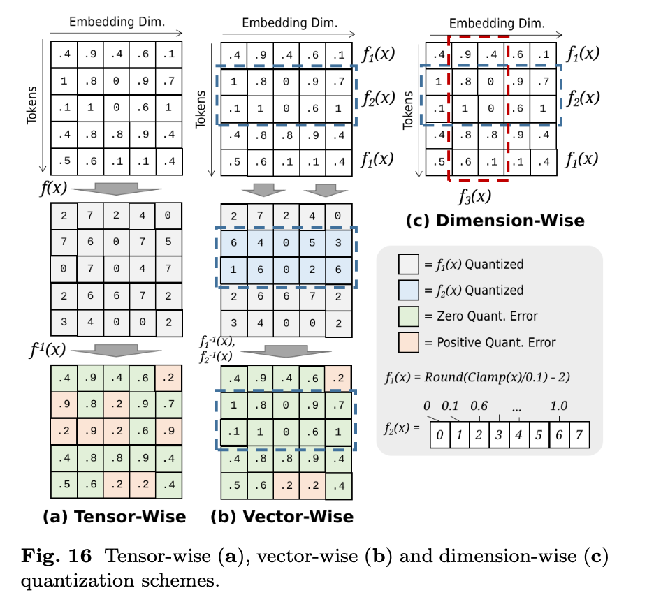
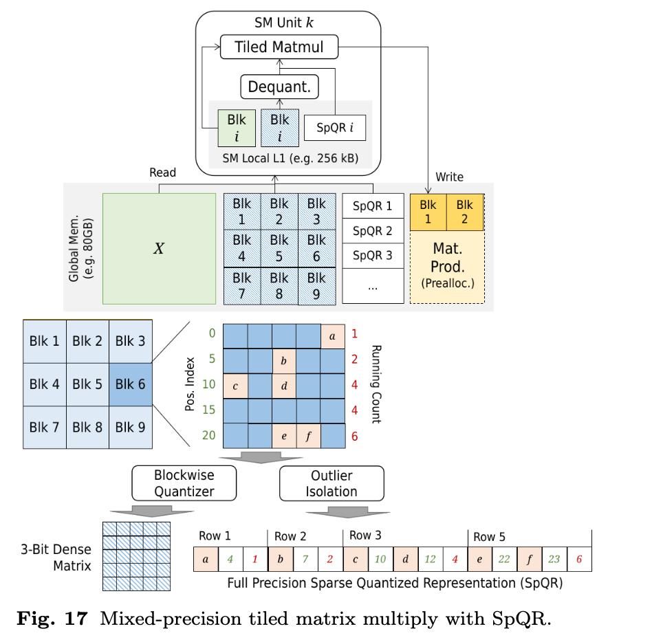
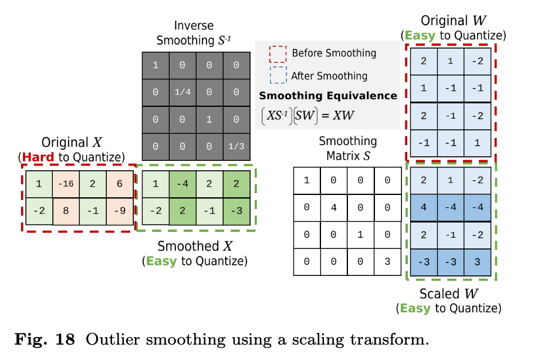

# **4.3 Quantization**

### 1. **Purpose**

* KV cache can become very large → memory bottleneck.
* **Quantization** reduces memory usage by lowering **numerical precision** (e.g., from FP16 → INT8). (FloatingPoint → Integer )
* Goal: shrink memory footprint while **preserving model quality**.

### 2. **Quantizer Types**

#### (a) **Uniform Quantizers**

* Map floating-point numbers into a **compressed integer range**.
* Done via **rounding** + applying offset + clamping (min/max).
* Simple and efficient, but may lose detail in high-information regions.

#### (b) **Non-Uniform Quantizers**

* Use **non-linear mapping** to preserve more detail where it matters.
* Example: logarithmic or adaptive scaling → better information retention.

### 3. **Granularity of Quantization**

Different parts of the model (tensors, vectors, dimensions) hold varying amounts of information, so applying **different quantizers per component** improves quality.

* **Tensor-wise quantization**: Same quantizer for the whole tensor.
* **Vector-wise quantization**: Each row/column (vector) gets its own quantizer.
* **Dimension-wise quantization**: Quantizer applied at per-dimension granularity (finest control).

*(Figure 16 illustrates this hierarchy of granularity.)*

### 4. **Outlier Protection Techniques**

Problem: A few **large outlier values** can distort quantization scales → degrade quality.

Solutions:

1. **Mixed-Precision Preservation**

*(Figures 17 shows how mixed precision help prevent quantization artifacts.)*

   * Keep outliers in higher precision (e.g., FP16) while quantizing the rest to INT8.
   * Protects important values from rounding errors.

2. **Outlier Smoothing**

*(Figures 18 shows how smoothing help prevent quantization artifacts.)*

   * Reduce (clip/smooth) the impact of outlier magnitudes before quantization.
   * Makes scaling more balanced across values.

### Summary

* **Quantization** reduces KV cache size by lowering precision.
* **Uniform vs Non-uniform** → tradeoff between simplicity and accuracy.
* **Granularity** (tensor, vector, dimension-wise) → finer quantization reduces information loss.
* **Outlier handling** (mixed-precision, smoothing) prevents degradation caused by extreme values.

---

## **Quantizer Design**

This subsection explains how **uniform** and **non-uniform quantizers** are actually designed and optimized.

### 1. **Design Objective**

* Goal: minimize the **loss function** between original values and quantized values.
* Common choice: **Mean Squared Error (MSE)** before vs. after quantization.
* Ensures quantized representation remains as close as possible to original.

### 2. **Uniform Quantizers**

* Formula:

  $`\hat{x} = \lfloor x / s \rceil + z`$

  where:

  * $`s`$ = **scaling factor** (step size between quantized levels).
  * $`z`$ = **zero-point offset** (shift to align ranges).

* Because the number of parameters is small ($`s`$, $`z`$), we can use **grid search** to find the optimal values.

* Simple and computationally efficient.

### 3. **Non-Uniform Quantizers**

* More flexible, since the mapping is **non-linear**.

* Design often involves **search-based approaches**:

  * **Bucketing**: Divide the input distribution into buckets/ranges and optimize quantization separately per bucket.
  * **Sophisticated search algorithms**: e.g., clustering (like k-means), dynamic programming, or optimization heuristics to learn quantization boundaries.

* Higher complexity, but better at preserving information in skewed or heavy-tailed distributions.

**Key Takeaway:**

* **Uniform quantizers** → few parameters, easy to optimize with grid search.
* **Non-uniform quantizers** → more complex, need advanced search strategies like bucketing or learned mappings, but yield higher fidelity.

---

## **Quantization Schemes**

This subsection categorizes **how quantization is applied** across different model components, trading off **storage/computation savings** against **quality preservation**.

### 1. **Tensor-wise Quantization**

* **Definition**: Apply **one quantizer** to the entire weight tensor (e.g., weight matrices in transformers).
* **Advantage**:

  * Simple, efficient.
  * Large **storage savings** since weights dominate memory usage.
* **Limitation**:

  * Coarse granularity → less adaptive to local variations in distribution.
* **Use case**: Compressing **weights** for inference/deployment.

### 2. **Vector-wise Quantization**

* **Definition**: Split the activation matrix into **g groups** of vectors (each group has $n/g$ embedding vectors). A different quantizer is trained/applied per group.
* **Trade-off**:

  * Larger $g$ → **finer control**, more accurate quantization.
  * Larger $g$ → requires **more quantizers**, increases complexity in matrix multiplication.
* **Use case**: **Activations**, where per-vector variability is high.

### 3. **Dimension-wise Quantization**

* **Definition**: Split each $d$-dimensional vector into **$k$ subspaces** of size $d/k$, and assign a separate quantizer to each subspace.
* **Advantage**:

  * Very fine-grained → adapts to local differences across vector dimensions.
* **Cost**:

  * Highest computational overhead.
  * More quantizers → harder integration into optimized kernels.
* **Use case**: High-precision tasks where even small quantization errors matter.

### Comparison Table

| Scheme             | Granularity         | Storage Saving | Accuracy Preservation | Complexity |
| ------------------ | ------------------- | -------------- | --------------------- | ---------- |
| **Tensor-wise**    | Whole tensor        | High           | Low–Moderate          | Low        |
| **Vector-wise**    | Groups of vectors   | Moderate–High  | Moderate–High         | Moderate   |
| **Dimension-wise** | Subspaces of vector | Moderate       | High (fine control)   | High       |

**Key Takeaway:**

* **Tensor-wise** → best for storage efficiency (weights).
* **Vector-wise** → balances efficiency & accuracy (activations).
* **Dimension-wise** → maximum precision, but highest complexity.

---

## **Outlier Protection in Quantization**

Quantization often struggles with **outlier values** (rare but extreme magnitudes). Since quantizers compress ranges, outliers can dominate scaling and cause **significant quality loss**. Two main strategies address this:

### 1. **Mixed-Precision Preservation**

* **Idea**: Keep most values quantized, but **store outliers in higher precision** (e.g., FP16 or FP32).
* **Implementation**:

  * Tensors are split into **two regions**:

    * Low-precision region (quantized values).
    * High-precision region (raw outliers).
  * Requires **specialized data structures** and **kernel operators** that can decode and process mixed-precision tensors.
* **Pros**: Preserves full fidelity of outliers.
* **Cons**:

  * Memory/computation overhead for mixed formats.
  * More complex implementation.
* **Use Case**: Weight quantization in deployment (where fidelity is critical).

### 2. **Outlier Smoothing**

* **Idea**: Instead of storing outliers separately, **reduce their impact** by rescaling operands before matrix multiplication.
* **Mechanism**:

  * Apply **scalar division** to the high-variance matrix (reduces outlier dominance).
  * Apply **reverse scaling** to the paired low-variance matrix (compensates for lost magnitude).
  * Result: Outlier information is preserved **within the product**, without mixed-precision tensors.
* **Pros**:

  * Avoids mixed-precision overhead.
  * Compatible with standard matrix multiplication.
* **Cons**:

  * More mathematically involved.
  * Effectiveness depends on how well scaling captures outlier influence.
* **Use Case**: Applied to **weights, activations**, and more recently to **KV caches**, where large values appear in attention mechanisms.

### Comparison Table

| Method                           | How it Works                                | Pros                                 | Cons                            | Use Cases                      |
| -------------------------------- | ------------------------------------------- | ------------------------------------ | ------------------------------- | ------------------------------ |
| **Mixed-Precision Preservation** | Store outliers separately in high precision | Exact preservation of outliers       | Overhead, special kernels       | Weights (deployment)           |
| **Outlier Smoothing**            | Rescale operands during matmul              | Efficient, no mixed precision needed | Approximate, depends on scaling | Weights, activations, KV cache |

**Key Insight:**

* **Mixed-precision** → best when exact preservation is needed.
* **Smoothing** → best when efficiency and compatibility matter.

---

