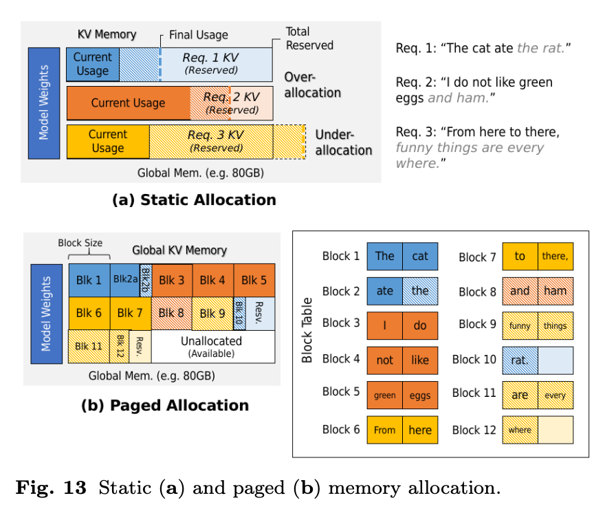

# **4. Memory Management in LLM Inference**

The **KV (Key-Value) cache** is the primary driver of memory usage during LLM inference. If not carefully managed, KV cache growth can lead to **memory over-subscription**, causing costly GPU/accelerator memory swaps and severe latency degradation.

This section introduces different strategies to manage KV cache efficiently.

### **1. Static Preallocation vs. Dynamic Allocation**

* **Static Preallocation**

  * Preallocate the *maximum possible memory per request* at request time.
  * ✅ Guarantees no memory over-subscription.
  * ❌ Highly wasteful since actual final KV size is unpredictable (except for constrained outputs).
  * ❌ Blocks unused memory from being used by other requests.

* **Dynamic Page-Based Allocation**

  * Allocate memory **incrementally in small blocks** as KV grows.
  * ✅ Avoids large unused reservations.
  * ✅ Increases memory utilization efficiency.
  * 🔄 Requires efficient allocators to prevent fragmentation.

### **2. Eviction & Offloading**

To reduce memory pressure when capacity is near exhaustion:

* **Eviction** → remove unneeded KV entries (e.g., tokens past context window).
* **Offloading** → transfer KV cache to **CPU memory, SSDs, or remote storage**, then reload when needed.

  * ❌ Reloading incurs bandwidth & latency costs.
  * 🔄 Trade-off between real-time performance and memory scalability.

### **3. Quantization**

* Compress KV cache entries (e.g., FP16 → INT8 or mixed precision).
* ✅ Reduces **byte footprint** of each KV entry.
* ✅ Allows more concurrent requests.
* ❌ May slightly degrade model accuracy if aggressive.

### **4. Cache Persistence**

* Applicable in **shared prompts** or **retrieval-augmented generation (RAG)**.
* Idea: **reuse KV cache entries across requests** instead of recomputing.
* Example scenarios:

  * System prompts that remain constant across users.
  * Retrieved documents in RAG pipelines shared across multiple queries.
* ✅ Saves both compute & memory by avoiding redundant KV storage.
* ❌ Requires cache-aware scheduling to maximize hit rates.

### **5. Toward Hybrid Memory Schemes**

* Future systems combine:

  * **Dynamic allocation** + **Quantization** (to shrink size).
  * **Offloading** + **Persistence** (to reuse and spill over).
  * **Eviction policies** tuned by access frequency (cache-aware scheduling).
* This creates **adaptive memory management frameworks** that balance:

  * Throughput
  * Latency
  * Memory capacity

**Key Takeaway:**
Modern LLM inference memory management goes beyond naive preallocation. Instead, systems adopt **dynamic paging, eviction/offloading, quantization, and persistence**—often in combination—to maximize GPU utilization, avoid preemptions, and maintain throughput at scale.

---

