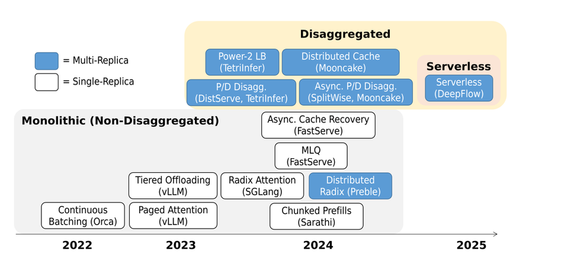

# **5.2 Runtimes**

A **runtime** is the execution engine that manages requests, memory, batching, and hardware resources during inference.
It comes in two main flavors:

1. **Single-replica runtimes** → manage inference on **one model instance**.
2. **Multi-replica runtimes** → manage inference across **multiple replicas of the model** (on multiple GPUs or servers).

## **1. Single-Replica Runtimes**

* Designed to **maximize throughput and latency** for one LLM copy.
* Handle:

  * **Batching** requests together.
  * **Cache reuse** (KV cache sharing).
  * **Efficient scheduling** (e.g., interleaving decoding).
* Good for smaller systems or early-stage deployments.

**Use case:** running one large LLM per GPU box, with careful memory and request scheduling.

## **2. Multi-Replica Runtimes**

When many users and requests come in, one replica isn’t enough → multiple replicas are used.

### **Challenges**

* **Load imbalance**:

  * Some replicas might have long queues (slow users, long prompts).
  * Others might be idle.
  * KV caches grow differently across replicas → different memory burdens.

### **Techniques**

* **Load balancing** → smartly route new requests to replicas with the least load or best fit.
* **Cache-aware execution**:

  * Requests with overlapping prompts can benefit from **block replication** (duplicate cache blocks across replicas).
  * Or **block partitioning** (split and share different parts of cache across replicas).
  * Goal: **maximize cache reuse** across users.

## **3. Scaling Architectures**

Beyond *just replicas*, the **system architecture** matters for cost and flexibility:

* **Monolithic architecture**

  * Each replica is a full, independent LLM server.
  * Simple, but resource-heavy (big GPU clusters, fixed allocation).

* **Disaggregated architecture**

  * Breaks apart components (compute, memory, scheduling).
  * Example: separate GPU pools for attention vs feedforward layers, or centralized memory managers.
  * More **granular scaling**: scale memory or compute independently.

* **Serverless architecture**

  * No long-lived replicas.
  * Models (or parts of models) are spun up **on-demand**.
  * Efficient for bursty workloads, but adds startup overhead.

**Takeaway:** Monolithic = simple but rigid; Disaggregated/Serverless = flexible and cost-efficient.

## **Summary (Runtime Design Space)**

| Runtime Type       | Strengths                                   | Challenges                    | Use Case                           |
| ------------------ | ------------------------------------------- | ----------------------------- | ---------------------------------- |
| **Single-replica** | Simple, efficient batching & caching        | Limited scalability           | Small deployments, one GPU/server  |
| **Multi-replica**  | Load balancing, cache reuse across replicas | Load imbalance, memory growth | Scaling to many users              |
| **Monolithic**     | Easy to deploy/manage                       | Expensive, over-provisioned   | Enterprise, high throughput        |
| **Disaggregated**  | Granular scaling (compute vs memory)        | Complexity in coordination    | Cost-sensitive cloud deployments   |
| **Serverless**     | Pay-as-you-go, burst handling               | Startup latency, cold starts  | On-demand, unpredictable workloads |

**Key insight:**
Runtimes determine **scalability and efficiency**. The frontier lies in **multi-replica runtimes + disaggregated/serverless architectures** to handle diverse workloads while controlling GPU costs.

---

**Table 1: Model execution features.**

| Type              | Runtime        | Load Bal.                   | Job Prior.         | Batch Freq. | Batch Size                |
|-------------------|----------------|-----------------------------|--------------------|-------------|---------------------------|
| Single-replica    | (2022) Orca        | N/A                         | FCFS               | Cont.       | Fixed                     |
|                   | (2023) vLLM        | N/A                         | FCFS               | Cont.       | Fixed                     |
|                   | (2024) Sarathi     | N/A                         | FCFS               | Cont. + CP  | Token budget              |
|                   | (2024) SGLang      | N/A                         | FCFS               | Cont. + CP  | Token budget              |
|                   | (2024) FastServe   | N/A                         | MLQ (FCFS)         | Cont.       | Fixed                     |
| Multi. mono.      | (2024) Preble      | Max hit + min load          | MLQ (Cache Hit)    | Cont. + CP  | Token budget              |
| Multi. disagg.    | (2024) DistServe   | Min queue (P), min load (D) | FCFS (P,D)         | Cont.       | Token budget (P,D)        |
|                   | (2024) TetriInfer  | Min load (P), rand-2 (D)    | (*) (P), FCFS (D)  | Cont. + CP  | Token budget (P,D)        |
|                   | (2024) SplitWise   | Min queue (P + D)           | FCFS (P,D)         | Cont. + CP  | Token budget (P,D)        |
|                   | (2024) Mooncake    | Min TTFT (P + D)            | FCFS (P,D)         | Cont. + CP  | Token budget (P,D)        |
| Multi. λ          | (2025) DeepFlow    | Max hit + min load (P,D)    | FCFS (P,D)         | Cont. + CP  | Token budget (P,D)        |

**Table 2: Memory management features.**

| Type            | Runtime            | Mem. Model     | Mem. Repl.   | Evict/Offload   | Recov.                | Persis. Model       |
|-----------------|--------------------|----------------|--------------|-----------------|-----------------------|---------------------|
| Single-replica  | (2022) Orca        | Static (GPU)   | N/A          | N/A             | N/A                   | N/A                 |
|                 | (2023) vLLM        | Paged (Tiered) | N/A          | Cost eq.        | Sync (CPU to GPU)     | N/A                 |
|                 | (2024) Sarathi     | Paged (Tiered) | N/A          | Cost eq.        | Sync (CPU to GPU)     | N/A                 |
|                 | (2024) SGLang      | Paged (GPU)    | N/A          | Always evict    | N/A                   | Radix (LRU)         |
|                 | (2024) FastServe   | Paged (Tiered)| N/A         | Always off.     | Async (CPU to GPU)    | N/A                 |
| Multi. mono.    | (2024) Preble      | Paged (GPU)    | Hot entries  | Always evict    | N/A                   | Distr. radix (LRU)  |
| Multi. disagg.  | (2024) DistServe   | Paged (GPU)  | N/A          | N/A             | Sync (P to D)         | N/A                 |
|                 | (2024) TetriInfer  | Paged (GPU)  | N/A          | N/A             | Sync (P to D)         | N/A                 |
|                 | (2024) SplitWise   | Paged (GPU)   | N/A          | Always evict    | Async (P to D)        | N/A                 |
|                 | (2024) Mooncake    | Paged (Tiered) | Hot entries  | N/A             | Async (P to D)        | Hash table (LRU)    |
| Multi. λ        | (2025) DeepFlow    | Paged (Tiered) | N/A          | Always evict    | Async (CPU to GPU)    | Radix (LRU)         |

---

## **5.2.1 Single-Replica Runtimes**

Single-replica runtimes focus on **fundamental system-level challenges** in LLM execution:

* **Batching** (how multiple requests are grouped for efficiency)
* **Scheduling** (how requests are prioritized/executed)
* **Memory management** (handling KV cache efficiently)

They form the **foundation** for techniques later extended to multi-replica runtimes.

### **Orca (2022)**

* **Contribution**: First LLM-specific inference runtime.
* **Key Idea**: **Round-based continuous batching** → now a standard approach.
* **Memory Model**: **Static allocation** → preallocates fixed memory per request (based on max context length).
* **Limitations**:

  * No preemption → cannot evict or offload requests.
  * Each request’s memory is private → **no cache sharing**.

### **vLLM (2023)**

* **Improvement**: Solves static allocation issues with **block-based cache memory**.
* **Features**:

  * Memory manager allows requests to share blocks.
  * Supports **request preemption** → evicts lowest-priority requests during low memory.
* **Limitation**: Does **not manage cache persistence** across multiple request lifetimes.

### **Sarathi-Serve (2024)**

* **Extension of vLLM**: Adds **chunked prefills** on top of continuous batching.
* **Technique**:

  * Packs batches with prefill tokens.
  * Enables **dynamic batch sizing** via **token budget**.

### **SGLang (2024)**

* **Focus**: Cache persistence + cache efficiency.
* **Features**:

  * **Managed cache persistence** → persists all cache blocks in memory.
  * **Radix tree** for fast block retrieval during prefill.
  * **LRU eviction** to control cache size.
  * **Priority**: Requests prioritized by **length of shared prefix** (avoids cache thrashing).
* **Benefit**: Optimized **prefill stage + cache sharing**.

### **FastServe (2024)**

* **Contribution**: Addresses **FCFS scheduling limitation**.
* **Technique**: **Multi-Level Queue (MLQ) prioritization** based on **arrival time**.
* **Goal**: Reduce **average request latency** compared to pure FCFS.

**In summary:**

* **Orca** introduced continuous batching.
* **vLLM** added block-based memory + preemption.
* **Sarathi** added chunked prefills for efficiency.
* **SGLang** optimized cache persistence/sharing with radix + LRU.
* **FastServe** improved scheduling via MLQ.

---

## **5.2.2 Multi-Replica Runtimes**

**Goal:** Efficient execution across **multiple replicas** of the LLM.

* **Load balancing** is critical to distribute requests evenly across workers.
* **Cache persistence** can be distributed, requiring **distributed cache management**.
* Architectural choices: **monolithic**, **disaggregated**, or **serverless**.

### **1. Monolithic Runtimes**

* All stages (prefill + decode) handled within the same worker set.
* **Example: Preble (2024)**

  * Extends **cache persistence** to multi-replica setting.
  * Uses a **central scheduler with a global radix tree** for cache lookup.
  * **Load balancing policy**: Based on **cache hit ratio + worker load**.
  * **Hot entries replicated** → prevents overloading workers with high hit rates.

### **2. Disaggregated Runtimes**

* **Key Idea:** Separate **prefill workers** and **decode workers**.
* **Challenge:** Cache (KV) must be transferred from prefill to decode workers.

#### **(a) Synchronous Transfer**

* **DistServe (2024)**

  * Assigns GPUs to prefill vs. decode tasks based on **physical locality**.
  * Example: Prefill + decode GPUs on same machine leverage **NVLink** for fast transfer.
  * Challenge: Decode worker is chosen *after prefill*, so bursts can overload decode side.

* **TetriInfer (2024)**

  * Addresses decode overload by using **power-of-two load balancing (random-2 choice)**.
  * More resilient to bursty workloads.

#### **(b) Asynchronous Transfer**

* **SplitWise (2024)**

  * Selects prefill + decode workers **simultaneously**.
  * Streams KV cache **asynchronously** during prefill.

* **Mooncake (2024)**

  * Similar async streaming as SplitWise.
  * Adds **load check before decode** → if insufficient memory, request is **aborted** (no preemption).
  * **Hot entry replication:** Uses **central hash table** to catalog cache blocks.

    * On cache hit → copies reusable blocks to prefill node, replicating hot entries across workers.

### **3. Serverless Runtimes**

* Use **stateless hardware resources** for **flexible scaling**.

* **Challenge:** Cold starts (loading model weights after machine procurement).

* **Example: DeepFlow (2025)**

  * Target: Shared multi-tenant LLM infrastructure.
  * **Avoids cold starts** via:

    * **Persistent machine reuse** (don’t return to pool immediately).
    * **Prewarmed pool** for fast spin-up.
  * **Cache management:**

    * Offloads cache entries to **host memory**.
    * Uses **central radix tree** for cache lookup and sharing across requests.

**Summary Table (Conceptual)**

| Architecture              | Example Runtime   | Key Features                                                                                      |
| ------------------------- | ----------------- | ------------------------------------------------------------------------------------------------- |
| **Monolithic**            | Preble (2024)     | Central scheduler + global radix tree, load balancing with cache hit ratio, hot entry replication |
| **Disaggregated (Sync)**  | DistServe (2024)  | Prefill/decode separation, GPU locality (NVLink), sync transfer                                   |
|                           | TetriInfer (2024) | Power-of-two load balancing, burst-resistant                                                      |
| **Disaggregated (Async)** | SplitWise (2024)  | Simultaneous prefill+decode selection, async streaming                                            |
|                           | Mooncake (2024)   | Async transfer + load check, hot entry replication via hash table                                 |
| **Serverless**            | DeepFlow (2025)   | Cold start mitigation, prewarmed pool, persistent reuse, host-memory cache + radix tree           |

---

