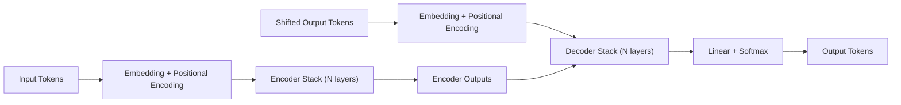
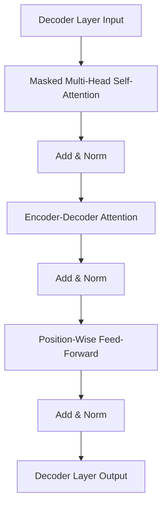

# Attention Is All You Need - Detailed Explanation

This document explains the 2017 paper "Attention Is All You Need" by Vaswani et al., which introduced the Transformer architecture. The core idea is that `sequence-to-sequence` modeling can be done using attention alone, without `recurrence` or `convolution`. This unlocked massive parallelism, improved long-range dependency modeling, and became the foundation for modern LLMs.

**High-Level Idea**
The Transformer is an `encoder-decoder` model that uses stacked self-attention and feed-forward layers. Attention lets each token directly "look at" every other token to compute context-aware representations. Removing recurrence means all tokens can be processed in parallel during training, which greatly speeds up training and scales well.


**Key Contributions**
1. A fully attention-based architecture for sequence transduction.
2. Scaled dot-product attention and multi-head attention as core primitives.
3. Positional encoding to retain order information without recurrence.
4. A highly parallelizable design with strong results on machine translation.


**Transformer Architecture Overview**
The model has two parts.
1. `Encoder`: converts the input sequence into a sequence of contextual representations.
2. `Decoder`: generates the output sequence, attending to both prior outputs and the encoder outputs.

Both encoder and decoder are stacks of identical layers.
1. `Encoder layer`: self-attention + feed-forward.
2. `Decoder layer`: masked self-attention + encoder-decoder attention + feed-forward.

Each sub-layer uses:
1. Residual connection around the sub-layer.
2. Layer normalization after the residual add.
3. Dropout for regularization.

**Architecture Diagrams**
The full encoder-decoder data flow:



The decoder layer internal flow:




**Scaled Dot-Product Attention**
For a set of queries, keys, and values, attention computes a weighted sum of values where weights are the similarity of queries to keys.

```
Attention(Q, K, V) = softmax(Q K^T / sqrt(d_k)) V
```

Where:
1. `Q`: query matrix.
2. `K`: key matrix.
3. `V`: value matrix.
4. `d_k`: dimensionality of keys (used to scale to stabilize gradients).

The softmax produces attention weights for each query over all keys. The scale factor reduces the risk of softmax saturation when `d_k` is large.


**Multi-Head Attention**
Instead of a single attention operation, multi-head attention runs multiple attention "heads" in parallel. Each head has its own projection of `Q`, `K`, and `V`.

Steps:
1. Linearly project Q, K, V into h different subspaces.
2. Perform attention in each head.
3. Concatenate head outputs and project back to the model dimension.

Benefits:
1. Different heads can focus on different relationships.
2. Improves expressivity without increasing sequence length.

**Position-Wise Feed-Forward Networks**
Each layer has a two-layer `MLP` applied independently to each position:

```
FFN(x) = max(0, x W1 + b1) W2 + b2
```

This is the same `MLP` for every position, which keeps computation parallel across tokens.


**Positional Encoding**
Without recurrence, the model needs explicit position information. The paper uses fixed sinusoidal encodings added to input embeddings:

```
PE(pos, 2i)   = sin(pos / 10000^(2i/d_model))
PE(pos, 2i+1) = cos(pos / 10000^(2i/d_model))
```

Properties:
1. Provides unique position signals.
2. Allows extrapolation to longer sequences.
3. Encodes relative positions because linear combinations of sinusoids can represent shifts.


**Encoder Details**
Each encoder layer includes:
1. Multi-head self-attention: every input token attends to all other input tokens.
2. Feed-forward network: applied per position.

The output is a sequence of contextual embeddings used by the decoder.


**Decoder Details**
Each decoder layer includes:
1. Masked multi-head self-attention: prevents a position from attending to future tokens.
2. Encoder-decoder attention: queries from the decoder attend to encoder outputs.
3. Feed-forward network.

Masking is crucial for autoregressive generation.


**Why No Recurrence**
RNNs process tokens sequentially, limiting parallelism and making long-range dependencies harder to learn. Self-attention provides a direct path between any two tokens with O(1) path length, improving gradient flow and representation of long-distance relationships.

**Complexity and Efficiency**
Self-attention has:
1. O(n^2) time in sequence length n.
2. O(n^2) memory for attention weights.

But it is highly parallelizable. For moderate sequence lengths, the speed benefits and modeling quality outweighed the quadratic cost, especially compared to RNNs.

**Training Setup in the Paper**
The paper evaluated on WMT 2014 translation tasks.
1. English-to-German.
2. English-to-French.

Training details:
1. `Adam optimizer` with a custom learning rate schedule and warmup.
2. Label smoothing to improve generalization.
3. Byte-pair encoding (BPE) for subword tokenization.
4. Dropout and other standard regularization.

Model configurations reported in the paper:
1. `Transformer Base`: 6 layers, `d_model=512`, `d_ff=2048`, 8 heads.
2. `Transformer Big`: 6 layers, `d_model=1024`, `d_ff=4096`, 16 heads.

**Results**
The Transformer achieved state-of-the-art translation quality and trained faster than prior RNN and CNN approaches. It also scaled well to larger models and datasets.


**Ablations and Insights**
Key findings:

1. Multi-head attention improves performance versus single-head.
2. Removing the scaling factor hurts training stability.
3. Positional encoding is necessary for order awareness.
4. The model performs well even without recurrence or convolution.


**Interpretability**
Attention weights provide some interpretability by showing which tokens influence others. Heads often learn patterns such as syntactic dependencies, positional alignment, or phrase boundaries.


**Limitations**
1. Quadratic attention cost limits very long sequences.
2. Self-attention can struggle with very long-range position extrapolation in practice.
3. The original model uses fixed positional encodings, which later research improved.

**Impact**
The Transformer became the basis for modern NLP and large language models, influencing BERT, GPT, T5, and many others. Its attention-centric design is now standard in text, vision, speech, and multimodal tasks.

**Mental Model Summary**
Think of the Transformer as a stack of layers where each token repeatedly:
1. Looks at all other tokens to gather relevant context.
2. Passes that context through a simple per-token MLP.
3. Repeats this process multiple times to build rich representations.

This repeated attention-and-MLP cycle is the core engine of the model.
