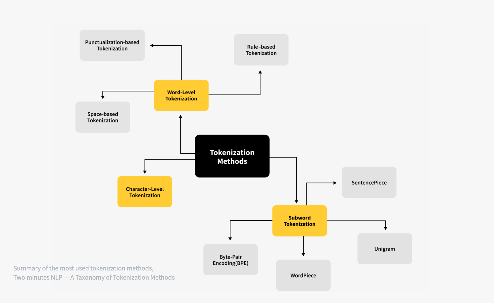

# **Dataset Pre-Processing for LLM Training**

Pre-processing is a **critical stage** in preparing large-scale datasets for LLM pre-training. It ensures that the data is **clean, balanced, diverse, and representative** while also reducing biases, redundancy, and leakage into downstream evaluation tasks. Below is a structured outline of the main pre-processing techniques.


### **1. Data Sampling**

* **Objective:** Balance dataset composition to align with training goals.
* **Strategies:**

  * **Up-sampling**: Increase representation of high-value or underrepresented domains (e.g., scientific text, medical corpora).
  * **Down-sampling**: Reduce noisy or low-quality web crawl data to avoid overwhelming the dataset.
  * **Classifier-based filtering**: Train a smaller classifier to identify and filter high-quality data.

    * Example: **Meta’s Galactica** — optimized for science by curating academic papers, textbooks, and lecture notes, while excluding irrelevant web data.


### **2. Handling Non-Standard Textual Components**

* Many corpora contain **emojis, symbols, markup, or non-standard tokens**.
* Conversion examples:

  * Emoji → textual form (“❄️” → *snowflake*).
  * Math markup → LaTeX normalization.
  * Programmatic code → standardized tokenization.
* Purpose: Ensure consistency across diverse domains and prevent token bloat in vocabulary.


### **3. Data Cleaning**

* **Goals:** Improve training efficiency and model robustness.
* **Common methods:**

  * Remove **boilerplate text** (headers, navigation menus).
  * Strip **HTML/XML markup**.
  * Normalize spelling and grammar (optional, depending on training philosophy).
  * Handle **cross-domain homographs** (words with multiple meanings in different fields).
  * Remove or reduce **biased / harmful speech** (to reduce toxicity).

**Philosophical trade-off:**

* Some research projects **clean aggressively** to reduce noise.
* Others argue LLMs should **see the real-world distribution** (including toxicity, errors, and misspellings) to better generalize and handle messy input.


### **4. Data Deduplication**

* Duplicate or near-duplicate documents **inflate frequency bias** and can lead to poor generalization.
* **Methods:**

  * **Exact matching** (hash-based).
  * **Fuzzy deduplication** (e.g., **Locality Sensitive Hashing (LSH)**, MinHash) to detect paraphrased or nearly identical documents.
* **Reference:** *Deduplicating Training Data Makes Language Models Better* shows significant improvements in model performance after deduplication.


### **5. Downstream Task Data Removal**

* **Problem:** Data leakage occurs when evaluation/test data is present in the training dataset.
* **Solution:**

  * Apply **n-gram overlap detection** (e.g., 13-gram matching) to remove eval dataset contamination.
  * Maintain **separate curated evaluation sets** untouched by training data.
* **Impact:** Ensures that reported downstream performance reflects **generalization**, not memorization.


### **6. Pros & Cons of Pre-Processing**

| **Technique**             | **Pros**                                                        | **Cons**                                                       |
| ------------------------- | --------------------------------------------------------------- | -------------------------------------------------------------- |
| **Data Sampling**         | Balances dataset, improves focus on high-value domains          | Risk of over/under-representing domains                        |
| **Non-Standard Handling** | Standardizes input, reduces vocabulary fragmentation            | May lose contextual richness (e.g., emoji sentiment)           |
| **Data Cleaning**         | Improves readability, reduces noise                             | Risk of over-cleaning and removing real-world variance         |
| **Deduplication**         | Improves generalization, reduces bias from overrepresented docs | Expensive at scale (billions of docs), risk of false positives |
| **Downstream Removal**    | Prevents data leakage, ensures fair eval                        | Requires careful monitoring of overlaps, costly at scale       |


**Summary:**
Pre-processing directly affects **model convergence, generalization, and downstream task performance**. Best practices combine **automated scalable methods** (deduplication, filtering, leakage detection) with **domain expertise** (for specialized corpora like law, medicine, or science).


---


## **Tokenization in LLMs**

Tokenization is the process of converting raw text into smaller units (tokens) that can be mapped to IDs and processed by transformers. The choice of tokenization strategy significantly impacts model efficiency, vocabulary size, handling of rare words, and cross-lingual performance.


**Tokenization Methods:**





### **1. Word-based Tokenization**

* **How it works**: Splits text by spaces or predefined rules (e.g., *Moses, spaCy*).
* **Pros**: Simple and intuitive; aligns with human perception of words.
* **Cons**:

  * Produces a very large vocabulary → leads to huge embedding matrices.
  * Many **Out-of-Vocabulary (OOV)** tokens (rare/new words).
  * Cannot easily capture morphological variations.
* **Notes**: Transformers trained this way typically limit vocabularies to <50k words.


### **2. Character-based Tokenization**

* **How it works**: Splits text into individual characters.
* **Pros**:

  * Extremely small vocabulary.
  * **No OOV tokens** (any word can be reconstructed from characters).
* **Cons**:

  * Very long sequences → higher computational cost.
  * Tokens are less meaningful (harder to learn rich representations).
  * Works better in logographic languages (e.g., Chinese, Japanese) where one character may carry rich meaning.


### **3. Subword-based Tokenization** *(dominant in modern LLMs)*

* **How it works**: Breaks text into frequent subwords. Rare words are decomposed; common words stay intact.

  * Examples: **Byte-Pair Encoding (BPE), WordPiece, SentencePiece, Unigram.**
* **Pros**:

  * Balanced vocabulary size.
  * Handles **rare words and morphology** well.
  * Avoids large embedding matrices while still learning meaningful context-independent representations.
* **Cons**:

  * Some ambiguity in splits (different tokenizers may segment differently).
* **Notes**: State-of-the-art LLMs (GPT, BERT, LLaMA, etc.) use BPE or SentencePiece.


### **Summary of Use Cases**

* **Word-based** → Simple, English-only tasks, small demos.
* **Character-based** → Languages with complex scripts or when **no OOV tolerance** is allowed.
* **Subword-based** → Best for large-scale, multilingual, morphology-rich LLMs (most widely adopted).

---


## **Subword-based Tokenization Methods in Detail**

Description of subword-based Tokenization Methods **Byte-Pair Encoding (BPE), WordPiece, Unigram, and SentencePiece**. 


### **1. Byte-Pair Encoding (BPE)**

* **How it works**: Starts from characters and iteratively merges the most frequent adjacent pairs to form new tokens.
* **Pros**:

  * Efficiently handles **rare words** by breaking them into subwords.
  * Small vocabulary, fewer `<unk>` tokens.
* **Cons**:

  * May produce subwords that are **not linguistically meaningful**.
* **Transformers using it**: GPT-2, GPT-3, RoBERTa.


### **2. WordPiece**

* **How it works**: Similar to BPE, but instead of merging the most frequent pair, it merges the pair that **maximizes likelihood of the training data**.
* **Pros**:

  * Better for languages where word meaning changes with **context**.
* **Cons**:

  * Still produces context-independent tokens, so meaning is not always fully preserved.
* **Transformers using it**: BERT, DistilBERT, Electra.


### **3. Unigram**

* **How it works**: Starts with a **large vocabulary**, then prunes tokens based on probability to reach an optimal smaller vocabulary.
* **Pros**:

  * Can generate **linguistically meaningful subwords**.
  * Handles **complex morphology** (e.g., agglutinative languages).
* **Cons**:

  * Can still struggle with rare/OOV words compared to BPE.
* **Transformers using it**: Not directly, but often used with SentencePiece.


### **4. SentencePiece**

* **How it works**: Treats the **input as a raw byte stream** (no need for pre-segmentation by spaces). Can apply BPE or Unigram internally.
* **Pros**:

  * Works for languages without spaces (Chinese, Japanese, Korean).
  * Useful for multilingual training.
* **Cons**:

  * Tokenization may include whitespace tokens, which add complexity.
* **Transformers using it**: ALBERT, XLNet, Marian, T5.


### **Key Takeaways**

* **BPE** → great for efficiency, widely used in GPT-family.
* **WordPiece** → optimized for likelihood, widely used in BERT-family.
* **Unigram** → linguistically rich, better for complex morphology.
* **SentencePiece** → most flexible, works across languages, especially non-space-delimited.


---


### **Beyond Subword Tokenization: Token-free Models**

* **ByT5 (Google Research)** is a prominent example.

  * **Approach**: Operates directly on raw bytes (Unicode), skipping tokenization altogether.
  * **Benefits**:

    * Works across **any language** without needing language-specific preprocessing.
    * Handles **OOV (out-of-vocabulary) words** seamlessly.
    * More **robust to noise** (e.g., typos, misspellings).
    * **Simplifies pipelines** → avoids the need for complex, error-prone tokenizers.
  * **Downside**:

    * Generally **less accurate** than tokenizer-based LLMs.
    * Byte sequences are **longer**, so training/inference is more compute-heavy.
  * **Current status**: Promising direction, but requires more research before it can outperform subword-based methods at scale.


### **Padding and Truncation**

* After tokenization (or byte encoding), sequences differ in length.
* **Padding**:

  * Short sequences are filled with a **special `<PAD>` token**.
  * Ensures that all input tensors have the **same shape**, enabling batch processing.
  * Example:

    ```
    ["I love ML", "Transformers are powerful"]  
    → ["I", "love", "ML", "<PAD>", "<PAD>"]  
    → ["Transformers", "are", "powerful"]
    ```
* **Truncation**:

  * Long sequences are **cut to a maximum length** supported by the model (e.g., 512 tokens for BERT).
  * Prevents memory issues and excessive training time.


### **Inherent Limitation of Subword Tokenization**

* Subword-based LLMs view inputs as **tokens** (chunks of text) instead of words or characters.
* **Implications**:

  * They don’t inherently understand **letters** or **whole words** as humans do.
  * Example: The word **“running”** might be split as `run` + `##ning` (WordPiece) or `runn` + `ing` (BPE).
  * This means the model struggles with **character-level merging** or orthographic variations.
  * Limitation is especially visible when dealing with **creative text**, rare character compositions, or symbolic languages.


### **Comparison: Tokenization vs Token-free**

| Approach               | Strengths                                               | Weaknesses                                               | Example Models       |
| ---------------------- | ------------------------------------------------------- | -------------------------------------------------------- | -------------------- |
| **Word-based**         | Simple, interpretable                                   | Huge vocab, OOV issues                                   | Early NLP pipelines  |
| **Character-based**    | No OOV, universal                                       | Long sequences, less semantic                            | Some early RNNs      |
| **Subword-based**      | Balances vocab + generalization, best for LLMs          | Still OOV at subword granularity, chunk-based limitation | GPT, BERT, T5, LLaMA |
| **Token-free (bytes)** | Universal, OOV-free, robust to noise, no tokenizer debt | Longer sequences, higher compute, less accurate so far   | ByT5                 |


---


