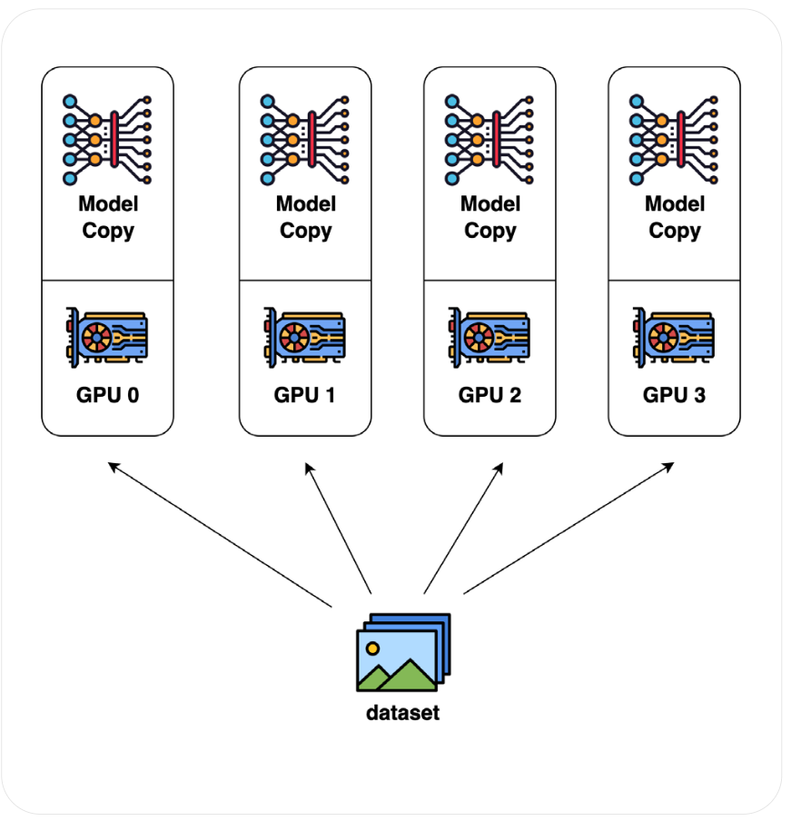
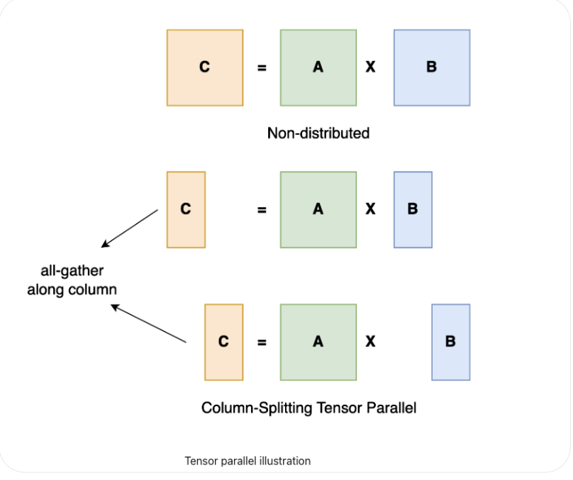
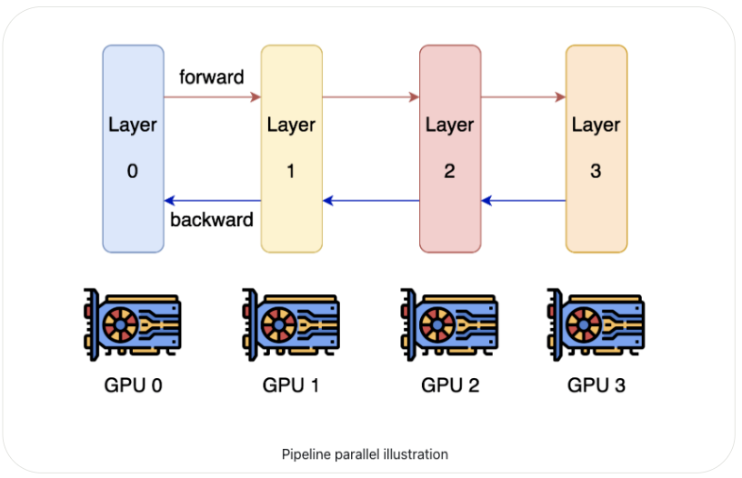

# **Pre-Training LLMs — Hardware & Infrastructure Realities**

Pre-training large language models (LLMs) is fundamentally a **hardware- and infrastructure-intensive effort**. Modern LLM training requires orchestration of thousands of high-performance GPUs/TPUs with specialized distributed training strategies.


### 1. **Examples of Current Large-Scale Training Efforts**

* **PaLM (540B, Google)**

  * Hardware: **6,144 TPU v4 chips**, organized into two TPU v4 Pods.
  * Parallelism: Combination of **model parallelism** and **data parallelism** connected over **data center network (DCN)**.

* **OPT (175B, Meta AI)**

  * Hardware: **992 NVIDIA A100 80GB GPUs**.
  * Parallelism: Fully **data parallelism** with **Megatron-LM tensor parallelism**.

* **GPT-NeoX (20B, EleutherAI)**

  * Hardware: **96 NVIDIA A100 40GB GPUs**.
  * Parallelism: Hybrid **pipeline + tensor parallelism** for community-scale training.

* **Megatron-Turing NLG (530B, NVIDIA & Microsoft)**

  * Hardware: **560 DGX A100 nodes** (8× A100 80GB GPUs per node).
  * Parallelism: Uses **tensor + pipeline parallelism** across massive distributed clusters.


### 2. **Key Infrastructure Challenges**

1. **Memory Constraints**

   * Even the largest GPUs (e.g., **NVIDIA A100 80GB**) cannot fit full LLM parameter sets (hundreds of billions).
   * Requires **model sharding** across GPUs (tensor/pipeline parallelism).

2. **Training Time Constraints**

   * A single GPU is impractical: training GPT-3 (175B) on **1 V100** would take ~**288 years**.
   * Thus, **scaling out compute** with massive GPU clusters is essential.

3. **Efficient Parallelism Strategies**

   * **Data Parallelism** → Replicates the model, splits batches.
   * **Model/Tensor Parallelism** → Splits layers or tensor operations across devices.
   * **Pipeline Parallelism** → Splits sequential layers across devices, keeps GPUs busy in stages.
   * **ZeRO (Zero Redundancy Optimizer)** → Memory-efficient optimizer state partitioning.

4. **Optimization Across the Stack**

   * **Algorithms**: Mixed precision training (FP16/BF16), gradient checkpointing.
   * **Software**: Frameworks like **Megatron-LM, DeepSpeed, Alpa, MosaicML Composer**.
   * **Hardware**: NVLink, InfiniBand, custom interconnects (e.g., TPU DCN, NVIDIA NVSwitch).


### 3. **Takeaway**

Training LLMs at frontier scale is no longer a **single-GPU or small-cluster problem**. It requires:

* **Massive hardware clusters** (thousands of GPUs/TPUs).
* **Parallelism-aware architectures** to overcome memory/computation bottlenecks.
* **Algorithmic + hardware co-optimization** to avoid training times stretching into centuries.

This is why only a handful of organizations (Google, OpenAI, Anthropic, Meta, NVIDIA/MSFT) can realistically train models at the **hundreds of billions of parameters scale** today — and why using commercial or open-source models are far more practical for most teams.


---


## **Memory vs. Compute Efficiency in LLM Training**

Training large language models requires balancing **memory efficiency** and **compute efficiency** across thousands of distributed GPUs. Both dimensions introduce unique challenges that must be addressed with careful architecture and parallelization design.


### 1. **Memory Efficiency**

* **Memory Demands**

  * LLM training involves storing **model weights, gradients, and optimizer states**, which collectively demand **terabytes of memory**.
  * A single GPU (even with 80GB memory) cannot accommodate models with hundreds of billions of parameters.

* **Mitigation Strategy: Gradient Accumulation**

  * Splits a large training batch into **micro-batches**.
  * Each micro-batch is processed sequentially, with **gradients accumulated** before a weight update.
  * Allows scaling **effective batch size** without proportionally increasing **activation memory footprint**.
  * Supports training at scales otherwise impossible with raw GPU memory limits.

* **Other Techniques**

  * **Activation checkpointing**: Recomputing activations during backpropagation instead of storing them.
  * **ZeRO optimizer (DeepSpeed)**: Partitions optimizer states, gradients, and parameters across devices.
  * **Mixed precision training**: Using FP16 or BF16 to reduce memory usage.


### 2. **Compute Efficiency**

* **Challenges in Large GPU Clusters**

  * Thousands of GPUs provide massive compute throughput, but **communication overhead** (synchronization, all-reduce operations) can become a bottleneck.
  * Poorly tuned parallelism strategies often leave GPUs idle, reducing effective utilization.

* **Large Batch Sizes**

  * Increasing batch size can improve **compute efficiency** by:

    * Raising the **arithmetic intensity** of GPU kernels.
    * Reducing time spent on **synchronization and communication**.
  * However, excessively large batch sizes can:

    * Hurt **generalization performance**.
    * Require **learning rate tuning** and specialized optimizers (e.g., LAMB, Adam with warmup).

* **Best Practices**

  * Find the **scaling sweet spot** between compute utilization and model convergence.
  * Use **dynamic batch sizing** strategies (gradual scaling as training progresses).
  * Employ **pipeline and tensor parallelism** to keep GPUs maximally engaged.


### 3. **The Balance**

* **Memory efficiency** ensures the model can *fit* and train at scale without running out of GPU memory.
* **Compute efficiency** ensures that thousands of GPUs are *fully utilized* and training time is practical.
* Both dimensions require **parallelism-aware architecture design**, which leads into **data, tensor, and pipeline parallelism strategies** — the cornerstone of modern LLM training.

---


# **Techniques for Parallelization**

Parallelization refers to splitting up tasks and distributing them across multiple processors or devices, such as GPUs, so that they can be completed simultaneously. This allows for more efficient use of compute resources and faster completion times compared to running on a single processor or device. Parallelized training across multiple GPUs is an effective way to reduce the overall time needed for the training process.


There are several different strategies that can be used to parallelize training, including gradient accumulation, micro-batching, data parallelization, tensor parallelization and pipeline parallelization, and more. Typical LLM pre-training employs a combination of these methods. 

Let’s define each:


## **Data Parallelism in LLM Training**



Data parallelism is the most widely used and straightforward strategy for scaling deep learning workloads across multiple GPUs or nodes. It addresses the challenge of **large datasets** that cannot fit into a single machine while still enabling efficient training.


### 1. **How It Works**

* The training dataset is **partitioned into shards**, with each shard distributed to a different GPU/node.
* Each node runs a **replica of the full model** and processes its local mini-batch of data independently.
* After computing gradients on its shard, each node communicates with others to **synchronize updates** and form a global model.
* Synchronization can be:

  * **Synchronous**: All nodes wait to average gradients before the next step.
  * **Asynchronous**: Nodes update independently, leading to faster throughput but risk of stale gradients.


### 2. **Advantages**

* **High Compute Efficiency**

  * Scales easily with more GPUs, since each processes different data in parallel.
* **Ease of Implementation**

  * Supported natively by frameworks like PyTorch DDP, Horovod, and TensorFlow MirroredStrategy.
* **Effective for Large Datasets**

  * Allows near-linear scaling when dataset size is massive.


### 3. **Limitations**

* **Gradient Communication Overhead**

  * After each backward pass, **full gradients must be exchanged across all GPUs**.
  * At large scale (thousands of GPUs), communication overhead can become a bottleneck.
* **Memory Inefficiency**

  * Each node stores a **full copy of the model and optimizer states**.
  * For LLMs with hundreds of billions of parameters, this can exceed per-GPU memory limits.
* **Scaling Challenges**

  * Communication costs grow super-linearly with more GPUs.
  * Requires high-bandwidth interconnects (e.g., NVLink, InfiniBand, TPU DCN).


### 4. **Enhancements to Data Parallelism**

* **ZeRO (DeepSpeed)** → Shards optimizer states, gradients, and parameters across devices to improve memory efficiency.
* **Fully Sharded Data Parallel (FSDP, PyTorch)** → Extends sharding to parameters, reducing memory overhead.
* **Gradient Compression** → Reduces communication cost by compressing gradients before all-reduce.
* **Overlapping Communication with Computation** → Hides latency by syncing gradients while computing the next batch.


### 5. **Summary**

Data parallelism is the **foundation of distributed deep learning** due to its simplicity and efficiency for large datasets. However, for **LLMs with billions of parameters**, pure data parallelism is insufficient due to **memory replication and communication bottlenecks**. This is why **tensor parallelism and pipeline parallelism** are often layered on top, leading to **hybrid parallelism approaches** for modern LLM training.


---


## **Tensor Parallelism in LLM Training**

Tensor parallelism addresses the **memory inefficiency** problem of data parallelism by splitting **individual model operations** (e.g., large matrix multiplications) across multiple GPUs. Instead of replicating the full model on each device, the computation of layers is distributed so that each GPU only handles a fraction of the work.





### 1. **How It Works**

* A large matrix multiplication (e.g., in a transformer’s feedforward or attention block) is **partitioned into submatrices**.
* Each GPU is responsible for computing its **slice** of the matrix multiplication.
* The partial results are combined during forward and backward propagation to form the full output.
* Example:

  * If you have a 16,000 × 16,000 weight matrix split across 4 GPUs, each GPU might store and compute a 4,000 × 16,000 slice.


### 2. **Advantages**

* **Memory Efficiency**

  * Model weights are **sharded across GPUs**, so each device only stores part of the model.
  * Allows training models that are too large to fit in the memory of a single GPU.

* **Faster Training on Large Models**

  * Distributes heavy linear algebra computations, reducing per-GPU workload.

* **Scales Better with Model Size**

  * Critical for LLMs with **hundreds of billions of parameters**, where weight matrices dominate memory.


### 3. **Limitations**

* **Increased Communication Overhead**

  * Requires frequent **synchronization of activations** between GPUs during forward and backward passes.
  * Communication happens at every layer, unlike data parallelism where it happens only after backward pass.

* **Bandwidth-Dependent**

  * To achieve efficiency, requires **high-bandwidth interconnects** (e.g., NVLink, NVSwitch, InfiniBand).
  
* **Implementation Complexity**

  * More complex to implement and debug compared to data parallelism.


### 4. **When to Use Tensor Parallelism**

* When model size **exceeds single-GPU memory capacity**.
* In **dense transformer architectures** where matrix multiplications dominate compute.
* When combined with **data parallelism** to balance both compute scaling and memory distribution.


### 5. **Summary**

Tensor parallelism enables training of **extremely large models** by **splitting model weights and computations** across GPUs, making it more memory-efficient than pure data parallelism. However, the heavy **communication of activations** requires **specialized interconnects** and careful tuning. In practice, tensor parallelism is usually combined with **pipeline parallelism** and **data parallelism** to form **hybrid strategies** (e.g., Megatron-LM’s 3D parallelism).


---


## **Pipeline Parallelism and Model Parallelism**





* **Pipeline Parallelism**

  * **Concept**: Splits a model’s layers into *sequential stages* across multiple GPUs. Each stage handles a subset of layers, and micro-batches of data are passed through the stages like an assembly line.
  * **Efficiency**: Improves memory and compute efficiency by ensuring GPUs can work concurrently once the pipeline is filled.
  * **Parallelism type**: Considered *inter-layer parallelism* (different GPUs handle different groups of layers).
  * **Pros**:

    * Higher throughput with minimal communication overhead.
    * Reduces memory burden per GPU.
  * **Cons**:

    * Scalability limited by model depth (number of layers).
    * Pipeline bubbles (idle GPU time at the beginning and end of training).

* **Model Parallelism**

  * **Concept**: Splits the *parameters of a model* across GPUs, where each GPU is responsible for computing only a portion of the model. Instead of replicating the model across devices (like in data parallelism), the model itself is partitioned.
  * **Efficiency**: Useful when the model is too large to fit into the memory of a single GPU.
  * **Pros**:

    * Enables training of massive models beyond single GPU memory limits.
  * **Cons**:

    * Communication between GPUs increases during forward and backward passes.
    * Limited scalability, since partitioning depth is finite and cannot scale infinitely (bounded by the number of layers or submodules).

**Key Difference**:

* Pipeline parallelism = *distributes computation by layers (sequential stages)*.
* Model parallelism = *splits the model itself across GPUs (structural partitioning)*.


---


## **Hybrid Parallelism in Large-Scale LLM Training**

* **Why Hybrid Parallelism?**
  No single parallelism strategy (data, tensor, pipeline, or model parallelism) scales efficiently to trillion-parameter models. Teams typically combine them to balance memory usage, compute efficiency, and communication overhead.


### **Real-World Examples**

* **PaLM (Google, 2022) & OPT (Meta, 2022)**

  * Combined **tensor parallelism** (splitting computations across GPUs) and **data parallelism** (replicating the model across devices with different data shards).
  * Goal: scale parameter-heavy models while ensuring efficient GPU utilization.

* **Megatron-LM (NVIDIA)**

  * Proposed **PTD-P (Pipeline + Tensor + Data Parallelism)**.
  * **Pipeline parallelism**: across multi-GPU servers.
  * **Tensor parallelism**: within a single multi-GPU server.
  * **Data parallelism**: across large GPU clusters.
  * Achieved **52% of peak GPU throughput** across thousands of GPUs.
  * Enabled training of models with **trillions of parameters**.


### **Hardware & Networking Needs**

* High-performance GPUs (e.g., NVIDIA A100/H100).
* **High-bandwidth interconnects** (e.g., InfiniBand, NVLink) to minimize communication bottlenecks across servers.
* Optimized cluster topologies to reduce data transfer overhead between nodes.


### **Cost Considerations**

* Training is **infrastructure-intensive**:

  * Example: **PaLM (540B parameters)** estimated training cost ≈ **$23 million**.
  * Expenses come from GPU compute hours, networking, and energy consumption.


### **Software Tooling**

* **Frameworks**: Distributed TensorFlow, Torch Distributed, Horovod.
* **Specialized libraries**:

  * **DeepSpeed** (Microsoft): ZeRO optimizer, memory efficiency.
  * **Megatron-LM** (NVIDIA): optimized hybrid parallelism.
* **Challenge**: Implementation complexity requires **system expertise** to configure and tune distributed training properly.


**Bottom line**: Modern LLMs (PaLM, OPT, GPT-4 scale) are only feasible with **hybrid parallelism**, specialized **software stacks**, **high-bandwidth interconnects**, and **massive infrastructure investments**.


---


## **Optimization and Memory-Efficient Strategies in Distributed Deep Learning**

When training LLMs across many GPUs, beyond parallelism, there are additional strategies to **reduce communication overhead**, **optimize memory usage**, and **improve scalability**. Three key ones are **gradient accumulation**, **asynchronous SGD**, and **micro-batching**.


### **1. Gradient Accumulation**

* **How it works**:

  * Instead of updating weights after every mini-batch, gradients are accumulated over multiple mini-batches before applying one optimization step.

* **Advantages**:

  * Reduces GPU-to-GPU communication frequency.
  * Simulates training with larger batch sizes without increasing memory usage.

* **Trade-offs**:

  * Slower per-update convergence since updates are less frequent.
  * Requires careful tuning of accumulation steps to balance compute efficiency and convergence speed.


### **2. Asynchronous Stochastic Gradient Descent (Async-SGD)**

* **How it works**:

  * Nodes compute gradients independently on **microbatches**.
  * A **parameter server** maintains global parameters:

    1. Workers fetch the latest parameters.
    2. Compute gradients on local microbatch.
    3. Send gradients back to parameter server.
    4. Server updates global parameters asynchronously.

* **Advantages**:

  * High throughput, since workers don’t wait for synchronization.
  * Efficient for large-scale distributed setups.

* **Trade-offs**:

  * Can introduce **stale gradients** (workers may compute gradients on outdated parameters).
  * May reduce stability and final convergence quality compared to synchronous methods.


### **3. Micro-Batching**

* **How it works**:

  * Splits a mini-batch into smaller **microbatches** that can be processed sequentially on a GPU.
  * Activations/gradients from microbatches are accumulated before performing a weight update.

* **Advantages**:

  * Reduces memory footprint (since not all samples are processed at once).
  * Enables training with much larger **effective batch sizes** on limited GPU memory.
  * Reduces synchronization points in multi-GPU training.

* **Trade-offs**:

  * Extra forward/backward passes per mini-batch increase overhead.
  * Careful balance needed between microbatch size and throughput.


### **Key Insight**

* **Gradient Accumulation** and **Micro-Batching** are often **combined**:

  * Micro-batching helps fit large models into memory.
  * Gradient accumulation ensures effective large-batch training.
* **Async-SGD** is useful for extreme-scale distributed setups but can sacrifice stability, so many modern LLM trainings (e.g., GPT-4, PaLM) prefer **synchronous + micro-batching + gradient accumulation** with efficient parallelism.


---


## **Unified LLM Training Workflow**

```
                  ┌───────────────────────────────────────────┐
                  │                 DATASET                   │
                  └───────────────────────────────────────────┘
                                    │
                                    ▼
                  ┌───────────────────────────────────────────┐
                  │        DATA PARALLELISM (Sharding)        │
                  │ - Split dataset across nodes              │
                  │ - Each node sees unique partition         │
                  └───────────────────────────────────────────┘
                                    │
                                    ▼
       ┌────────────────────────────────────────────────────────────────┐
       │            WITHIN EACH NODE (Multi-GPU Server)                 │
       └────────────────────────────────────────────────────────────────┘
                                    │
        ┌───────────────────────────┼───────────────────────────┐
        ▼                           ▼                           ▼
┌────────────────────┐     ┌────────────────────┐     ┌────────────────────┐
│ PIPELINE PARALLEL  │     │ TENSOR PARALLEL    │     │ MICRO-BATCHING     │
│ - Split layers     │     │ - Split matrices   │     │ - Split mini-batch │
│   across GPUs      │     │   across GPUs      │     │   into chunks      │
│ - Inter-layer      │     │ - Intra-layer      │     │ - Reduce memory    │
│   parallelism      │     │   parallelism      │     │   footprint        │
└────────────────────┘     └────────────────────┘     └────────────────────┘
                                    │
                                    ▼
                  ┌───────────────────────────────────────────┐
                  │   GRADIENT ACCUMULATION (Sync Barrier)    │
                  │ - Aggregate gradients from microbatches   │
                  │ - Delay optimizer step until N batches    │
                  └───────────────────────────────────────────┘
                                    │
                                    ▼
                  ┌───────────────────────────────────────────┐
                  │   SYNCHRONIZATION ACROSS NODES            │
                  │ - AllReduce for gradients (sync)          │
                  │ - Or async parameter server (async SGD)   │
                  └───────────────────────────────────────────┘
                                    │
                                    ▼
                  ┌───────────────────────────────────────────┐
                  │         OPTIMIZER UPDATE STEP             │
                  │ - Update global model weights             │
                  │ - Broadcast updated params to workers     │
                  └───────────────────────────────────────────┘
```


## **How They Interact**

1. **Data Parallelism**: Splits dataset across nodes. Each node works on a different data shard.

2. **Pipeline + Tensor Parallelism**: Splits model layers (pipeline) and tensor ops (tensor) across GPUs *within a node*.

3. **Micro-Batching**: Allows fitting large effective batch sizes into GPU memory.

4. **Gradient Accumulation**: Combines gradients from several microbatches before applying an optimizer step.
   
5. **Synchronization**: Across GPUs/nodes, gradients are shared (synchronously via AllReduce, or asynchronously via parameter servers).

6. **Optimizer Step**: Updates global parameters, ensuring model consistency.


This diagram reflects how **PaLM, OPT, Megatron-Turing, and Chinchilla-style models** scale efficiently while managing **memory limits** and **compute throughput**.


---

