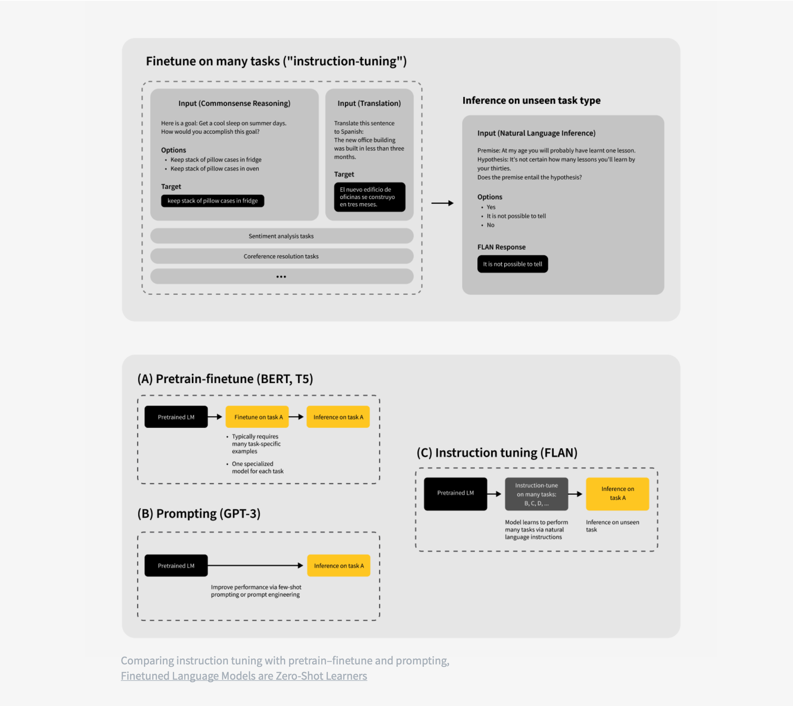
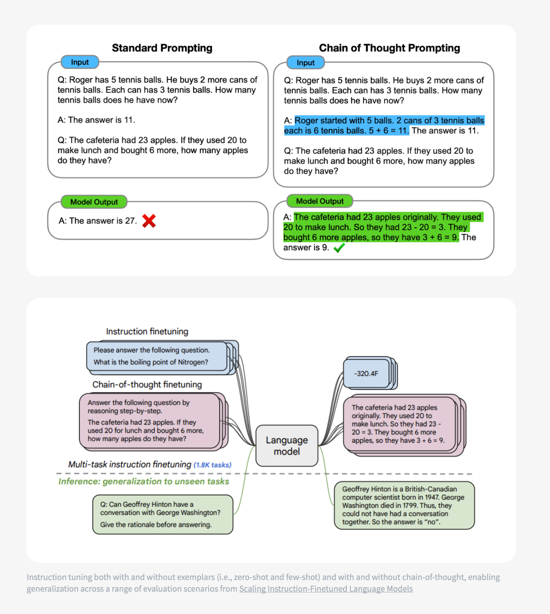

# **Instruction Tuning**

Instruction tuning is a fine-tuning strategy designed to bridge the gap between **general-purpose pre-trained LLMs** and **real-world task performance**, especially in **zero-shot** scenarios where no examples are provided at inference time.


### **Why Instruction Tuning?**

* **Problem:**

  * Pre-trained LLMs excel at few-shot learning but often struggle in **zero-shot settings**.
  * Reason: prompts may not align with the distribution/format of pre-training data.
* **Solution:**

  * Fine-tune models on **task-specific instructions**, making them more robust and aligned to human queries.


### **How It Works**

1. **Task Collection:** Gather a diverse set of NLP tasks (translation, summarization, QA, NLI, etc.) framed as natural instructions.

   * Example:

     * Instruction: *“Translate the following English sentence to French.”*
     * Input: *“The book is on the table.”*
     * Output: *“Le livre est sur la table.”*

2. **Fine-Tuning Phase:** Train the LLM on this dataset so it learns the mapping from **instructions → outputs**.

3. **Evaluation Phase:** Test the tuned model on unseen tasks, verifying if it can generalize instructions beyond training examples.





### **Benefits**

* **Improves Zero-Shot Performance:** Reduces reliance on few-shot demonstrations during inference.
* **Better Alignment with Human Queries:** Responds more naturally to task phrasing in instructions.
* **Generalization:** Performs well on tasks **not included** in the instruction-tuning dataset.
* **Efficiency:** Achieves performance gains without large-scale retraining from scratch.


### **Key Insight**

Instruction tuning shifts the paradigm:

* Instead of expecting users to **adapt prompts to the model**, the model is **adapted to follow instructions**.


---


## **Instruction Tuning: Step-by-Step Pipeline**

Here’s a structured pipeline from **dataset curation** to **evaluation** for implementing instruction tuning in practice:


```
            ┌────────────────────────────┐
            │ 1. Dataset Curation        │
            │ - FLAN / Super-NI / Self-  │
            │   Instruct / Domain data   │
            │ - Format: Instruction-     │
            │   Input-Output triples     │
            └─────────────┬──────────────┘
                          │
                          ▼
            ┌────────────────────────────┐
            │ 2. Preprocessing           │
            │ - Normalize formats        │
            │ - Tokenization             │
            │ - Balance task coverage    │
            └─────────────┬──────────────┘
                          │
                          ▼
            ┌────────────────────────────┐
            │ 3. Fine-Tuning Setup       │
            │ - Model: LLaMA, T5, GPT    │
            │ - Strategy: Full FT or     │
            │   PEFT (LoRA, Prefix,      │
            │   Adapters)                │
            │ - Loss: Cross-Entropy      │
            │ - Optimizer: AdamW + LR    │
            │   scheduling               │
            └─────────────┬──────────────┘
                          │
                          ▼
            ┌────────────────────────────┐
            │ 4. Evaluation              │
            │ - Benchmarks: SQuAD, ARC,  │
            │   SNLI, WMT, BIG-bench     │
            │ - LM Eval Harness          │
            │ - Zero-shot & Few-shot     │
            │ - Human evaluation         │
            └─────────────┬──────────────┘
                          │
                          ▼
            ┌────────────────────────────┐
            │ 5. Post-Training           │
            │ - Bias & toxicity filtering│
            │ - Alignment (RLHF, output  │
            │   steering)                │
            │ - Robustness testing       │
            └─────────────┬──────────────┘
                          │
                          ▼
            ┌────────────────────────────┐
            │ 6. Deployment              │
            │ - Optimize for inference   │
            │   (ONNX, TensorRT, vLLM)   │
            │ - Release with model card  │
            │   & documentation          │
            └────────────────────────────┘
```

### **1. Dataset Curation**

Instruction tuning requires a **collection of tasks written as natural instructions**.

* **Sources of instruction datasets:**

  * **Public instruction datasets**:

    * **FLAN (Google)** – broad set of NLP tasks reformulated as instructions.
    * **Natural Instructions** – crowdsourced dataset with >1,600 tasks.
    * **Super-NaturalInstructions** – extended version with more task variety.
    * **Self-Instruct** – bootstrap approach where GPT-3 generates new instruction-style data.

  * **Custom domain-specific tasks**: If targeting finance, healthcare, or legal use-cases, curate task data in natural instruction format.

* **Format Example:**

| **Instruction**                         | **Input**                        | **Output**                    |
| --------------------------------------- | -------------------------------- | ----------------------------- |
| Summarize this article in one sentence. | "The stock market rose by 2%..." | "The stock market gained 2%." |
| Translate English to German.            | "The weather is nice today."     | "Das Wetter ist heute schön." |
| Classify sentiment.                     | "I love this phone."             | "Positive"                    |


### **2. Preprocessing**

* Normalize task formatting into **Instruction–Input–Output** triples.
* Tokenize using the same tokenizer as the pre-trained LLM.
* Ensure **balanced task coverage** (avoid overfitting to a single task type).


### **3. Fine-Tuning Setup**

* **Model:** Start with a large pre-trained LLM (e.g., T5, GPT-3, LLaMA, Falcon).

* **Training Objective:** Minimize cross-entropy loss between predicted tokens and the target output.

* **Techniques:**

  * **Full fine-tuning** – update all parameters (costly for very large models).
  * **Parameter-efficient fine-tuning (PEFT):**

    * LoRA (Low-Rank Adaptation)
    * Prefix tuning
    * Adapter layers
  * PEFT is widely used because it saves memory and compute.

* **Hyperparameters:**

  * Batch size: As large as memory allows.
  * Learning rate: Small (1e-5 to 5e-5), with decay scheduling.
  * Warmup steps: To stabilize early training.
  * Optimizer: AdamW commonly used.


### **4. Evaluation**

Evaluate the tuned model across **seen and unseen tasks**:

* **Standard NLP Benchmarks:**

  * QA: SQuAD, TriviaQA
  * Reasoning: ARC, PIQA
  * Inference: SNLI, QNLI
  * Summarization: CNN/DailyMail
  * Translation: WMT

* **Instruction-Tuning Specific:**

  * **BIG-bench**: 200+ challenging tasks.
  * **LM Evaluation Harness**: 200+ task evaluations (EleutherAI).
  * **Zero-shot generalization**: Test on tasks not included in tuning data.

* **Human Evaluation:**

  * Have annotators judge correctness, relevance, fluency.
  * Check for hallucinations, bias, and safety concerns.


### **5. Post-Training Steps**

* **Bias & Toxicity Filtering:** Apply post-hoc filtering or reinforcement learning from human feedback (RLHF) to align responses.
* **Instruction Generalization Testing:** Try prompts in **natural human phrasing** to ensure robustness.
* **Deployment Preparation:** Package tuned model into inference-optimized format (ONNX, TensorRT, vLLM).


### **6. Example Workflow (Summarized)**

1. Collect instruction-based datasets (FLAN, Super-NI, domain-specific).
2. Format into (Instruction, Input, Output).
3. Choose tuning strategy (Full FT or LoRA/PEFT).
4. Train with AdamW + LR scheduling.
5. Evaluate on benchmarks + human eval.
6. Apply alignment techniques (RLHF, output steering).
7. Package for inference and release with model card.


---


## **Instruction Tuning – Key Considerations**

### **1. Parameter Updates**

* **Instruction Tuning** updates **all model parameters**.
* Unlike **parameter-efficient fine-tuning (PEFT)** (e.g., LoRA, Adapters, Prefix-tuning), it does **not freeze** most of the base model.
* **Trade-off**: Higher training cost (compute + memory), but results in **more generalizable** models.


### **2. Generalization**

* Produces **broadly capable models** that perform well across diverse tasks.
* Can serve as a **general-purpose model** for multiple downstream applications.
* This contrasts with PEFT, where models are often more **task-specific**.


### **3. Cost vs. Benefit**

* **Cost**: Requires a significant training budget (compute, dataset preparation, time).
* **Benefit**: If you can afford it, you end up with a model that is closer to a **foundation model** and can handle tasks **zero-shot** or **few-shot** without further tuning.


### **4. Task Suitability**

* **Works best** for tasks naturally expressed as instructions:

  * Natural Language Inference (NLI)
  * Question Answering (QA)
  * Translation
  * Summarization
* **More challenging** for reasoning-heavy tasks (e.g., multi-step logical reasoning).


### **5. Enhancing Reasoning**

* To improve performance on reasoning, include **Chain-of-Thought (CoT) examples** during tuning.

  * Example: Instead of only providing Q → A pairs, show **step-by-step reasoning** in the training data.
  * This helps models internalize **multi-step logical processes**.





**Summary**:
Instruction tuning is expensive but yields **general-purpose, robust, and highly generalizable models**. If training budget and instruction-formatted datasets are available, it is often the preferred strategy — especially when reasoning can be reinforced with **chain-of-thought data**.


---


## **Instruction Tuning vs. PEFT**

| Aspect                    | **Instruction Tuning**                                                                   | **Parameter-Efficient Fine-Tuning (PEFT)**                                  |
| ------------------------- | ---------------------------------------------------------------------------------------- | --------------------------------------------------------------------------- |
| **Parameters Updated**    | Updates **all model parameters**                                                         | Updates **only a small subset** (e.g., adapters, low-rank matrices in LoRA) |
| **Training Cost**         | **High** (compute, time, storage)                                                        | **Low** (memory + compute efficient)                                        |
| **Resulting Model**       | Produces a **general-purpose model** capable across many tasks                           | Produces a **task-specific model**, tuned for one/few downstream tasks      |
| **Generalization**        | Strong **zero-shot** and **few-shot** generalization                                     | Limited — may not generalize well outside trained tasks                     |
| **Dataset Needs**         | Requires large **instruction-formatted dataset** (diverse tasks phrased as instructions) | Requires **smaller, domain/task-specific dataset**                          |
| **Inference Performance** | High, across diverse tasks                                                               | High for tuned task, weaker outside it                                      |
| **Flexibility**           | Once trained, can handle **multiple downstream tasks** without extra tuning              | Usually needs **separate PEFT modules per task**                            |
| **Reasoning Tasks**       | Can struggle unless **chain-of-thought examples** are included                           | Typically weaker for reasoning unless carefully engineered                  |
| **Use Case**              | Ideal if you want a **general-purpose model** (foundation-like)                          | Ideal if you want a **lightweight, domain-specific adaptation**             |
| **Example**               | **FLAN-T5**, **InstructGPT**                                                             | **LoRA-tuned LLaMA models**, **Adapters on BERT**                           |


**Takeaway**:

* Use **Instruction Tuning** if you want a **universal, broadly capable model** and have budget + datasets.
* Use **PEFT** if you want a **cheap, fast adaptation** for **specific tasks**.


---


## **Fine-Tuning Approaches for LLMs**

### **1. Full-Parameter Fine-Tuning**

* **Description**: Updates *all* parameters of the model.
* **Example**: Classic fine-tuning, Instruction Tuning.
* **Pros**: Maximum flexibility & generalization.
* **Cons**: Extremely costly in compute, storage, and time.


### **2. Parameter-Efficient Fine-Tuning (PEFT)**

Updates **only a small subset** of parameters, keeping the base frozen.
Popular methods include:

| **Method**                           | **How it works**                                                                     | **Pros**                                    | **Cons**                              |
| ------------------------------------ | ------------------------------------------------------------------------------------ | ------------------------------------------- | ------------------------------------- |
| **Adapters**                         | Add small bottleneck layers between existing layers. Only adapters are trained.      | Modular, reusable across tasks.             | Slight inference latency.             |
| **LoRA (Low-Rank Adaptation)**       | Decomposes weight matrices into low-rank updates.                                    | Very efficient, widely adopted.             | Requires careful rank selection.      |
| **Prefix-Tuning**                    | Learn continuous task-specific “prefix vectors” added to keys & values in attention. | Parameter-light, works well for generation. | Less effective for complex tasks.     |
| **Prompt-Tuning**                    | Trainable soft prompts prepended to inputs.                                          | Very small parameter footprint.             | Task-specific, weaker generalization. |
| **P-Tuning v2**                      | Optimized prompt-tuning across layers with better performance.                       | Scales better than vanilla prompt-tuning.   | Still weaker than full fine-tuning.   |
| **BitFit**                           | Only fine-tune bias terms of layers.                                                 | Minimal storage, fast.                      | Limited representational power.       |
| **(IA)^3** (Learned scaling factors) | Train scaling vectors to rescale activations inside transformer blocks.              | Extremely lightweight.                      | Less expressive than LoRA.            |


### **3. Hybrid / Advanced Fine-Tuning**

Combines ideas from full and PEFT.

* **Instruction Tuning**: Full fine-tuning with instruction-style datasets for better zero-shot performance.
* **RLHF (Reinforcement Learning with Human Feedback)**: Aligns model outputs with human preferences using a reward model + PPO or DPO.
* **DPO (Direct Preference Optimization)**: A more efficient RLHF alternative without reinforcement learning overhead.
* **Adapter Fusion**: Combine multiple adapters trained on different tasks.
* **Mixture-of-Experts Fine-Tuning**: Activate/train only certain experts (sub-networks).
* **Continual / Incremental Fine-Tuning**: Update the model in phases as new data arrives, avoiding catastrophic forgetting.


### **Summary**

There are **3 main families** of fine-tuning approaches:

1. **Full-parameter fine-tuning** (e.g., Instruction Tuning).
2. **PEFT methods** (LoRA, Adapters, Prefix-tuning, Prompt-tuning, BitFit, (IA)^3, etc.).
3. **Hybrid & advanced fine-tuning** (RLHF, DPO, Adapter Fusion, MoE fine-tuning, continual training).

In practice, **LoRA + RLHF/DPO** has become the most common recipe for state-of-the-art aligned models.


---

