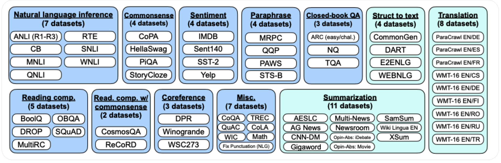

# **Model Evaluation for LLMs**


### **1. Purpose of Evaluation**

The goal of evaluating a pre-trained LLM is to measure its **generalization** and **capability across diverse tasks**, including reasoning, comprehension, translation, and programming. Evaluation benchmarks act as a standardized yardstick to compare models and guide improvements.


### **2. Evaluation Categories & Benchmarks**

#### **a. Open-Domain Question Answering (QA)**

* **Datasets**: TriviaQA, Natural Questions, Web Questions.
* **Task**: Answer fact-based questions from open domains, requiring retrieval and reasoning.

#### **b. Cloze & Completion Tasks**

* **Datasets**: LAMBADA, HellaSwag, StoryCloze.
* **Task**: Fill in missing text, continue a story, or predict plausible completions.
* **Measures**: Language understanding, contextual prediction ability.

#### **c. Winograd-Style Tasks**

* **Datasets**: Winograd, WinoGrande.
* **Task**: Resolve ambiguous pronouns using commonsense reasoning.
* **Importance**: Tests **coreference resolution** beyond surface-level statistics.

#### **d. Commonsense Reasoning**

* **Datasets**: PIQA, ARC, OpenBookQA.
* **Task**: Assess grounding in physical and commonsense knowledge.

#### **e. In-Context Reading Comprehension**

* **Datasets**: DROP, CoQA, QuAC, SQuADv2, RACE, SuperGLUE.
* **Task**: Answer questions about passages, sometimes requiring multi-step reasoning.

#### **f. Natural Language Inference (NLI)**

* **Datasets**: SNLI, QNLI.
* **Task**: Determine if a premise entails, contradicts, or is neutral with respect to a hypothesis.

#### **g. Reasoning Tasks**

* **Datasets**: Arithmetic reasoning datasets.
* **Task**: Test multi-step symbolic/logical reasoning, often requiring chain-of-thought.

#### **h. Code Understanding & Generation**

* **Datasets**: HumanEval, MBPP (text-to-code), TransCoder (code-to-code).
* **Task**: Write, complete, or translate code.
* **Measures**: Programming knowledge, syntactic correctness, logical reasoning.

#### **i. Machine Translation**

* **Datasets**: WMT language pairs.
* **Metric**: BLEU score (and newer metrics like COMET or ChrF).
* **Task**: Translate text between multiple languages.

#### **j. Generalized & Multi-Task Benchmarks**

* **BIG-bench**: 200+ tasks spanning reasoning, linguistics, and programmatic challenges.
* **LM Evaluation Harness (EleutherAI)**:

  * A unified library to evaluate autoregressive LLMs across 200+ tasks.
  * Advantage: Consistent methodology, widely adopted in research for comparison.





### **3. Key Evaluation Metrics**

* **Accuracy** (QA, NLI, multiple-choice tasks).
* **Perplexity** (measures how well a model predicts text, often used as a proxy for fluency).
* **BLEU/ROUGE/ChrF/COMET** (translation and summarization).
* **Pass@k** (code generation success rate).
* **Calibration metrics** (confidence vs. correctness alignment).


### **4. Evaluation Strategies**

* **Task Diversity**: Avoid overfitting by testing across domains.
* **Zero-Shot, Few-Shot, Fine-Tuned**: Evaluate models under different prompting conditions.
* **Cross-Lingual Evaluation**: Test multilingual generalization.
* **Robustness Testing**: Evaluate resilience against adversarial inputs, noisy text, and OOD (out-of-distribution) examples.


**Summary**:
Model evaluation for LLMs relies on a wide range of **standardized benchmarks** covering QA, reasoning, comprehension, translation, and coding. Frameworks like **BIG-bench** and **LM Evaluation Harness** provide systematic, large-scale testing. A mix of task-specific metrics (accuracy, BLEU, Pass@k) and global metrics (perplexity, calibration) ensures a comprehensive picture of model performance.


---


## **LLM Evaluation Benchmarks by Capability**


### **1. Question Answering & Knowledge Recall**

| Capability                                    | Benchmarks                                 | Description                                                      |
| --------------------------------------------- | ------------------------------------------ | ---------------------------------------------------------------- |
| Open-Domain QA                                | TriviaQA, Natural Questions, Web Questions | Test factual recall and retrieval from knowledge.                |
| Reading Comprehension (Extractive/Generative) | SQuADv2, RACE, CoQA, QuAC, DROP            | Requires understanding passages, sometimes multi-step reasoning. |


### **2. Language Understanding & Contextual Prediction**

| Capability                       | Benchmarks                     | Description                                                            |
| -------------------------------- | ------------------------------ | ---------------------------------------------------------------------- |
| Cloze & Completion               | LAMBADA, HellaSwag, StoryCloze | Assess contextual understanding and ability to predict continuations.  |
| Natural Language Inference (NLI) | SNLI, QNLI                     | Determine entailment, contradiction, or neutrality between statements. |
| Commonsense Reasoning            | PIQA, ARC, OpenBookQA          | Test physical, commonsense, and real-world reasoning.                  |


### **3. Reasoning & Logic**

| Capability                      | Benchmarks                        | Description                                                         |
| ------------------------------- | --------------------------------- | ------------------------------------------------------------------- |
| Winograd-style Coreference      | Winograd, WinoGrande              | Resolve ambiguous pronouns requiring reasoning.                     |
| Arithmetic & Symbolic Reasoning | Arithmetic reasoning tasks, GSM8K | Multi-step numerical/logical reasoning.                             |
| General Reasoning               | SuperGLUE                         | Suite of reasoning tasks across NLI, QA, and reading comprehension. |


### **4. Multilingual & Translation**

| Capability                  | Benchmarks                           | Description                                        |
| --------------------------- | ------------------------------------ | -------------------------------------------------- |
| Machine Translation         | WMT language pairs (BLEU/ChrF/COMET) | Test translation quality across diverse languages. |
| Cross-Lingual Understanding | XNLI, XQuAD, TyDi QA                 | Evaluate multilingual generalization.              |


### **5. Code Understanding & Generation**

| Capability   | Benchmarks      | Description                                                       |
| ------------ | --------------- | ----------------------------------------------------------------- |
| Text-to-Code | HumanEval, MBPP | Assess ability to generate functional code from natural language. |
| Code-to-Code | TransCoder      | Evaluate program translation between languages.                   |


### **6. Broad & Multi-Task Evaluations**

| Capability               | Benchmarks                         | Description                                                       |
| ------------------------ | ---------------------------------- | ----------------------------------------------------------------- |
| Generalized Benchmarking | BIG-bench (200+ tasks)             | Broad coverage of reasoning, linguistics, and programmatic tasks. |
| Standardized Evaluation  | LM Evaluation Harness (EleutherAI) | Framework for consistent evaluation across 200+ tasks.            |


**Summary Table of Capabilities & Benchmarks**

* **Knowledge Recall** → TriviaQA, Natural Questions, Web Questions
* **Comprehension & Context** → SQuADv2, LAMBADA, StoryCloze, HellaSwag
* **Commonsense Reasoning** → PIQA, ARC, OpenBookQA
* **Logical & Arithmetic Reasoning** → Winograd, WinoGrande, GSM8K
* **Translation** → WMT, XNLI, XQuAD
* **Code Generation** → HumanEval, MBPP, TransCoder
* **General Benchmark Suites** → BIG-bench, LM Evaluation Harness, SuperGLUE


---


## **Emerging Benchmarks & Frameworks**

| Name                                              | Focus / Novelty                                                              | Key Features & Goals                                                                                                                                                                                                                                                                                     |
| ------------------------------------------------- | ---------------------------------------------------------------------------- | -------------------------------------------------------------------------------------------------------------------------------------------------------------------------------------------------------------------------------------------------------------------------------------------------------- |
| **HELM (Holistic Evaluation of Language Models)** | Broad, multi-metric evaluation across scenarios                              | Developed by Stanford CRFM; evaluates models on 42 scenarios across metrics like accuracy, calibration, robustness, fairness, bias, toxicity, efficiency. <br>Also has newer **HELM Capabilities** which focus on core capabilities across a curated set of scenarios.  |
| **GAIA (General AI Assistants Benchmark)**        | Tests real-world assistant capabilities, tool use, reasoning, multi-modality | Contains ~ 466 questions; requires reasoning + tool use + web browsing; humans ~92%, GPT-4 + plugins ~15%.                                                                                                                                                                                |
| **LiveBench**                                     | Contamination-free, dynamically updated tasks                                | Designed to avoid test-set leakage; includes questions from recent sources (news, math competitions, arXiv) and releases new tasks over time.                                                                                                                                        |
| **OneEval**                                       | Structured reasoning over multiple modalities of knowledge                   | Evaluates reasoning across text, code, knowledge graphs, formal logic in various domains; shows sharp drop in performance as reasoning complexity increases.                                                                                                                                 |
| **SEA-HELM**                                      | Multilingual + cultural evaluation focused on Southeast Asia                 | Emphasis on Southeast Asian languages and cultural contexts, integrated safety & linguistic tasks.                                                                                                                                                                                          |


### How They Augment / Complement Traditional Benchmarks

* **Contamination control**: Benchmarks like *LiveBench* are designed to minimize overlap between model training data and evaluation data, reducing unfair advantage.
  
* **Holistic / multi-metric evaluation**: HELM’s multi-dimensional metrics (not just accuracy) push models to be evaluated on bias, calibration, robustness, etc.
  
* **Assistant-level tasks**: GAIA emphasizes tool use, web reasoning, and real-world tasks that go beyond “benchmarked questions.”
  
* **Structured reasoning**: OneEval tests reasoning over knowledge graphs, logic, and structured datasets — a gap in older benchmarks focused mostly on text.
  
* **Multilingual and cultural sensitivity**: SEA-HELM ensures evaluation for underrepresented languages and cultural domains.


---

## **N-Shot Learning & Human Evaluation**

### **N-Shot Definitions**

* **Zero-shot** — Model receives a task prompt with **no** supervised examples at inference time.
* **One-shot** — Model receives exactly **one** demonstration example before performing the task.
* **Few-shot** — Model receives a small number of demonstration examples (e.g., 3–10) before performing the task.


### **Few-shot example (sentiment analysis)**

```
Task: sentiment analysis

Tweet: "I hate it when my phone battery dies."
Sentiment: Negative

Tweet: "My day has been :smile"
Sentiment: Positive

Tweet: "This is the link to the article"
Sentiment: Neutral

Tweet: "This new music video was incredible"
Sentiment:
Answer:
______
```


### **Prompting techniques that affect n-shot performance**

* **Instruction clarity**: Explicit task instructions improve reliability.
* **Exemplar quality**: Use clean, diverse, and representative demonstrations.
* **Ordering and variety**: Randomize exemplar order across trials to measure sensitivity.
* **Chain-of-Thought (CoT)**: For reasoning tasks, include step-by-step exemplars to boost multi-step reasoning; note tradeoffs in verbosity and safety/sensitivity of exposing internal reasoning.
* **Formatting consistency**: Keep label formats, whitespace, and punctuation consistent between exemplars and evaluation prompts.
* **Context window**: Ensure demonstrations plus prompt fit model context length; consider long-context models or retrieval/condensed exemplars when needed.


### **Automated evaluation metrics (task dependent)**

* **Classification**: accuracy, F1, precision, recall, macro/micro averages.
* **QA / Reading comprehension**: exact match (EM), F1.
* **Generation**: BLEU, ROUGE, METEOR, COMET (for translation/summarization).
* **Code**: pass@k, functional correctness, unit test success.
* **Perplexity**: fluency proxy for language modeling.
* **Calibration**: expected calibration error; useful for confidence-aware systems.


### **Robust n-shot evaluation protocols**

* Run each prompt + exemplar set with multiple random seeds / temperatures; report mean ± confidence intervals.
* Evaluate across several prompt templates and exemplar permutations to estimate prompt sensitivity.
* Use **ensemble prompts** or majority voting across prompt variants to stabilise results.
* Check for training-data contamination (data leakage) before evaluation.


### **Human evaluation: roles & process**

* **NLP Engineers**

  * Design prompts and automated evaluation suites.
  * Probe semantic/syntactic failures, build failure taxonomies (e.g., arithmetic errors, hallucinations, hallucinated citations).
  * Implement large-scale automated probes and targeted stress tests.

* **Subject Matter Experts (SMEs)**

  * Perform specialized judgments (medical, legal, scientific).
  * Provide step-by-step rationales when model output is incorrect (useful for error triage and labeled CoT exemplars).
  * Define domain-specific correctness and safety criteria.


### **Human evaluation best practices**

* **Annotation guidelines**: precise instructions, examples, edge-case rules, and rubric for partial credit.
* **Sample size**: for reliable estimates, evaluate hundreds–thousands of examples depending on task variance; stratify by difficulty.
* **Inter-annotator agreement**: measure Cohen’s kappa or Krippendorff’s alpha; target ≥0.6–0.8 for high-quality labels. Adjudicate disagreements via senior SMEs.
* **Blind annotation**: hide model identity to reduce rater bias during comparative studies.
* **Adversarial / stress testing**: include noisy text, typos, paraphrases, adversarial triggers, and out-of-distribution examples.


### **Error analysis & failure classes**

* Create a labeled taxonomy (e.g., hallucination, factual error, arithmetic failure, refusal error, format error).
* Track per-class rates and impact (severity × frequency).
* Use confusion matrices and per-class precision/recall to prioritize fixes.
* Run ablation studies and compare performance across exemplar styles (CoT vs. direct answer) to identify architectural or prompting fixes.


### **Statistical rigor**

* Report confidence intervals, effect sizes, and significance tests when comparing models or prompt variants.
* Use holdout test sets free from training contamination; measure variance across multiple random seeds.


### **Operational evaluation practices**

* **A/B testing** in production for end-user metrics (task completion, human correction rate, downstream conversion).
* Monitor model drift and periodic re-evaluation on fresh data.
* Log model confidence and downstream user corrections for continuous improvement loops.


### **Checklist for an n-Shot + Human Evaluation run**

* [ ] Confirm no overlap between training data and evaluation set.
* [ ] Define prompt templates, exemplar selections, and CoT policy.
* [ ] Run automated metrics across multiple prompt permutations and seeds.
* [ ] Conduct SME annotations with clear rubric; compute inter-annotator agreement.
* [ ] Produce failure taxonomy and prioritize remediation.
* [ ] Report mean metrics with confidence intervals and statistical tests.
* [ ] Deploy A/B test if moving to production and monitor online metrics.


**Summary**
N-shot evaluation is a task-agnostic axis that measures model adaptability via prompting. Robust assessment requires a mix of automated metrics, prompt-sensitivity testing, and human evaluation guided by clear rubrics and failure taxonomies. Combining NLP engineer probes with SME deep reviews yields both broad and domain-specific insight into model strengths and limitations.


---


## References

- [Holistic Evaluation of Language Models - arXiv](https://arxiv.org/abs/2211.09110?utm_source=chatgpt.com)

- [HELM Capabilities - Stanford CRFM](https://crfm.stanford.edu/2025/03/20/helm-capabilities.html?utm_source=chatgpt.com)

- [GAIA: A Benchmark for General AI Assistants](https://arxiv.org/pdf/2311.12983?utm_source=chatgpt.com)

- [LiveBench: A Challenging, Contamination-Free LLM Benchmark](https://arxiv.org/abs/2406.19314?utm_source=chatgpt.com)

- [OneEval: Benchmarking LLM Knowledge-intensive Reasoning over Diverse Knowledge Bases](https://arxiv.org/abs/2506.12577?utm_source=chatgpt.com)

- [SEA-HELM: Southeast Asian Holistic Evaluation of Language Models](https://arxiv.org/abs/2502.14301?utm_source=chatgpt.com)


