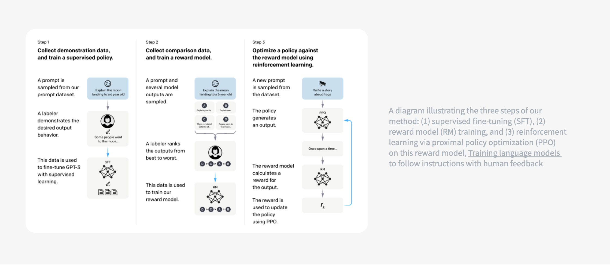

# **RLHF: Reinforcement Learning with Human Feedback**

### **Why RLHF?**

* Pre-trained LLMs are good at next-token prediction but not optimized for **helpfulness, harmlessness, and honesty (HHH)**.
* RLHF aligns models closer to **human preferences** by fine-tuning them with **feedback signals** rather than just raw data.

## **The RLHF Pipeline**

### **Step 1: Instruction Tuning (Supervised Fine-Tuning)**

* Collect a dataset of **labeler demonstrations** of desired behavior (good answers, helpful responses).
* Fine-tune the pre-trained LLM using supervised learning.
* Outcome: A **base instruction-following model**.

### **Step 2: Reward Model Training**

* Collect **comparison data**:

  * Human labelers rank multiple outputs from the model for the same prompt (e.g., prefer A > B).
* Train a **Reward Model (RM)** to predict which output humans would prefer.
* The RM becomes a **proxy for human judgment**.

### **Step 3: Policy Optimization with RL**

* Use the trained **Reward Model** as the objective for reinforcement learning.
* Optimize the model (policy) to **maximize expected reward**:

  * Popular algorithm: **Proximal Policy Optimization (PPO)**.
* This step adjusts the model to **follow instructions safely and align with human values**.

## **Iterative Refinement**

* Steps 2 & 3 are **repeated in cycles**:

  * Collect more comparison data.
  * Retrain the reward model.
  * Re-optimize the policy.
* Outcome: Progressive alignment to **human intent and safety standards**.

## **Strengths of RLHF**

* Reduces harmful or biased outputs.
* Improves adherence to instructions.
* Produces models that **generalize better** to unseen tasks in a user-aligned way.

## **Limitations**

* **Human feedback is costly** (requires expert labeling).
* Reward models may inherit **human biases**.
* RL training is **computationally expensive** and unstable.
* Doesn’t guarantee truthfulness (models can still hallucinate).

**Takeaway**:
RLHF extends **instruction tuning** by layering on **human preference alignment**. It transforms LLMs from raw “next-token predictors” into **instruction-following assistants** that better reflect **what users actually want**.

### **Why RLHF is Needed**

* Pretraining objective = predict the next token on internet text.
* Misalignment: models may hallucinate, output toxic/biases, or ignore user instructions.
* RLHF addresses this gap by **teaching the model what humans prefer** after pretraining + instruction tuning.

### **RLHF Workflow**

1. **Instruction Tuning (Supervised Fine-Tuning – SFT)**

   * Collect *demonstrations* of desired behavior from human labelers.
   * Fine-tune the pretrained model using these examples.
   * Produces a base instruction-following model.

2. **Reward Model Training**

   * Labelers compare multiple outputs from the SFT model for the same input.
   * Dataset: pairs of outputs with preference labels.
   * Train a *reward model (RM)* to predict which output a human would prefer.

3. **Reinforcement Learning Optimization**

   * Use the RM to guide the policy (the LLM).
   * Algorithm: often **Proximal Policy Optimization (PPO)**.
   * Model generates text → RM scores it → policy updated to maximize reward.
   * This step is iterative: collect more human comparisons → retrain RM → refine policy.

### **Key Characteristics**

* RLHF = **Instruction Tuning + Preference Modeling + RL Optimization**.
* Enables **safety, usefulness, and alignment** with human goals.
* Effective for **open-ended tasks** like dialogue, summarization, reasoning, and creative writing.

---

## **RLHF: Benefits and Trade-offs**

### **Key Achievements**

* **InstructGPT / ChatGPT**: RLHF demonstrated large improvements in:

  * **Truthfulness** – fewer hallucinations, better factual grounding.
  * **Safety** – reductions in toxic or biased outputs.
  * **Instruction Following** – better alignment with user intent.
* These improvements come while maintaining most of the pretrained model’s capabilities.

### **The Alignment Tax**

* **Definition**: Slight reduction in raw performance on some downstream tasks after applying RLHF.
* **Reason**: Optimizing for *alignment with human preferences* instead of *pure next-token prediction*.
* **Mitigation**: Ongoing research explores ways to minimize alignment tax while retaining alignment benefits.

### **Practical Adoption**

* RLHF is resource-intensive (requires humans-in-the-loop for data labeling and preference modeling).
* Companies providing **RLHF-as-a-Service**:

  * **Scale AI**
  * **Labelbox**
  * **Surge**
  * **Label Studio**
* These providers handle data collection, labeling, and sometimes reward model training pipelines.

### **Bottom Line**

RLHF is currently the **gold standard for aligning large language models** with human goals, despite its costs. As methods improve, the alignment tax is expected to shrink, making RLHF even more broadly adopted in both research and production systems.

---
