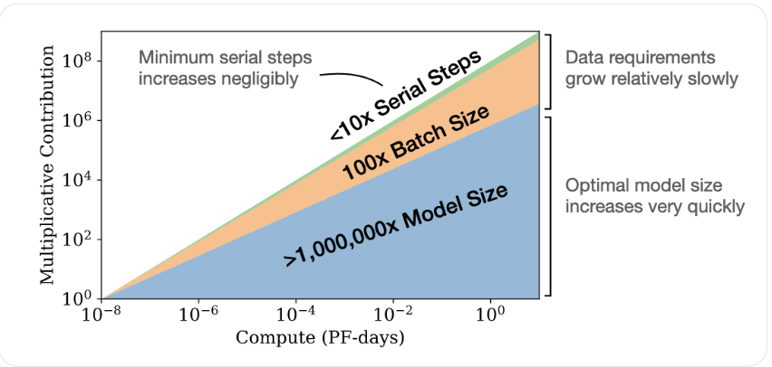

# **Original LLM Scaling Laws**

## 1. **Motivation**

* Before 2020, improvements in LMs were often ad-hoc: bigger models, bigger datasets, but no formal principle.
* Kaplan et al. (OpenAI, 2020) showed that **loss (cross-entropy) follows smooth power laws** in terms of:

  * **Model size** (parameters, $N$)
  * **Dataset size** (tokens, $D$)
  * **Compute budget** ($C$)

This gave a **predictive framework** for how performance scales.

## 2. **Key Findings**

### 2.1 Power-Law Relationship

For large models trained on sufficient data:

$`L(N, D) \approx L_\infty + aN^{-\alpha} + bD^{-\beta}`$

* $L(N, D)$ = test loss
* $L_\infty$ = irreducible loss (intrinsic noise of language)
* $\alpha, \beta$ = scaling exponents
* $a, b$ = constants

**Interpretation:**

* Loss decreases smoothly as model size or dataset size grows.
* No sharp saturation point was observed — just diminishing returns.

### 2.2 Optimal Compute Allocation

Given finite compute, there’s an **optimal trade-off** between $N$ and $D$.

* If model is **too large, trained on too little data** → under-trained, wasted capacity.
* If model is **too small, trained on too much data** → over-trained, wasted compute.

**Rule of Thumb (Kaplan et al., 2020):**

* **Dataset size** should scale roughly as $D \propto N^{0.74}$.
* **Compute-optimal training** balances parameters and data to minimize loss per FLOP.

### 2.3 Scaling with Compute

Loss also follows a power law in compute:

$`L(C) \approx L_\infty + kC^{-\gamma}`$

where $\gamma \approx 0.05$–$0.1$ (small exponent).

* This means **big compute → better results**, but returns diminish.

## 3. **Practical Implications**

* **Predictability:** Future models’ performance could be extrapolated without training them fully.
* **Data-hungry nature:** Larger models require disproportionately more data to remain compute-optimal.
* **Bottleneck shift:** Training moved from model-size-limited → data-limited → compute-limited.
* Inspired **GPT-3’s design (175B params)** — chosen based on scaling predictions.

## 4. **Limitations of Original Laws**

* Derived mostly from **autoregressive LMs** on English text.
* Ignored architectural innovations (e.g., sparse models, retrieval augmentation).
* Later work (DeepMind’s **Chinchilla Scaling Laws, 2022**) showed:

  * Kaplan’s models were **undertrained** on too little data.
  * Optimal scaling should favor **more training data per parameter**.

## 5. **Equations Summary**

1. **Loss vs Parameters**
$`L(N) \approx L_\infty + aN^{-\alpha}`$

2. **Loss vs Dataset Size**
$`L(D) \approx L_\infty + bD^{-\beta}`$

3. **Loss vs Compute**
$`L(C) \approx L_\infty + kC^{-\gamma}`$

4. **Optimal Data–Parameter Scaling**
$`D \propto N^{0.74}`$

## 6. **Impact**

* Set the **foundation of modern LLM development**.
* Justified billion-scale parameter growth (GPT-3, PaLM, LLaMA).
* Provided benchmarks for when to scale **data vs parameters**.

---

