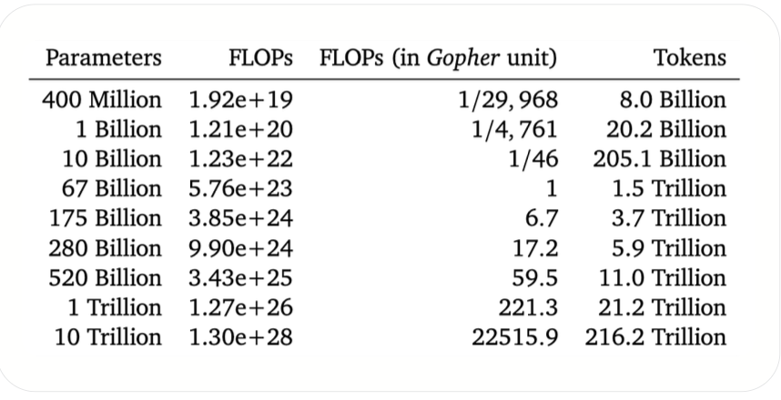
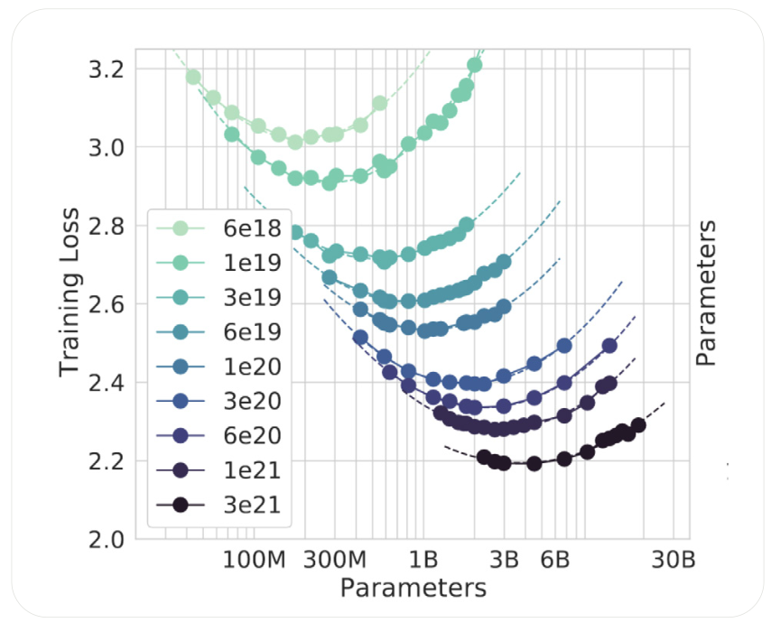

# **THE SCALING LAWS**

Scaling laws describe how the performance of large language models (LLMs) improves as a function of **model size (parameters)**, **dataset size (tokens)**, and **compute budget (FLOPs)**. They provide mathematical and empirical rules that guide how to allocate resources for training increasingly powerful models.

### 1. **The Core Idea**

* Performance (measured by loss or downstream task accuracy) follows predictable power-law relationships with scale.
* If you increase:

  * **Parameters (P)** → better capacity to represent functions.
  * **Data (D)** → better generalization and knowledge.
  * **Compute (C)** → more updates, larger batch sizes, and longer training.

Kaplan et al. (2020, OpenAI) showed that cross-entropy loss $L$ approximately scales as:

$L \approx A \cdot P^{-\alpha} + B \cdot D^{-\beta} + C \cdot C^{-\gamma}$

where $\alpha, \beta, \gamma > 0$ are empirically derived exponents.

### 2. **Optimal Compute/Data/Parameter Tradeoff**

* You **cannot just increase parameters without data** — models overfit.
* You **cannot just increase data without parameters** — models underfit.
* Kaplan’s laws suggest an **optimal balance**:

  * For a given compute budget, there’s an optimal model size and dataset size.
  * Training too small a model for too long wastes compute.
  * Training too large a model on too little data is inefficient.

* If compute increases **10×** → scale model size by **~3.1×** and training data by **~3.1×**.
* If compute increases **100×** → scale model size by **~10×** and training data by **~10×**.

This balances the trade-off between **underfitting** (too few parameters) and **overfitting** (too few tokens).

### 3. **Empirical Observations**

* **Loss scales predictably** until reaching an **irreducible floor** (intrinsic entropy of natural language).
* **Bigger models generalize better** across domains with minimal fine-tuning.
* **Compute-optimal frontier**: For each generation of hardware, organizations train the largest possible model/data pair that maximizes efficiency.

### 4. **Chinchilla Scaling (DeepMind, 2022)**

* Kaplan’s laws initially emphasized **increasing parameters**.
* DeepMind’s **Chinchilla paper** corrected this: most large LLMs (e.g., GPT-3) were **under-trained on too little data**.
* Findings:

  * To maximize performance, models should be **trained with ~20 tokens per parameter**.
  * Example: A **70B parameter model** should be trained on ~1.4 trillion tokens.
* Implication: **Data scaling is as important as parameter scaling**.

DeepMind’s *Chinchilla* study refined earlier scaling laws (Kaplan et al.) by showing that **most large LLMs were too big and under-trained on data**. The key claim is:

* For **optimal efficiency**, model size (**parameters**) and dataset size (**training tokens**) should **scale together at roughly the same rate**.
* With more compute, you shouldn’t only increase parameters — you must also increase training data.

**Best Practices for Training LLMs**

* **Rule 1:** *Decide on your dataset and find the Chinchilla-optimal model size.*

  * Example: With 1 trillion tokens, an optimal model would have ~50B parameters.

* **Rule 2:** *Choose data–model size combination based on compute and inference needs.*

  * Example: For edge deployment, smaller models may be preferable even if not fully Chinchilla-optimal.

### 5. **Modern Scaling Trends (2023–2025)**

* **Mixture of Experts (MoE)**: Instead of training dense huge models, scale with *sparsity* — only activate part of the network per input. This reduces compute while keeping parameter count massive.
  
* **Data quality > data quantity**: Curation, deduplication, and filtering improve efficiency beyond sheer token count.
  
* **Multimodal scaling**: Scaling laws extend to text, vision, audio, and cross-modal embeddings.
  
* **Frontier models (GPT-4, Gemini, Claude, LLaMA 3, Mistral Large)** adhere to Chinchilla-optimal scaling, with trillions of tokens and parameter-efficient architectures.

### 6. **Practical Takeaways**

* **Option 1 (API use)**: You inherit the benefits of scaling laws indirectly by using models already trained optimally.

* **Option 2 (Fine-tune open-source)**: Pick a model trained near Chinchilla scaling (e.g., LLaMA 3, Mistral). Fine-tune rather than training from scratch.

* **Option 3 (Pre-train)**: Only consider if you have trillions of tokens and massive compute. Scaling laws tell you exactly how much data/compute you’ll need for competitive performance.

**Scaling laws show that LLM progress is predictable and data-hungry**. The shift from GPT-3 style (parameter-heavy, data-light) to **Chinchilla-optimal (balanced parameters and data)** is the foundation for today’s frontier models.

In summary: **Chinchilla scaling shows that both parameters and tokens must grow together.** Training a huge model on limited data is wasteful, while training a small model on massive data underutilizes compute. The **two golden rules** are:

1. Pick dataset → match Chinchilla-optimal model size.
2. Balance data and parameters based on compute and latency requirements.

