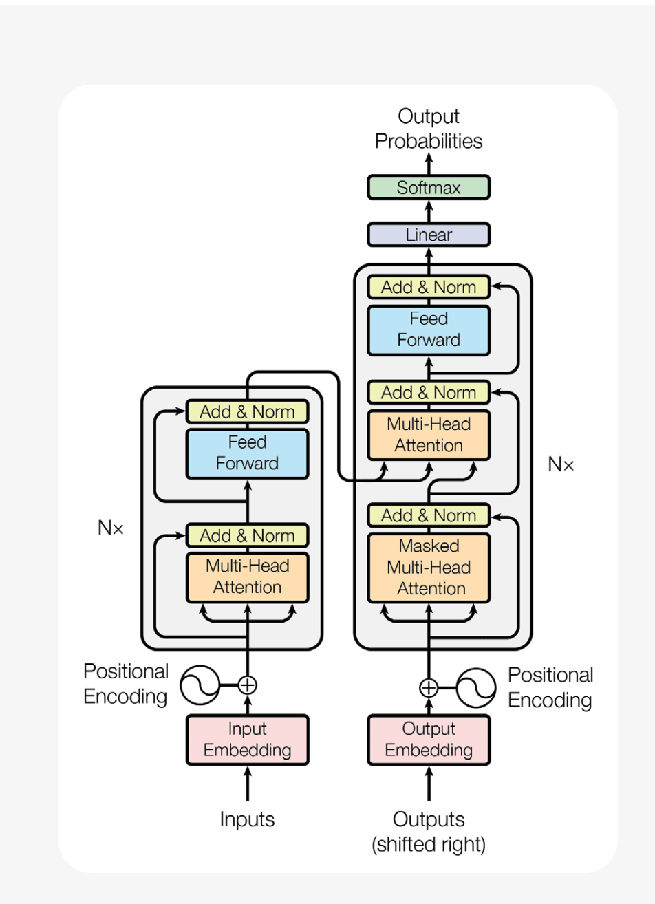

# **Transformer Model Architecture**

The Transformer consists of two main components:

1. **Encoder** (left side in the diagram)
2. **Decoder** (right side in the diagram)

Both are stacks of layers (usually 6–48 in modern implementations, denoted as $N \times$ in the figure).

## **1. Input Representation**

* **Input Embedding**: Each token is mapped into a dense vector of fixed dimension $d_{model}$ (e.g., 512 or 1024).
* **Positional Encoding**: Since Transformers lack recurrence (RNNs) or convolution (CNNs), they require **positional encodings** to represent word order.

  * Formula (for position $pos$ and dimension $i$):

$$
PE_{(pos,2i)} = \sin \left(\frac{pos}{10000^{2i/d_{model}}}\right), \quad
PE_{(pos,2i+1)} = \cos \left(\frac{pos}{10000^{2i/d_{model}}}\right)
$$

  Added directly to embeddings:
$X = \text{Embedding}(tokens) + PE$

## **2. Encoder**

The encoder processes the input sequence into a contextual representation.

Each of the $N$ layers has:

1. **Multi-Head Self-Attention**

   * Computes attention for each token with respect to all tokens (including itself).

   * Self-attention mechanism:

$$
\text{Attention}(Q, K, V) = \text{softmax}\left(\frac{QK^T}{\sqrt{d_k}}\right)V
$$

where $Q, K, V$ are learned projections of input embeddings.

   * Multi-head = multiple sets of $Q, K, V$ matrices → allows learning diverse relations.

2. **Add & Norm**

   * Residual connection + Layer Normalization.

3. **Feed Forward Network (FFN)**

   * Two-layer MLP applied position-wise:

$$
FFN(x) = \max(0, xW_1 + b_1)W_2 + b_2
$$

   * Adds non-linearity.

## **3. Decoder**

The decoder generates outputs step by step (autoregressively).

Each of the $N$ layers has:

1. **Masked Multi-Head Self-Attention**

   * Prevents attending to future tokens (causal masking).
   * Ensures output generation is left-to-right.

2. **Encoder-Decoder Multi-Head Attention**

   * Allows decoder to attend to encoder outputs (context from input sequence).

3. **Feed Forward Network + Add & Norm** (same as encoder).

## **4. Output Projection**

* Final decoder output → Linear layer → Softmax → Vocabulary distribution.
* Produces probability distribution over next token.

## **5. Training Objective**

* **Teacher Forcing**: During training, decoder sees the ground truth shifted right.
* **Loss**: Cross-entropy between predicted token distribution and ground-truth token.

# **Transformer Advantages**

* **Parallelization**: No recurrence → can process all tokens in parallel.
* **Scalability**: Efficient on GPUs/TPUs.
* **Long-Range Dependencies**: Attention can connect any two tokens directly.
* **Versatility**: Basis for LLMs, translation, vision (ViT), speech, multimodal models.

# **Extensions**

* **BERT (2018)**: Encoder-only, Masked LM pretraining.
* **GPT series**: Decoder-only, causal LM pretraining.
* **T5 / FLAN**: Encoder–decoder instruction tuning.
* **Vision Transformers (ViT)**: Applied to image patches.

---

# Large Language Models (LLM) Overview

## 1. Definition
Large Language Models (LLMs) are **deep learning models** trained on massive amounts of text data to understand and generate human-like language. They are based on the **Transformer architecture** and scale up to billions or trillions of parameters.

## 2. Core Components
- **Architecture**: Transformer-based (self-attention + feed-forward layers).  
- **Training**: Pre-trained on vast text corpora with objectives such as:
  - Causal Language Modeling (e.g., GPT)  
  - Masked Language Modeling (e.g., BERT)  
- **Parameters**: Ranging from millions (small models) to trillions (e.g., GPT-4).  

## 3. Training Paradigms
- **Pretraining**: Self-supervised learning on raw text.  
- **Finetuning**: Specialized adaptation to downstream tasks.  
- **Instruction Tuning**: Training to follow human instructions across tasks.  
- **RLHF (Reinforcement Learning with Human Feedback)**: Aligning models with human preferences to reduce toxicity and improve truthfulness.  

## 4. Applications
- Natural Language Understanding (NLU)  
- Question Answering (QA)  
- Summarization  
- Translation  
- Coding (e.g., Copilot, Code Llama)  
- Reasoning & Decision Support  

## 5. Scaling Laws
Research shows that model performance improves predictably with:
- More data  
- Larger models (more parameters)  
- Greater compute resources  

## 6. Challenges
- **Alignment Tax**: Trade-off between performance and alignment with human intent.  
- **Bias & Fairness**: Risk of amplifying societal biases.  
- **Compute Costs**: Extremely expensive training and serving.  
- **Generalization**: Some reasoning tasks remain challenging.  

## 7. Key Techniques
- **Parameter Efficient Finetuning (PEFT)**: LoRA, adapters.  
- **Knowledge Distillation**: Compressing large models into smaller ones.  
- **Mixture-of-Experts (MoE)**: Scaling efficiently by activating only parts of the model per query.  
- **Prompt Engineering & In-Context Learning**: Directing model behavior without retraining.  

## 8. Future Directions
- Multimodal LLMs (text + image + video + audio).  
- More efficient architectures (sparse attention, linear transformers).  
- Stronger reasoning capabilities (chain-of-thought, tool use).  
- Democratized LLMs: More open-source models like LLaMA, Mistral, Falcon.  

---

# **Large Language Models (LLMs) Components**

## 1. **Core Components**

### 1.1 Transformer Architecture

The foundation of modern LLMs.

* **Encoder–Decoder (Seq2Seq)**: For tasks like translation.
* **Decoder-only (GPT-style)**: Predicts the next token autoregressively.
* **Encoder-only (BERT-style)**: Learns contextual representations for classification tasks.

Key layers:

* **Input Embeddings**: Convert tokens into dense vectors.
* **Positional Encoding**: Inject order information (since attention is order-agnostic).
* **Multi-Head Attention**: Learns dependencies between tokens.
* **Feed-Forward Network (FFN)**: Expands representation capacity.
* **Residual + LayerNorm**: Stabilize training and gradient flow.
* **Output Layer (Softmax)**: Produces probabilities over vocabulary.

Equation for **scaled dot-product attention**:

$`\mathrm{Attention}(Q, K, V) = \mathrm{softmax}\left(\frac{QK^T}{\sqrt{d_k}}\right) V`$

### 1.2 Pretraining Objectives

LLMs are first pretrained on large corpora using self-supervised tasks:

* **Causal LM (CLM)**: Predict next token (GPT).
* **Masked LM (MLM)**: Predict missing tokens (BERT).
* **Seq-to-Seq LM**: Encode input, decode output (T5, PaLM).

### 1.3 Parameters & Scaling

LLMs range from millions to hundreds of billions of parameters.

* **Scaling Laws**: Empirical findings show performance scales predictably with dataset size, model size, and compute.
* Trade-off: More parameters → better generalization, but higher cost.

## 2. **Training Paradigms**

### 2.1 Pretraining

Massive text datasets → learn general world knowledge & language patterns.

### 2.2 Fine-Tuning

Adapt pretrained model to a specific domain/task.

* **Full Fine-Tuning**: All parameters updated.
* **Parameter-Efficient Fine-Tuning (PEFT)**: Update only small subsets (e.g., LoRA, adapters).

### 2.3 Instruction Tuning

Fine-tune on datasets where tasks are phrased as natural instructions.

* Improves **zero-shot performance**.
* Better alignment to user queries.

### 2.4 RLHF (Reinforcement Learning with Human Feedback)

Three-step alignment pipeline:

1. Instruction-tuning.
2. Train a **reward model** from human preferences.
3. Optimize with reinforcement learning (PPO).

## 3. **Applications of LLMs**

* **Natural Language Understanding (NLU)**: Sentiment, classification.
* **Question Answering (QA)**: Open-domain retrieval QA.
* **Summarization**: Abstractive & extractive.
* **Translation**: Cross-lingual tasks.
* **Code Generation**: GitHub Copilot, AlphaCode.
* **Reasoning & Planning**: Chain-of-thought prompting, symbolic reasoning hybrids.

## 4. **Challenges**

* **Alignment Tax**: Safety-aligned models may lose raw task performance.
* **Bias & Fairness**: Training data inherits human biases.
* **Toxicity**: Risk of harmful content.
* **Compute & Cost**: High training + inference costs.
* **Generalization & Hallucination**: Making up facts is still common.

## 5. **Key Techniques**

* **PEFT**: LoRA, Prefix Tuning, Adapters.
* **Knowledge Distillation**: Compress large models into smaller ones.
* **Mixture of Experts (MoE)**: Activate only parts of the network per input → efficient scaling.
* **Prompt Engineering**: Designing input formats to elicit better responses.

## 6. **Future Directions**

* **Multimodal LLMs**: Text + Image + Audio (e.g., GPT-4V, Gemini).
* **Efficient Architectures**: Sparse attention, linear attention, retrieval-augmented models.
* **Better Reasoning**: Chain-of-thought, tool use, symbolic + neural hybrids.
* **Open-Source Expansion**: Community-driven models (LLaMA, Mistral, Falcon).

---

Here’s a structured **overview of Large Language Models (LLMs)** in a mind-map format:

* **Core Components**

  * Transformer Architecture
  * Pretraining Objectives
  * Billions of Parameters

* **Training Paradigms**

  * Pretraining
  * Finetuning
  * Instruction Tuning
  * RLHF

* **Applications**

  * NLU
  * QA
  * Summarization
  * Translation
  * Coding
  * Reasoning

* **Challenges**

  * Alignment Tax
  * Bias & Fairness
  * Compute Costs
  * Generalization

* **Key Techniques**

  * PEFT (LoRA, Adapters)
  * Knowledge Distillation
  * Mixture of Experts
  * Prompt Engineering

* **Future Directions**

  * Multimodal LLMs
  * Efficient Architectures
  * Reasoning Improvements
  * Open-Source Expansion

---
