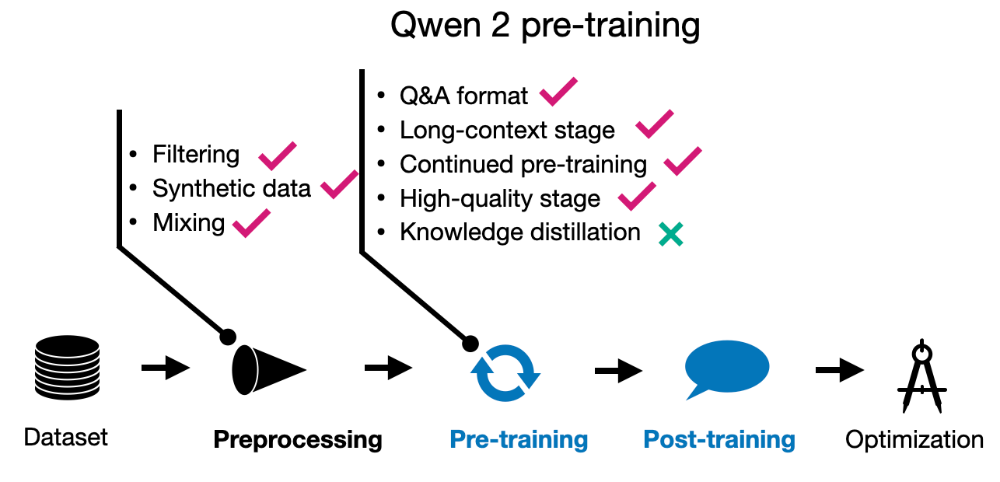
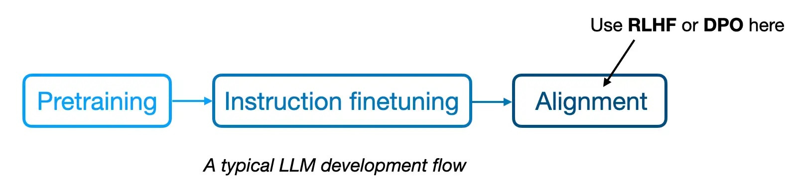
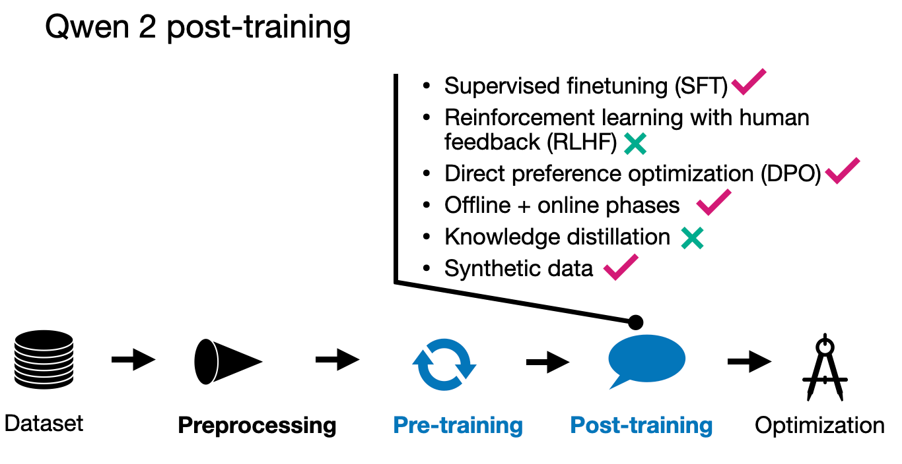

# **Alibaba's Qwen 2**

## **1. Qwen 2 Overview**

Qwen 2 models come in 5 flavors. There are 4 regular (dense) LLMs with sizes 0.5 billion, 1.5 billion, 7 billion, and 72 billion parameters. In addition, there is a Mixture-of-Experts model with 57 billion parameters, where 14 billion parameters are activated at the same time.

One of the stand-out features of Qwen 2 LLMs are their good multilingual capabilities in 30 languages. They also have a surprisingly large 151,642 token vocabulary (for reference, Llama 2 uses a 32k vocabulary, and Llama 3.1 uses a 128k token vocabulary); as a rule of thumb, increasing the vocab size by 2x reduces the number of input tokens by 2x so we can fit more text into the same input. Also it especially helps with multilingual data and coding to cover words outside the standard English vocabulary.

## **2. Qwen 2 Pre-training**

The Qwen 2 team trained the 1.5 billion, 7 billion, and 72 billion parameter models on 7 trillion training tokens, which is a reasonable size. For comparison, Llama 2 models were trained on 2 trillion tokens, and Llama 3.1 models were trained on 15 trillion tokens.

Interestingly, the 0.5 billion parameter model was trained on 12 trillion tokens. However, the researchers did not train the other models on the larger 12 trillion token dataset because they did not observe any improvements during training, and the additional computational costs were not justified.

One of the focus areas has been improving the data filtering pipeline to remove low-quality data and enhancing data mixing to increase data diversity— a theme we will revisit when examining other models later.

Interestingly, they also used Qwen models (although they didn't specify details, I assume they mean previous generation Qwen models) to synthesize additional pre-training data. And the pre-training involved “multi-task instruction data… to enhance in-context learning and instruction-following abilities.”

Furthermore, they performed training in two stages: regular pre-training followed by long-context training. The latter increased the context length from 4,096 to 32,768 tokens at the end phase of pre-training using "high-quality, lengthy data."

## **3. Qwen 2 Post-training**

The Qwen 2 team employed the popular two-phase post-training methodology, starting with supervised instruction fine-tuning (SFT), which was applied across 500,000 examples for 2 epochs. This phase aimed to refine the model’s response accuracy in predetermined scenarios.

After SFT, they used direct preference optimization (DPO) to align the LLM with human preferences. (Interestingly referred to in their terminology as reinforcement learning from human feedback, RLHF.) As I discussed in my Tips for LLM Pretraining and Evaluating Reward Models article a few weeks ago, the SFT+DPO approach seems to be the most popular preference tuning strategy at the moment due to the ease of use compared to other methods, such as RLHF with PPO.

The alignment phase itself was also done in 2 stages. First using DPO on an existing dataset (offline stage). Second, using a reward model to form the preference pair (online). Here, the model generates multiple responses during training, and a reward model selects the preferred response for the optimization step in "real-time" (that is, during training). This is also often referred to as "rejection sampling."

For the construction of the dataset, they used existing corpora complemented by human labeling to determine target responses for SFT and identify preferred and rejected responses essential for DPO. The researchers also synthesized artificially annotated data. 

Moreover, the team used LLMs to generate instruction-response pairs specifically tailored for "high-quality literary data," to create high-quality Q&A pairs for training.

## **4. Conclusion**

Qwen 2 is a relatively capable model, and similar to earlier generations of Qwen. When attending the NeurIPS LLM efficiency challenge in December 2023, I remember that most of the winning approaches involved a Qwen model. 

Regarding the training pipeline of Qwen 2, what stands out is that synthetic data has been used for both pre-training and post-training. Also, the focus on dataset filtering (rather than collecting as much data as possible) is one of the notable trends in LLM training. Here, I would say, more is better, but only if it meets certain quality standards.

