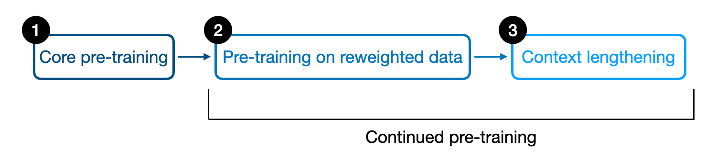
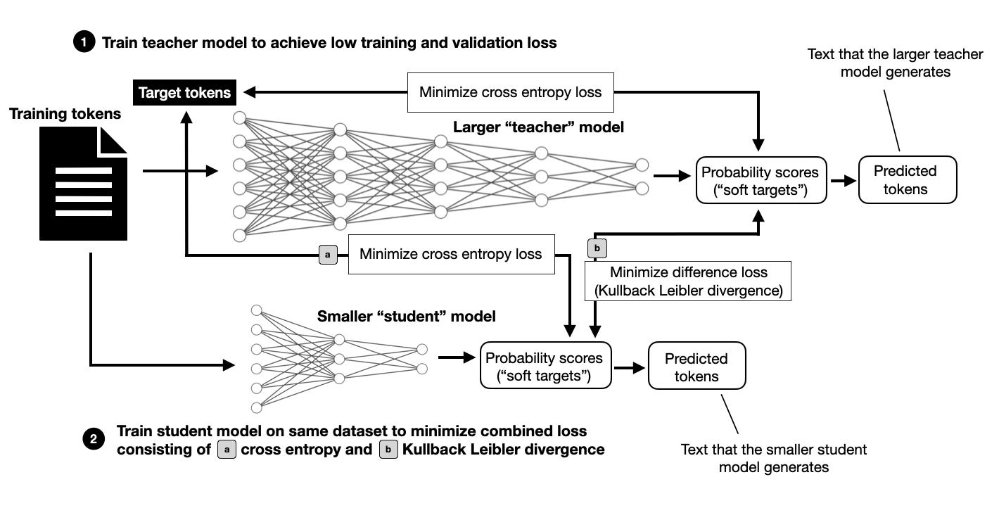
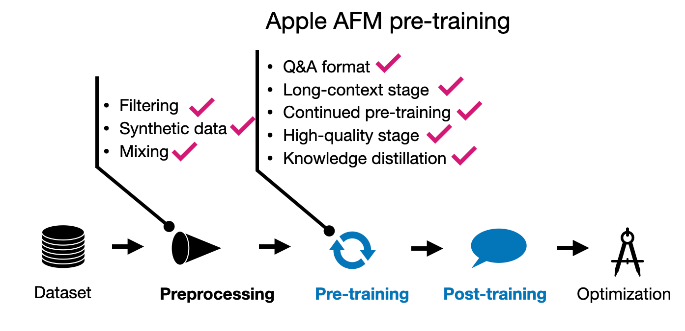
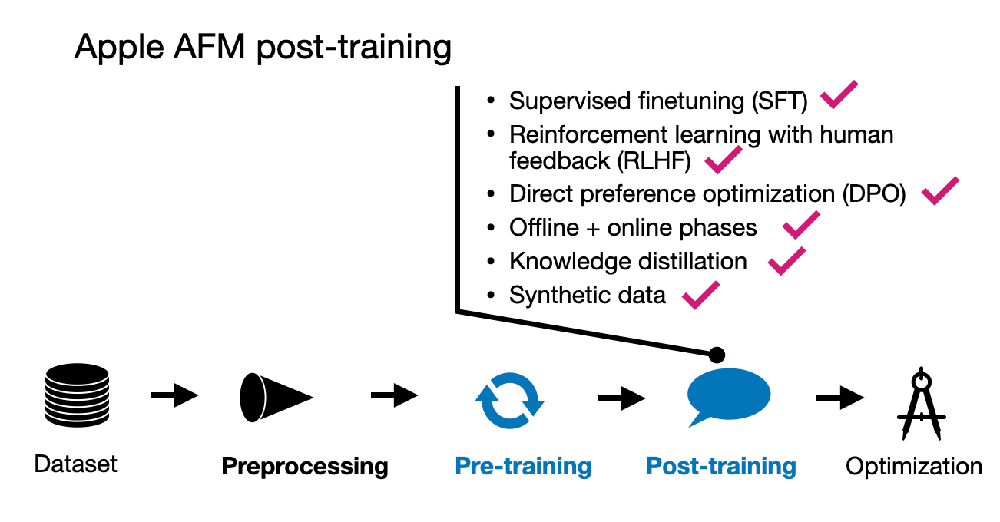

# **Apple's Apple Intelligence Foundation Language Models (AFM)**

## **AFM Overview**

Specifically, the paper describes two versions of the AFM: a 3-billion-parameter on-device model intended for deployment on phones, tablets, or laptops, and a more capable server model of unspecified size. 

These models are developed for chat, math, and coding tasks, although the paper does not discuss any of the coding-specific training and capabilities.

Like the Qwen 2, the AFMs are dense LLMs and do not utilize a mixture-of-experts approach.

## **AFM Pre-training**

To reinforce one of the takeaways of the Qwen 2 paper, the researchers mentioned that quality was much more important than quantity. (With a vocabulary size of 49k tokens for the device model and 100k tokens for the server model, the vocabulary sizes were noticeably smaller than those of the Qwen 2 models, which used 150k token vocabulary.) 

Interestingly, the pre-training was not done in 2 but 3 stages!

1. **Core (regular) pre-training**

2. **Continued pre-training where web-crawl (lower-quality) data was down-weighted; math and code was up-weighted**

3. **Context-lengthening with longer sequence data and synthetic data**

### **Pre-training I: Core Pre-training**

Core pre-training describes the first pre-training stage in Apple's pre-training pipeline. This is akin to regular pre-training, where the AFM-server model was trained on 6.3 trillion tokens, a batch size of 4096 batch size and a 4096-token sequence length. This is very similar to Qwen 2 models, which were trained in 7 trillion tokens.

However, it gets more interesting for the AFM-on-device model, which is distilled and pruned from a larger 6.4-billion-parameter model (trained from scratch like the AFM-server model described in the previous paragraph).

There's not much detail on the distillation process besides "a distillation loss is used by replacing the target labels with a convex combination of the true labels and the teacher model's top-1 predictions (with 0.9 weight assigned to the teacher labels)."

Knowledge distillation, as illustrated above, still involves training on the original dataset. However, in addition to the training tokens in the dataset, the model to be trained (referred to as the student) receives information from the larger (teacher) model, which provides a richer signal compared to training without knowledge distillation. The downside is that you must: 

1) train the larger teacher model first, and 
2) compute predictions on all training tokens using the larger teacher model. 

These predictions can be computed ahead of time (which requires substantial storage space) or during training (which may slow down the training process).

### **Pre-training II: Continued Pre-training**

The continued pre-training stage includes a small context lengthening step from 4,096 to 8,192 tokens on a dataset consisting of 1 trillion tokens (the core pre-training set was five times larger). The primary focus, however, is on training with a high-quality data mix, with an emphasis on math and code. 

Interestingly, the researchers found that the distillation loss was not beneficial in this context.

### **Pre-training III: Context Lengthening**

The third pre-training stage involves only 100 billion tokens (10% of the tokens used in the second stage) but represents a more significant context lengthening to 32,768 tokens. To achieve this, the researchers augmented the dataset with synthetic long-context Q&A data.

## **AFM Post-training**

Apple appears to have taken a similarly comprehensive approach to their post-training process as they did with pre-training. They leveraged both human-annotated and synthetic data, emphasizing that data quality was prioritized over quantity. Interestingly, they did not rely on predetermined data ratios; instead, they fine-tuned the data mixture through multiple experiments to achieve the optimal balance.

The post-training phase involved a two-step process: supervised instruction fine-tuning followed by several rounds of reinforcement learning with human feedback (RLHF).

A particularly noteworthy aspect of this process is Apple’s introduction of two new algorithms for the RLHF stage:

1. Rejection Sampling Fine-tuning with Teacher Committee (iTeC)
2. RLHF with Mirror Descent Policy Optimization

The iTeC algorithm combines rejection sampling with multiple preference tuning techniques—specifically, SFT, DPO, IPO, and online RL. Rather than relying on a single algorithm, Apple trained models using each approach independently. These models then generated responses, which were evaluated by humans who provided preference labels. This preference data was used to iteratively train a reward model in an RLHF framework. During the rejection sampling phase, a committee of models generated multiple responses, with the reward model selecting the best one.

This committee-based approach is quite complex but should be relatively feasible, particularly given the relatively small size of the models involved (around 3 billion parameters). Implementing such a committee with much larger models, like the 70B or 405B parameter models in Llama 3.1, would definitely be more challenging.

As for the second algorithm, RLHF with Mirror Descent, it was chosen because it proved more effective than the commonly used PPO (Proximal Policy Optimization).

## **Conclusion**

Apple's approach to pre-training and post-training is relatively comprehensive, likely because the stakes are very high (the model is deployed on millions, if not billions, of devices). However, given the small nature of these models, a vast array of techniques also becomes feasible, since a 3B model is less than half the size of the smallest Llama 3.1 model.

One of the highlights is that it’s not a simple choice between RLHF and DPO; instead, they used multiple preference-tuning algorithms in the form of a committee. It’s also interesting that they explicitly used Q&A data as part of the pre-training.

