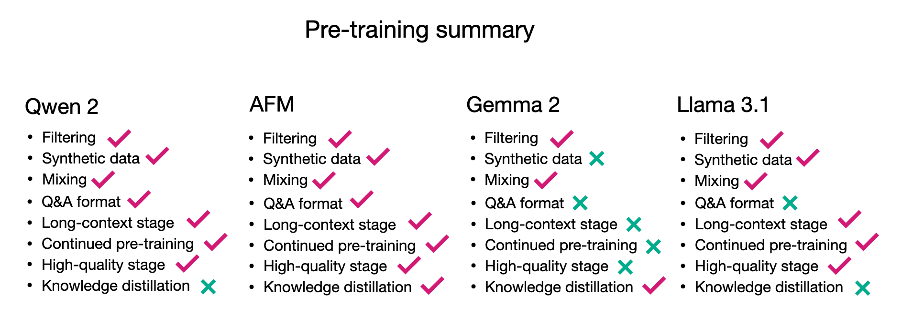
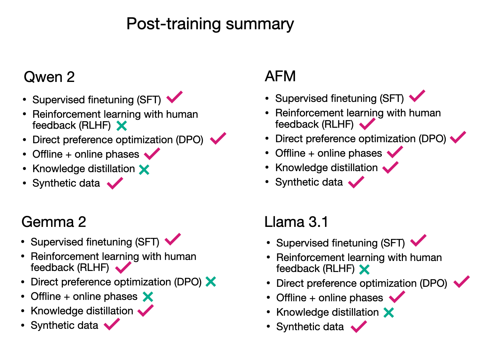

# **Main Takeaways**

All four models take somewhat different approaches to `pre-training` and `post-training`. Of course, methodologies overlap, but no training pipeline is quite the same. For pre-training, a shared feature seems to be that all methods use a multi-stage pre-training pipeline, where a general core pre-training is followed by a context lengthening and sometimes high-quality annealing step. The figure below shows again the different methods employed in pre-training at a glance.

When it comes to post-training, also none of the pipelines was exactly the same. It seems that rejection sampling is now a common staple in the post-training process. However, when it comes to DPO or RLHF, there's no consensus or preference (no pun intended) yet.

So, in all, there is no single recipe but many paths to developing highly-performant LLMs.

Lastly, the four models perform in the same ballpark. Unfortunately, several of these models have not made it into the LMSYS and AlpacaEval leaderboards, so we have no direct comparison yet, except for the scores on multiple-choice benchmarks like MMLU and others.