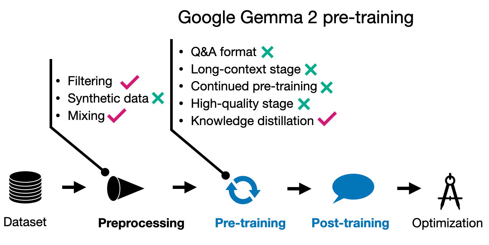
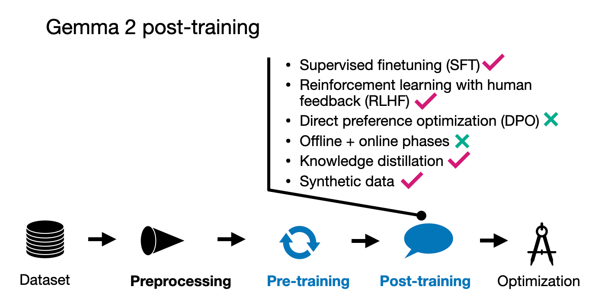

# **Google's Gemma 2**

## **Gemma 2 Overview**

The Gemma 2 models are available in three sizes: 2 billion, 9 billion, and 27 billion parameters. The primary focus is on exploring techniques that do not necessarily require increasing the size of training datasets but rather on developing relatively small and efficient LLMs.

Notably, Gemma 2 features a substantial vocabulary size of 256k tokens. For comparison, Llama 2 uses a 32k token vocabulary, and Llama 3 has a 128k token vocabulary.

Additionally, Gemma 2 employs sliding window attention, similar to Mistral's early models, likely to reduce memory costs.

## **Gemma 2 Pre-training**

The Gemma researchers argue that even small models are often undertrained. However, rather than simply increasing the size of the training dataset, they focus on maintaining quality and achieve improvements through alternative methods, such as knowledge distillation, similar to Apple's approach. 

While the 27B Gemma 2 model was trained from scratch, the smaller models were trained using knowledge distillation similar to Apple's approach explained previously. 

The 27B model was trained on 13 trillion tokens, the 9B model on 8 trillion tokens, and the 2B model on 2 trillion tokens. Additionally, similar to Apple's approach, the Gemma team optimized the data mixture to improve performance.

## **Gemma 2 Post-training**

The post-training process for the Gemma models involved the typical supervised fine-tuning (SFT) and reinforcement learning with human feedback (RLHF) steps. 

The instruction data involved using English-only prompt pairs, which were a mix of human-generated and synthetic-generated content. Specifically, and interestingly, the responses were primarily generated by teacher models, and knowledge distillation was also applied during the SFT phase.

An interesting aspect of their RLHF approach, following SFT, is that the reward model used for RLHF is ten times larger than the policy (target) model.

## **Conclusion**

The Gemma team seems to really double down on knowledge distillation, which they use during both pre-training and post-training similar to Apple. Interestingly, they didn't use a multi-stage pre-training approach though, or at least, they didn't detail it in their paper.