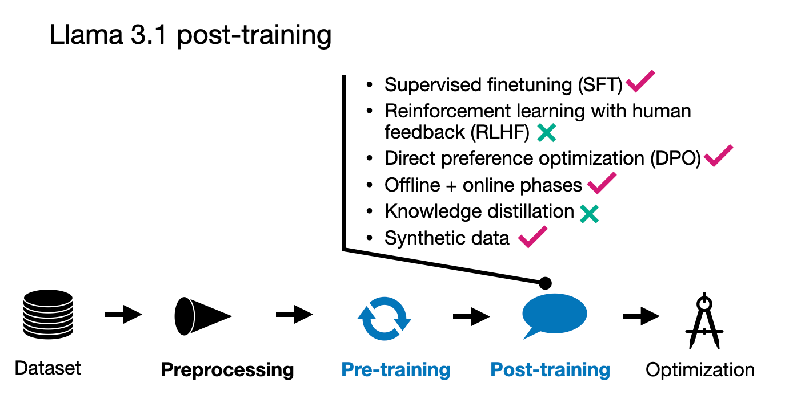

# **Meta AI's Llama 3.1**

## **Llama 3.1 Overview**

Along with releasing a huge 405 billion parameter model, Meta updated their previous 8 billion and 70 billion parameter models, giving them a slight MMLU performance boost.

While Llama 3 uses group query attention like other recent LLMs, surprisingly, Meta AI said no to sliding window attention and Mixture-of-Experts approaches. In other words, the Llama 3.1 looks very traditional, and the focus was clearly on the pre-training and post-training rather than architecture innovations.

Similar to previous Llama releases, the weights are openly available. Moreover, Meta said that they updated the Llama 3 license so that it's now finally possible (allowed) to use Llama 3 for synthetic data generation or knowledge distillation to improve other models.

## **Llama 3.1 Pre-training**

Llama 3 was trained on a massive 15.6 trillion tokens dataset, which is a substantial increase from Llama 2's 1.8 trillion tokens. The researchers say that it supports at least eight languages, (whereas Qwen 2 is capable of handling 20). 

An interesting aspect of Llama 3 is its vocabulary size of 128,000, which was developed using OpenAI's tiktoken tokenizer. 

In terms of pre-training data quality control, Llama 3 employs heuristic-based filtering alongside model-based quality filtering, utilizing fast classifiers like Meta AI's fastText and RoBERTa-based classifiers. These classifiers also help in determining the context categories for the data mix used during training.

The pre-training for Llama 3 is divided into three stages. The first stage involves standard initial pre-training using the 15.6 trillion tokens with an 8k context window. The second stage continues with the pre-training but extends the context length to 128k. The final stage involves annealing, which further enhances the model's performance. Let's look into these stages in more detail below.

### **Pre-training I: Standard (Initial) Pre-training**

In their training setup, they began with batches consisting of 4 million tokens, each with a sequence length of 4096. This implies a batch size of approximately 1024 tokens, assuming that the 4 million figure is rounded to the nearest digit. After processing the first 252 million tokens, they doubled the sequence length to 8192. Further into the training process, after 2.87 trillion tokens, they doubled the batch size again.

Additionally, the researchers did not keep the data mix constant throughout the training. Instead, they adjusted the mix of data being used during the training process to optimize model learning and performance. This dynamic approach to data handling likely helped in improving the model's ability to generalize across different types of data.

### **Pre-training II: Continued Pre-training for Context Lengthening**

Compared to other models that increased their context window in a single step, the Llama 3.1 context lengthening was a more gradual approach: Here, the researchers increased the context length through six distinct stages from 8,000 to 128,000 tokens. This stepwise increment likelely allowed the model to adapt more smoothly to larger contexts. 

The training set utilized for this process was involved 800 billion tokens, about 5% of the total dataset size.

### **Pre-training III: Annealing on High-quality Data**

For the third pre-training stage, the researchers trained the model on a small but high-quality mix, which they found helps improve the performance on benchmark datasets. For example, annealing on the GSM8K and MATH training sets provided a significant boost on the respective GSM8K and MATH validation sets.

In section 3.1.3 of the paper, the researchers stated that the annealing dataset size was 40 billion tokens (0.02% of the total dataset size); this 40B annealing dataset was used to assess data quality. In section 3.4.3, they state that the actual annealing was done only on 40 million tokens (0.1% of the annealing data).

## **Llama 3.1 Post-training**

For their post-training process, the Meta AI team employed a relatively straightforward method that included supervised fine-tuning (SFT), rejection sampling, and direct preference optimization (DPO).

They observed that reinforcement learning algorithms like RLHF with PPO were less stable and more challenging to scale compared to these techniques. It's worth noting that the SFT and DPO steps were iteratively repeated over multiple rounds, incorporating both human-generated and synthetic data.

Before describing the further details, their workflow is illustrated in the figure below.

Note that even though they used DPO, they also developed a reward model as you'd do in RLHF. Initially, they trained the reward model using a checkpoint from the pre-training phase, utilizing human-annotated data. This reward model was then used for the rejection sampling process, helping to select appropriate prompts for further training. 

In each training round, they applied model averaging techniques not only to the reward model but also to the SFT and DPO models. This averaging involved merging the parameters from recent and previous models to stabilize (and improve) performance over time.

## **Conclusion**

The Llama 3 models remain fairly standard and similar to the earlier Llama 2 models but with some interesting approaches. Notably, the large 15 trillion token training set distinguishes Llama 3 from other models. Interestingly, like Apple's AFM model, Llama 3 also implemented a 3-stage pre-training process.

In contrast to other recent large language models, Llama 3 did not employ knowledge distillation techniques, opting instead for a more straightforward model development path. For post-training, the model utilized Direct Preference Optimization (DPO) instead of the more complex reinforcement learning strategies that have been popular in other models. Overall, this choice is interesting as it indicates a focus on refining LLM performance through simpler (but proven) methods.

